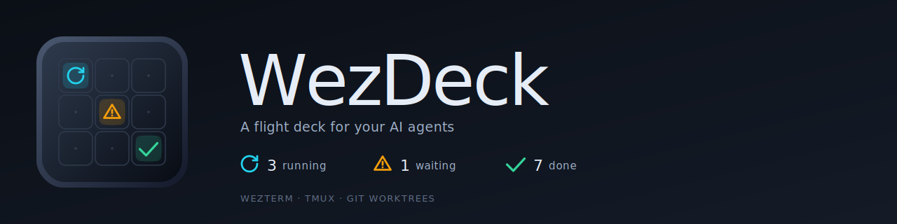

<p align="center">
  
</p>

<h1 align="center">WezDeck</h1>

<p align="center">
  <em>A flight deck for your AI agents — built on WezTerm, tmux, and git worktrees.</em>
</p>

<p align="center">
  <a href="LICENSE"></a>
  
  
  
  
</p>

> One WezTerm tab per repo. One tmux window per worktree. One pane per agent. One keystroke to find what's waiting on you.

This repository is the source of truth for the WezDeck runtime. The GitHub repo is [`yunsii/wezdeck`](https://github.com/yunsii/wezdeck) (the previous `yunsii/wezterm-config` URL still works via GitHub's permanent redirect).

## ✨ Highlights

- **Tab × Worktree × Agent in one frame** — every WezTerm tab is one repo, every tmux window inside it is a linked git worktree, every pane can host an agent CLI (`claude` / `codex` / …).
- **Live attention surface** — per-tab badges plus a single right-status counter `⟳ N running ⚠ N waiting ✓ N done`, driven by a Claude hook → `attention.json` pipeline.
- **One keystroke to jump** — `Alt+/` opens a popup of every pending pane across every tab; `Alt+,` / `Alt+.` step through them.
- **One keystroke to spawn a worktree** — `Ctrl+k g d/t/h` carves out a new linked worktree (with its own agent) without leaving the keyboard.
- **Manifest-driven hotkeys** — `wezterm-x/commands/manifest.json` is the single source of truth; per-machine overrides live in `wezterm-x/local/keybindings.lua`.

## 📺 Demo

<p align="center">
  
  
</p>

Six mock projects (cli-parser / image-resizer / log-daemon, two worktrees each), all driving the real attention pipeline. Right-status `⟳ 2 ⚠ 5 ✓ 1` aggregates across the workspace; tab badges flip per pane; the focused agent is paused on a permission prompt — the rest are still streaming or have completed. Reproduce: see [`assets/demo/README.md`](assets/demo/README.md).

## 🧭 How It Works

```
WezTerm tab          ─┐
  └─ tmux window     ─┤  one repo  ·  one worktree  ·  one agent
       └─ tmux pane  ─┘
                       ↑
       Claude hook → attention.json → tab badges + right-status counter
                                       ↑
                                  Alt+/  jumps to next pending pane
```

Full architecture, ownership boundaries, and the WSL ⇄ Windows communication channels: [`docs/architecture.md`](docs/architecture.md).

## ✅ Requirements

| | Required | Notes |
|---|---|---|
| **WezTerm** | nightly | `hybrid-wsl` mode runs on the Windows nightly build |
| **tmux** | ≥ 3.6 | DEC mode 2026 (synchronized output); 3.4 deadlocks. Ubuntu 24.04 still ships 3.4 — build from source. [Why](docs/ime-flicker-and-sync-output.md) |
| **lua5.4** | recommended | Powers the sync precheck; missing → precheck skipped with a warning |
| **jq** | recommended | Agent-attention writer & focus path; missing → degraded labels |
| **go ≥ 1.21** | optional | For maintainers of `native/picker/`. End users get a sha256-pinned prebuilt tarball via the release fetcher |
| **python3** | optional | Only for WakaTime status |

Supported runtime modes: `hybrid-wsl` (Windows WezTerm + WSL/tmux) and `posix-local` (Linux / macOS local).

## 🚀 Quick Start

```bash
# 1. Seed your machine-local config
cp -r wezterm-x/local.example/ wezterm-x/local/
$EDITOR wezterm-x/local/constants.lua   # runtime_mode, default_domain, shell, …
$EDITOR wezterm-x/local/shared.env      # WAKATIME_API_KEY, MANAGED_AGENT_PROFILE, …

# 2. Sync the runtime into $HOME (writes ~/.wezterm.lua + ~/.wezterm-x/)
skills/wezterm-runtime-sync/scripts/sync-runtime.sh

# 3. Reload WezTerm and confirm the right status shows
#    "⟳ 0 ⚠ 0 ✓ 0" — that means the attention pipeline is live.
```

Full setup walkthrough: [`docs/setup.md`](docs/setup.md).

## 📚 Documentation

**Get started**
- [Setup](docs/setup.md) · [Daily workflow](docs/daily-workflow.md) · [Workspaces](docs/workspaces.md)

**Daily use**
- [Keybindings](docs/keybindings.md) · [tmux UI](docs/tmux-ui.md) · [Agent attention](docs/agent-attention.md) · [Browser debug](docs/browser-debug.md)

**Internals**
- [Architecture](docs/architecture.md) · [Performance](docs/performance.md) · [Diagnostics](docs/diagnostics.md) · [IME & sync output](docs/ime-flicker-and-sync-output.md)

**Releases**
- [Host helper](docs/host-helper-release.md) · [Picker](docs/picker-release.md)

Agent rules: [`AGENTS.md`](AGENTS.md). Reusable user-level profiles: [`agent-profiles/`](agent-profiles/).

## 🎨 Brand

Brand SVGs and the geometric construction notes live in [`assets/brand/`](assets/brand/) — see [`assets/brand/README.md`](assets/brand/README.md) for the asset table and proportional rules.

## 📄 License

MIT © Yuns. See [LICENSE](LICENSE).
