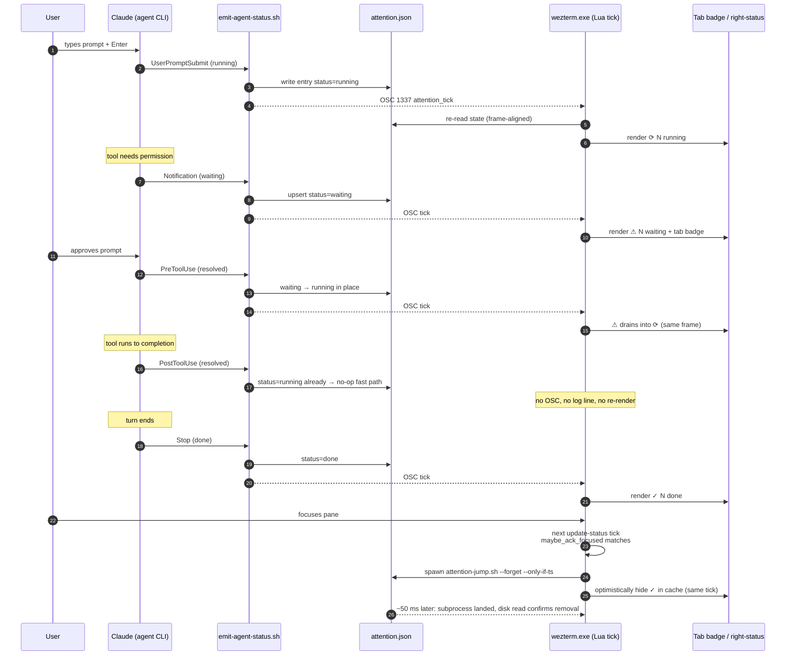
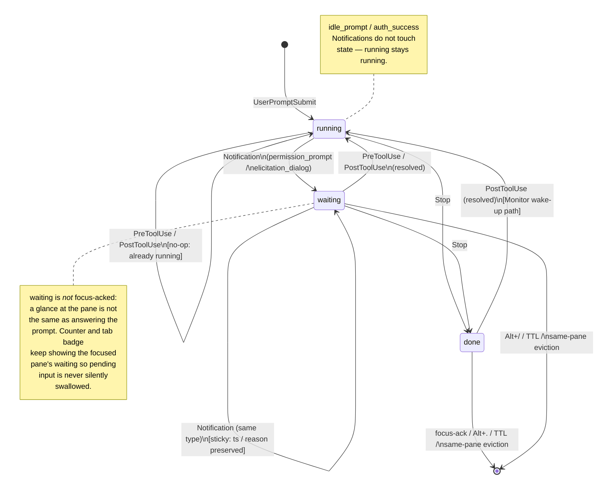
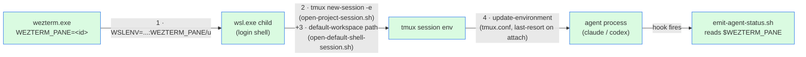

# Agent Attention

Use this doc when you need anything about the agent-attention pipeline: shared state file, Claude hook install / upgrade, status transitions, rendering, the three keyboard entry points (`Alt+,` / `Alt+.` / `Alt+/`), focus-based auto-ack, or Codex integration.

The high-level layering (hooks → shared JSON → OSC tick → Lua render) is summarised in [`architecture.md#interaction-layers`](./architecture.md#interaction-layers); this doc owns the implementation detail.

## Hook installation

The agent-attention feature expects Claude Code to emit OSC 1337 user vars from the hook events listed in the install template below (`UserPromptSubmit`, `Notification`, `Stop`, `PreToolUse`, `PostToolUse`, `SessionStart`). The hook script ships in this repo at `scripts/claude-hooks/emit-agent-status.sh` and is keyboard-first: when it runs it only decorates the pane, so installing it globally is safe and a no-op in non-WezTerm terminals.

> **Upgrading from an earlier version of this doc** — the hook argument for `UserPromptSubmit` changed from `cleared` to `running`. If your existing `~/.claude/settings.json` still points at `... emit-agent-status.sh cleared`, swap it for `running`. Claude Code re-reads `settings.json` on every hook firing, so the change takes effect on the next event (send a fresh prompt to exercise `UserPromptSubmit`) — no Claude restart needed. Use the verification command at the bottom of this section to confirm the new command is firing.

> **Upgrading from a four-hook install** — a fifth hook, `SessionStart` with `matcher: "clear"`, was added to drop the discarded session's `running` entry when the user runs `/clear`. Without it, the ⟳ counter stays stuck for up to 30 minutes (or until the next `UserPromptSubmit` on the same pane triggers same-pane eviction). Merge the `SessionStart` block from the template below; no Claude restart needed. To confirm it is wired, run `/clear` in a pane that currently shows a ⟳, and watch the badge drop within one WezTerm status tick.

> **Upgrading from a five-hook install** — a sixth hook, `PreToolUse → resolved`, was added so that approving a permission prompt flips `⚠ waiting → ⟳ running` the moment the approve keystroke lands, instead of staying on `⚠` for the full tool-execution window until `PostToolUse` fires. The two `resolved` hooks are idempotent — once `PreToolUse` flips the entry, `PostToolUse` sees `running` on the fast path and short-circuits without lock, OSC tick, or log line — so wiring both is a free belt-and-suspenders. Merge the `PreToolUse` block from the template below; no Claude restart needed. To confirm, answer a permission prompt and watch the badge flip from `⚠` to `⟳` immediately rather than after the tool finishes.

> **Upgrading: closing the agent-side git-status lag** — `PostToolUse` and `Stop` each now carry a second hook entry that backgrounds `tmux-status-refresh.sh --force --refresh-client`. This is the agent-side counterpart to the shell prompt hook described in [`setup.md#tmux-status-prompt-hook`](./setup.md#tmux-status-prompt-hook): without it, file edits driven by Claude (Edit / Write / Bash `git …`) only show up in the tmux status segment after the 30s poll. The `tmux-status-refresh.sh` script's own `@tmux_status_force_debounce` (default 2s) absorbs PostToolUse spam, so high-frequency tool calls do not stampede git/node probes. Merge both new entries from the template below; no Claude restart needed. To confirm, send a prompt that runs `git status` or edits a tracked file and watch the tmux status segment update within a tick instead of after 30s.

### Install / update

Merge the block below into the `hooks` section of `~/.claude/settings.json` (do not replace the file). Each hook event has one shell invocation:

```json
{
  "hooks": {
    "UserPromptSubmit": [
      {
        "hooks": [
          { "type": "command", "command": "/home/yuns/github/wezterm-config/scripts/claude-hooks/emit-agent-status.sh running" }
        ]
      }
    ],
    "Notification": [
      {
        "hooks": [
          { "type": "command", "command": "/home/yuns/github/wezterm-config/scripts/claude-hooks/emit-agent-status.sh waiting" }
        ]
      }
    ],
    "Stop": [
      {
        "hooks": [
          { "type": "command", "command": "/home/yuns/github/wezterm-config/scripts/claude-hooks/emit-agent-status.sh done" },
          { "type": "command", "command": "bash /home/yuns/github/wezterm-config/scripts/runtime/tmux-status-refresh.sh --force --refresh-client >/dev/null 2>&1 &" }
        ]
      }
    ],
    "PreToolUse": [
      {
        "hooks": [
          { "type": "command", "command": "/home/yuns/github/wezterm-config/scripts/claude-hooks/emit-agent-status.sh resolved" }
        ]
      }
    ],
    "PostToolUse": [
      {
        "hooks": [
          { "type": "command", "command": "/home/yuns/github/wezterm-config/scripts/claude-hooks/emit-agent-status.sh resolved" },
          { "type": "command", "command": "bash /home/yuns/github/wezterm-config/scripts/runtime/tmux-status-refresh.sh --force --refresh-client >/dev/null 2>&1 &" }
        ]
      }
    ],
    "SessionStart": [
      {
        "matcher": "clear",
        "hooks": [
          { "type": "command", "command": "/home/yuns/github/wezterm-config/scripts/claude-hooks/emit-agent-status.sh pane-evict" }
        ]
      }
    ]
  }
}
```

Substitute the absolute path for your clone if different. `jq` is optional — with it, the hook reads `.session_id` from the piped hook payload and extracts `.message` / `.stop_reason` / `.prompt` as the state entry's `reason`; without it, the hook still writes the entry but keys it to `pane:<WEZTERM_PANE>` and uses canned per-status labels. There is no Windows dependency; the hook script writes only the `attention_tick` OSC to `/dev/tty` in the enclosing WezTerm pane.

### What each hook does

- `UserPromptSubmit → running` lights the `⟳ N running` counter the moment a turn begins so the user can see at a glance which panes are mid-turn.
- `Notification → waiting` raises the `⚠ N waiting` counter only for `permission_prompt` / `elicitation_dialog` notifications. `idle_prompt` and `auth_success` are ignored — they are neither a user-action signal nor a turn-end signal, so the current `running` / `waiting` / `done` entry is left untouched. This matters for Monitor subscriptions that hold the agent idle mid-turn: an earlier implementation re-routed `idle_prompt` to `done`, which silently flipped a still-running session to done. Sticky: a second `waiting` on a session whose current status is already `waiting` is a no-op, so repeated prompts inside one turn do not oscillate the counter.
- `Stop → done` flips the entry to `done` when the turn ends, so the `✓ N done` counter surfaces work that finished while you were elsewhere. The companion `tmux-status-refresh.sh --force --refresh-client` invocation forces a final tmux status repaint so any git/branch state the turn touched lands within a tick instead of waiting on the 30s poll.
- `PreToolUse → resolved` flips `waiting → running` the moment a permission prompt is approved (the tool is about to run, so Claude is mid-turn again). Without this hook the `⚠` counter sits on `waiting` for the full tool-execution window — seconds to tens of seconds for slow tools — until `PostToolUse` fires.
- `PostToolUse → resolved` is a belt-and-suspenders for the Monitor wake-up case: after a prior turn's `Stop` wrote `done`, an async Monitor event can wake the agent and its next tool call (auto-allowed, no `UserPromptSubmit`) flips `done → running`. `PreToolUse` catches this in practice too, so the double-firing is redundancy — it is free because it is idempotent: once `PreToolUse` has flipped the entry, `PostToolUse` sees `running` on the fast path and short-circuits without lock, OSC tick, or log line. The companion `tmux-status-refresh.sh --force --refresh-client` invocation forces tmux to recompute the status segment after each tool call so file edits / `git` Bash calls reflect immediately; PostToolUse spam is absorbed by the script's 2s `@tmux_status_force_debounce` window.
- `SessionStart (matcher: "clear") → pane-evict` drops every entry on the current `(tmux_socket, tmux_pane)` when the user runs `/clear`. Without this hook, the discarded session's `running` entry has no mechanism of its own to leave state.json — `/clear` does not fire `Stop` and the session_id resets, so the stale `⟳` sits until the 30-minute TTL or until the next `UserPromptSubmit` on the same pane triggers same-pane eviction. The matcher is scoped to `clear` so `startup` / `resume` / `compact` SessionStart variants do not touch pane state.

Without `UserPromptSubmit → running` the `⟳ running` counter will never light up. Without `PreToolUse → resolved` the `⚠ waiting` counter will linger from the permission prompt all the way until `PostToolUse` (or `Stop`) fires at the end of the tool call. Without `PostToolUse → resolved` the Monitor wake-up path loses its belt-and-suspenders (`PreToolUse` still covers it in practice, but the redundancy is intentional). Without `SessionStart → pane-evict`, `/clear` mid-turn will leave a stuck `⟳` for minutes.

### After editing settings.json

Claude Code re-reads `settings.json` on each hook firing, so an edit takes effect immediately — no Claude restart is required. Exercise the new hook by sending a prompt in each Claude pane, then verify from a WSL shell:

```bash
tail -200 ~/.local/state/wezterm-runtime.log \
  | grep -a 'status="running"' \
  | sed -n 's/.*session_id="\([^"]*\)".*/\1/p' \
  | sort -u
```

You should see one UUID per active pane. If the list only shows `pane:<N>` entries (the script's fallback key when no Claude payload is piped in) or is empty, the `running` hook is not wired — double-check `~/.claude/settings.json` points at `... emit-agent-status.sh running` (not `cleared`) and that the hook script is executable.

#### Latency probe — investigating "status counter lags the visible prompt"

**Use this procedure whenever the status bar counter (`⚠ N waiting`, `✓ N done`, `⟳ N running`) is observably behind the visible UI by more than a frame.** It is the canonical diagnostic for "I see the permission prompt but the counter doesn't update for N seconds" and similar flavors.

Every hook invocation now writes:

- `entry_ts_ms` — captured at the very first line of the script, before any `case`/jq/tmux work. Closest available proxy for "hook handler entered".
- `elapsed_ms` — `entry → emit` in-script latency (jq + flock + git + DCS write). Healthy < 200 ms.
- `notification_type` — passed through from the hook payload so you can tell which `Notification` flavor fired (`permission_prompt`, `idle_prompt`, `auth_success`, …).

Two previously-silent paths now log so the hook-fire trail is complete:

- `notification ignored` — the `Notification → waiting` hook fired but `notification_type` was `idle_prompt` / `auth_success`, so state was untouched. Use this to confirm Claude actually fired the hook when the permission UI appeared.
- `hook resolved no-op` — `PreToolUse` / `PostToolUse → resolved` fired on an entry that was already `running` (the common auto-allowed-tool fast path), so no OSC tick was emitted by design.

The Lua side's `tick received` log gains:

- `latency_ms` — gap between the shell-side OSC emit (`tick_ms`) and WezTerm dispatching `user-var-changed`. Subject to WSL/Windows clock skew, so treat sub-100 ms (including small negatives) as noise; signal is seconds-scale spikes.

##### One-shot waterfall

`scripts/dev/attention-latency-probe.sh` joins the WSL `runtime.log` and the Windows `wezterm.log` on `tick_ms` and prints a per-event waterfall with anomaly flags:

```bash
scripts/dev/attention-latency-probe.sh                  # last 20 events
scripts/dev/attention-latency-probe.sh --status waiting # waiting only
scripts/dev/attention-latency-probe.sh --pane %2        # one tmux pane
```

Anomaly markers:

- `⚠INSCRIPT>Nms` — in-script work was slow (> 200 ms; jq / flock / git contention).
- `⚠TICK>Nms` — OSC delivery (hook → wezterm) was slow (> 500 ms).
- `✗NO_TICK` — wezterm never logged a `tick received` for this emit's `tick_ms`. Fast path lost (DCS passthrough drop, wezterm event-loop stalled, tmux backpressure). Renderer falls back to the 250 ms periodic `update-status` tick — still works, just not within a frame.

##### Standing repro for the parallel-waiting issue

1. Open two tmux panes both running Claude in this repo.
2. In pane A, ask Claude to run a Bash command that needs permission.
3. While the prompt is up, in pane B, do the same.
4. Note wallclock when each visual prompt appears.
5. Note wallclock when the `⚠ N waiting` counter ticks `0 → 1 → 2`.
6. Run `scripts/dev/attention-latency-probe.sh --status waiting --last 10`.

Decision tree:

- **`entry_ts` lags noted UI wallclock by seconds** → upstream of us; Claude Code fired the `Notification` hook late. Nothing to fix in this repo. Confirm by checking whether the row was tagged `notification ignored` (Claude fired with `idle_prompt` first, only later with `permission_prompt`).
- **`entry_ts` matches the UI but `cross` (`latency_ms`) is seconds** → OSC pipeline. Look for tmux DCS drops, wezterm event-loop stalls, or `✗NO_TICK` rows that fell back to the periodic tick.
- **Both are tight but the counter still doesn't update** → renderer side. Check `render_status` log lines on the wezterm side — `attention.collect()` may be returning an unexpected list (TTL prune timing, focused-pane filter, sticky-waiting interaction).

### Codex integration

Codex's hook surface is narrower than Claude Code's: `~/.codex/config.toml`'s `notify` fires once per `agent-turn-complete`, equivalent to Claude's `Stop` hook, and there is no stable event yet for permission prompts or for the user submitting the next prompt. Codex's `hooks.json` lifecycle system, which would let us wire `waiting` and `cleared`, is still under development upstream (tracked in [openai/codex#2150](https://github.com/openai/codex/discussions/2150) and [#15497](https://github.com/openai/codex/issues/15497)).

Practical consequence for this repo:

- Wiring `notify` to `emit-agent-status.sh done` would give a half-integration — `done` badges and counts work, but those entries would never auto-clear on the next prompt. You would rely on the 30-minute TTL, a fresh `Stop` overwrite, or the `Alt+/` clear-all sentinel.
- Codex's `notify` payload does not publish a stable `session_id` today, so the hook's fallback key (`pane:<WEZTERM_PANE>`) would be used. In the hybrid-wsl one-agent-per-pane layout this still dedupes correctly; mixing Claude and Codex in the same WezTerm pane is not supported in that mode.
- Nothing Codex-specific ships in `~/.codex/config.toml` from this repo. When the upstream lifecycle hooks GA and cover the `waiting` / `cleared` / `resolved` equivalents, integration collapses to adding the matching `notify`/`hooks.json` entries that call the same `emit-agent-status.sh waiting|done|cleared|resolved` interface — no changes in the hook script or Lua side.

## End-to-end walkthrough

One full turn — prompt submitted, permission asked + approved, tool runs, turn ends, user re-focuses the pane — exercises every hook, both writes to `attention.json`, the OSC 1337 nudge channel, and the focus-based auto-ack. The diagram below walks one such turn step by step. State diagram (every transition the state machine accepts, regardless of order) lives further down under [*Hook → status map*](#hook--status-map).



Edge legend: solid arrows = synchronous bash/Lua calls or in-process state mutations; dashed arrows = OSC 1337 nudges across the WSL ⇄ Windows boundary; the `J-->>W` final hop is the dedup-map invalidation after the async `--forget` write completes.

Two non-obvious properties this picture makes visible:

- **PostToolUse is idempotent**, not a unique state path. Step 8 sees `running` already and short-circuits without lock, OSC tick, or log line. Wiring both `PreToolUse` and `PostToolUse` is intentional belt-and-suspenders for the Monitor wake-up case (see *Why both* below); the redundancy is free.
- **Focus-based auto-ack does the optimistic hide before the disk write lands.** The user perceives the `✓` counter dropping in the same tick as their focus change, even though the actual subprocess takes ~50 ms. The `--only-if-ts` guard keeps a fresh entry that landed during that window from being wiped — the guard is what makes the optimism safe.

## State file

State lives in a shared JSON file at `$runtime_state_dir/state/agent-attention/attention.json`. Two top-level fields:

- `entries` — the active set, keyed by `session_id`. Each entry stores `wezterm_pane_id`, tmux `socket`/`session`/`window`/`pane`, a `status` of `running`, `waiting`, or `done`, a free-text `reason`, the `git_branch` captured at hook-fire time (resolved from `$CLAUDE_PROJECT_DIR` → tmux `pane_current_path` → `$PWD`), and an epoch-ms `ts`. Writes are serialized by flock and land via atomic tmp-rename; entries older than 30 minutes are pruned on every write.
- `recent` — a tombstone array of entries that left `entries` via any exit path. Same fields as an entry plus `last_status` (the status the entry held when archived), `last_reason`, `live_ts` (the entry's `ts` at archive time), and `archived_ts`. Dedup key is `(session_id, tmux_socket, tmux_session, tmux_pane)`; cap is 50 entries; TTL is 7 days. The picker shows recent entries under the `💬 RCNT` band so the user can jump back to a previously-active session even after the live entry is gone. See *Recent archive* below.

## Transitions

- `scripts/claude-hooks/emit-agent-status.sh` is the sole writer. Claude Code hooks (configured in user-level `~/.claude/settings.json`) map events to statuses: `UserPromptSubmit` → `running` (a turn has begun), `Stop` → `done`, `PreToolUse` → `resolved` and `PostToolUse` → `resolved` (both go through the same conditional transition: `waiting` and `done` flip to `running` in place, a missing entry is upserted as `running`, and `running` is a no-op — see *Resolved transitions to running* below), `SessionStart` with `matcher: "clear"` → `pane-evict` (see *SessionStart pane eviction* below), and `Notification` branches on `notification_type` — `permission_prompt` / `elicitation_dialog` → `waiting`, while `idle_prompt` and `auth_success` exit without touching state (idle_prompt is not a turn-end signal — a persistent Monitor subscription can hold the agent idle mid-turn, and Stop owns the done transition). This gives three orthogonal meanings: `running` = "Claude is mid-turn", `waiting` = "Claude needs user action", `done` = "turn finished, awaiting next prompt". The test-only `cleared` action is an explicit remove used by `scripts/dev/test-agent-attention.sh`; it is never wired to a Claude hook.
- *Why both `PreToolUse` and `PostToolUse` fire `resolved`.* PreToolUse fires right after the user approves a permission prompt but *before* the tool runs, so `waiting → running` flips as soon as the approve keystroke lands. Without it, the counter and tab badge sit on `waiting` for the full tool-execution window (seconds to tens of seconds for slow tools) until PostToolUse fires. PostToolUse stays wired as a belt-and-suspenders path for the Monitor-subscription wake-up case: when a streamed event lands after a prior turn's `Stop`, Claude's next tool call (auto-allowed, no user action, no new `UserPromptSubmit`) needs to flip `done → running` so the counter reflects that Claude is mid-turn again. PreToolUse catches this too in practice, so keeping PostToolUse is redundancy, not a unique path — and the redundancy is free because the double-firing is idempotent: once PreToolUse has flipped the entry, PostToolUse sees `running` on the fast path and short-circuits without a lock, OSC tick, or log line.
- *Waiting is sticky.* Inside `attention_state_upsert`, a `waiting` upsert on a session whose current status is already `waiting` is a no-op — `ts`, `reason`, and tmux coordinates all stay at their first-waiting values. Only a non-waiting upsert (normally `running` or `done`) transitions the entry out. This prevents the counter from oscillating when Claude fires multiple permission prompts inside a single turn, and it keeps the 30-minute TTL clock anchored to when the session first blocked for input instead of to the most recent prompt. `running` and `done` are not sticky — repeated upserts refresh `ts` and `reason`.
- *SessionStart pane eviction.* `/clear` does **not** fire a `Stop` hook for the discarded session, so the pre-clear session's `running` entry has no mechanism of its own to transition out — it sits in `state.json` until the 30-minute TTL or until the next `UserPromptSubmit` on the same pane triggers the same-pane eviction in `attention_state_upsert`. If the user waits several minutes before typing the next prompt (or `/clear`s a done/waiting session), the counter stays stuck on the stale status the whole time. The `SessionStart` hook with `matcher: "clear"` fires `emit-agent-status.sh pane-evict`, which calls `attention_state_evict_pane` to drop every entry on the current `(tmux_socket, tmux_pane)` except the new session_id from the payload. The exception is defensive — at SessionStart time the new session has no entry yet, but it guards against a race where a UserPromptSubmit lands between the hook firing and `evict_pane` acquiring the flock. No new entry is written; the new session's own `UserPromptSubmit` will produce the next `running` write. This hook is a no-op outside tmux (the helper short-circuits when tmux coords are empty), and is matcher-scoped to `clear` so `startup`/`resume`/`compact` SessionStart variants do not touch pane state — ghost entries from a WezTerm restart still rely on TTL or `Alt+/`, matching the pre-existing story in *Stale-entry recovery* below.
- *Resolved transitions to running.* The `PostToolUse` hook fires `emit-agent-status.sh resolved`, which calls `attention_state_transition_to_running`. A completed tool is treated as evidence that Claude is mid-turn — either the user resolved a permission prompt (`waiting`), or an async event woke the agent after a prior `Stop` (`done`). Branches by current status: (a) `waiting` flips to `running` in place (status and `ts` update, tmux coordinates preserved, reason cleared); (b) `done` flips to `running` in place using the same in-place update — this is the Monitor wake-up path: a persistent Monitor subscription can deliver a streamed event after the prior turn's Stop, and Claude's first tool call on that wake-up is the signal to flip the counter back; (c) *missing* upserts a fresh `running` entry using the hook-side tmux/wezterm metadata — this covers the focus-ack path, where `maybe_ack_focused` forgets the `waiting` row within one 250 ms tick, so by the time `PostToolUse` fires there is nothing to flip; (d) `running` is a no-op so auto-allowed tools do not spam OSC ticks on every call. Denied permission (tool never runs) leaves the `waiting` entry in place; it clears on focus-ack, or on the next `Stop` / `UserPromptSubmit` / TTL. The shell-side fast path peeks at the state file without the flock and short-circuits only on `running` so the hot path stays cheap; `done` intentionally takes the lock so the Monitor wake-up can actually transition. When the hook returns no-op, `emit-agent-status.sh` skips the OSC tick and the `attention` log entry entirely.
- After every write the hook emits OSC 1337 `SetUserVar=attention_tick=<ms>` (tmux DCS-wrapped when inside tmux). `wezterm-x/lua/titles.lua` owns the `user-var-changed` handler: when the tick arrives it reloads `state.json` and re-renders the right-status segment in the same call, so the counter repaints within a frame of the OSC rather than waiting up to `status_update_interval` (250ms) for the next periodic tick. `update-status` stays the fallback refresher and also owns the periodic housekeeping (TTL prune, focus-based auto-ack) that does not need to fire on every hook event. The hook writes a sender-side trace to `$WEZTERM_RUNTIME_LOG_FILE` under category `attention` (fields `status`, `session_id`, `wezterm_pane`, `tmux_*`, `osc_emitted`, `tick_ms`) so the OSC pipeline can be diagnosed by pairing with `tick received` entries in the WezTerm log.
- *Exit paths.* An entry leaves `entries` through one of these paths. Paths marked **[archived]** copy the departing entry into `recent[]` (see *Recent archive* below) before removing it from `entries`; paths without the marker drop the entry without archiving (rare — currently only same-session in-place transitions, which technically aren't exits at all):
  1. **30-minute TTL** at the next prune (write-time or periodic). **[archived]**
  2. **`Alt+/` clear-all sentinel** — wipes every entry. **[archived]** (the user is resetting active state, not erasing history.)
  3. **Same-session overwrite** — a fresh `Stop` or non-waiting `Notification` on the same `session_id` (a `waiting` upsert against an existing `waiting` is a no-op; see *Waiting is sticky* above). Not an exit — the slot is reused for the same agent's next state, so nothing is archived.
  4. **Same-pane eviction by a different session** — an upsert from a *different* `session_id` that lands on the same `(tmux_socket, tmux_pane)`. A pane hosts at most one active attention entry, so restarting an agent in place evicts the prior one instead of double-counting. **[archived]**
  5. **Jump-to-done forget** — a successful `Alt+.` / `Alt+/` jump to a `done` entry immediately spawns `attention-jump.sh --forget <session_id> --only-if-ts <ts>`. The `--only-if-ts` guard keeps a fresher `done` that reused the same `session_id` during the ~50 ms subprocess window from being wiped. **[archived]**
  6. **Periodic background prune** — see *Periodic cleanup* below. **[archived]** (shares the TTL prune helper.)
  7. **Focus-based auto-ack** — `done` only (`waiting` is intentionally excluded so a glance does not silently swallow a pending prompt). Uses the same zero-delay `--forget` with `--only-if-ts` guard. See *Rendering* below. **[archived]**
  8. **Test-only `cleared`** — `scripts/dev/test-agent-attention.sh cleared` or the `--clear-all` sentinel; never wired to a Claude hook. **[archived]** (cleared goes through the same remove path as `--forget`.)
  9. **`pane-evict` on `/clear`** — `SessionStart` with `matcher: "clear"` wipes every entry on the current `(tmux_socket, tmux_pane)` except the new `session_id`. See *SessionStart pane eviction* above. **[archived]**

  Note that the `resolved` transition (see *Resolved transitions to running* above) is **not** an exit path — it flips `waiting`/`done` to `running` in place (or upserts a fresh `running`) and the entry continues to occupy its slot until one of the paths above fires.
- *Recent archive.* Every exit path marked **[archived]** above pushes the departing entry onto `attention.json`'s top-level `recent[]` array via the shared `archive_into_recent` jq helper in `attention-state-lib.sh`. Each tombstone preserves the entry's tmux/wezterm coordinates plus `last_status` (the status held at archive time), `last_reason`, `live_ts` (the entry's `ts` at archive time), and `archived_ts`. Dedup key is `(session_id, tmux_socket, tmux_session, tmux_pane)`, with the newer `archived_ts` winning on collision; the array is capped at 50 entries (`ATTENTION_RECENT_CAP`) and TTL'd at 7 days (`ATTENTION_RECENT_TTL_MS`), enforced on every archive call so the array stays bounded even when the picker never opens. The `Alt+/` picker shows recent entries under a 💬 RCNT band after the live waiting/done/running rows; selecting one dispatches `attention-jump.sh --recent --session <id> --archived-ts <ms>`, which probes pane existence first. If the recorded `(tmux_socket, tmux_session, tmux_pane)` is no longer alive, the script removes the row from `recent[]` and toasts instead of jumping; if alive, it reuses the same `select-window` / `select-pane` / `wezterm.exe cli activate-pane` chain as the live `--session` path. The picker also runs a cheap one-shot `tmux list-panes -a` per recent socket at popup-open time so dead recent rows are filtered out of display, even though the jump-time probe would catch them too — a render-time filter and a jump-time check guard against the race window where a pane dies between display and Enter.
- *Periodic cleanup.* `wezterm-x/lua/titles.lua`'s `update-status` handler calls `attention.maybe_prune()` on every tick. The call is self-throttled to `PRUNE_INTERVAL_MS = 60s`: at most once per minute it spawns `attention-jump.sh --prune --ttl 1800000` via `wezterm.background_child_process`, which runs the same shell-side TTL sweep as a hook write. Without this, entries from sessions that have gone idle for more than 30 minutes would sit in state.json indefinitely because the TTL prune only fires on writes, and the `--direct` fast path used by `Alt+,` / `Alt+.` does not write. The `attention.TTL_MS` constant in Lua mirrors the shell default so the display-time filter in `attention.collect()` / `attention.tab_badge()` hides aged entries immediately, before the next background prune physically removes them.

### Hook → status map



## Rendering

- `wezterm-x/lua/attention.lua` is render-only; it owns no mutation path. On `user-var-changed` for `attention_tick` (and as a fallback on every `update-status`) it re-parses state.json into an in-memory cache.
- A tab gets a badge whose marker and color follow the active pane's status. Priority when multiple sessions share a pane is `waiting` > `running` > `done`. Shapes progress from filled to hollow so the badge stays scannable without relying only on color: warm-orange `●` (`tab_attention_waiting_*`) for `waiting`, cool-blue `◐` (`tab_attention_running_*`) for `running`, muted-green `○` (`tab_attention_done_*`) for `done`. The right-status segment renders three counters `⚠ N waiting  ✓ N done  ⟳ N running` unconditionally with one-cell gaps so the bar width stays stable. Order leads with the action item (`⚠`), followed by the recently-finished pile (`✓`), and ambient in-flight context (`⟳`) last. When a counter is zero, that slot dims to `tab_bar_background` / `new_tab_fg` at `Intensity = Normal` — the segment becomes visually quiet rather than disappearing, so locations in the status bar are predictable and the eye does not have to re-scan when a task completes.
- *Focused-pane filter.* The right-status counter and the tab badge exclude only `done` entries whose `(wezterm_pane_id, tmux_pane)` matches the currently-focused pane (via `attention.is_entry_focused`). For `done` the user is already looking at the result, and `maybe_ack_focused` is about to remove the entry in the same tick anyway; the filter is a visual fallback so the counter/badge drops instantly regardless of subprocess timing. `waiting` is *not* filtered — it is an action item, and a glance at the pane is not the same as answering the prompt; suppressing it under focus would make a Monitor / Bash permission prompt or elicitation dialog silently disappear from the counter while the agent is still blocked. `running` is also not filtered — the counter is meant to convey the total number of parallel turns in flight, so the user can tell at a glance how many agents are working; hiding the focused one would make `⟳ N` under-count when switching between parallel tasks. Inactive tabs and tabs whose tmux-focused pane differs from the entry's `tmux_pane` still show their full badge set, so multi-pane tmux sessions keep their per-pane precision. The tmux-focus lookups share a `tmux_focus_cache` that resets on every `reload_state`, so one render tick costs one file read per `(socket, session)` instead of one per entry.
- Multi-agent within one WezTerm pane is supported: each agent has its own `session_id`, so entries never collide. The right-status counter reflects real tasks, not panes.
- *Focus-based auto-ack.* `attention.maybe_ack_focused(window, pane)` runs every `update-status` tick. Whenever the tick's active WezTerm pane matches the `wezterm_pane_id` of a live `done` entry **and** tmux-pane-level focus also matches, it spawns `attention-jump.sh --forget <session_id> --only-if-ts <ts>` with no grace delay *and* optimistically drops the entry from the in-memory cache in the same tick, so the `✓` counter and the tab badge clear immediately rather than waiting for the ~50 ms subprocess to land the write on disk. `attention.reload_state` re-applies the hide (via the `hidden_entries` map, keyed by `session_id` → `ts`) until the next disk read confirms the entry is gone or has been replaced by a fresh `ts`, which prevents a counter bounce while the subprocess is in flight.

  - *Why `done` only.* `waiting` is an action item (Monitor / Bash permission prompts, elicitation dialogs); a glance at the pane is not the same as answering it, so auto-acking on focus would silently swallow pending input the moment the user briefly visited the pane. `waiting` clears via the actual response path (`PreToolUse` / `PostToolUse` resolved when the user answers, `Stop`, `Alt+/`, TTL, or same-pane eviction). `running` is also excluded — it is a live indicator of active work, not an action item, and it transitions to `waiting` or `done` on its own as the agent progresses.

  - *Why `--only-if-ts` matters.* During the ~50 ms subprocess window a fresh entry (same `session_id`, new `ts`) could land via a hook; the guard keeps the subprocess from wiping it. `reload_state` seeing a mismatched `ts` then clears the hide so the fresh entry surfaces in the next render.

  - *Why the tmux-pane check is needed.* A WezTerm pane commonly hosts a whole tmux session, so WezTerm pane id alone cannot distinguish "user is looking at the agent pane" from "user has moved to another tmux pane inside the same session". Both must match before auto-ack fires.

  - *Where tmux focus comes from.* `scripts/runtime/tmux-focus-emit.sh` writes the active `pane_id` into `<state_dir>/state/agent-attention/tmux-focus/<safe_socket>__<safe_session>.txt` (no flock — each session owns its file). `tmux.conf` wires it onto two hooks: `after-select-pane` covers in-tmux pane switches, and `client-focus-in` covers wezterm-side tab or workspace switches (wezterm OSC focus-in to the tmux client fires it with `#{pane_id}` resolving to the client's currently-active pane). Without the client hook the focus file would freeze at the last in-tmux switch (Alt+1 / Alt+p land back on a tab whose wezterm pane never changed and whose tmux client never called select-pane), and `is_entry_focused` would miss the agent pane the user just landed on. `pane-focus-in` is intentionally not used: tmux 3.4 silently ignores `set-hook -g pane-focus-in` because the hook only exists in pane scope, so a global binding never lands on the server.

  - *Naming-key invariant.* Both sides of the focus file — the shell writer in `tmux-focus-emit.sh` and the Lua reader in `attention.cached_tmux_focus` — key the filename by `#{session_name}`, which is also what `emit-agent-status.sh` records as `tmux_session` in state.json. Using `#{session_id}` there instead would make `is_entry_focused` silently miss on every lookup because state entries carry the name, and that silent miss disables the focused-pane filter, the tab-badge suppression, and `maybe_ack_focused` all at once.

  - *Cost control.* Lua reads the focus file via a per-tick cache keyed by `(socket, session)`, so multiple candidate entries sharing the session cost one read. Each `(session_id, ts)` pair is scheduled at most once (dedup map is pruned against the live state), so the tick loop does not re-spawn the subprocess while focus stays put. On tmux-focus mismatch or missing focus file, the entry is skipped *and* dedup stays unset, so the next tick rechecks after the user's tmux pane switch fires `client-focus-in` / `after-select-pane` and the state file catches up. Entries without tmux coordinates (non-tmux panes, legacy rows) fall back to WezTerm-pane-only matching.

## Keyboard

The three entry points share one rule: they require a tmux-backed pane, and outside tmux they show the standard `... is only available when the current pane is running tmux` toast (consistent with `Alt+v` / `Alt+g` / `Alt+o` / `Ctrl+k` / `Ctrl+Shift+P`).

- `Alt+,` / `Alt+.` are Lua `action_callback`s (not tmux forwarders). They call `attention.pick_next` on the current state (scoped to `waiting` and `done` respectively — `running` entries are not navigation targets), then `attention.activate_in_gui` performs `SwitchToWorkspace` when needed, plus mux-level `tab:activate()` and `pane:activate()` so the target becomes visible even across WezTerm OS windows and workspaces. The tmux `select-window`/`select-pane` runs in the background via `scripts/runtime/attention-jump.sh --direct --tmux-socket … --tmux-window … [--tmux-pane …]` spawned through `wsl.exe` from Lua — the entry already carries the coordinates, so the fast path skips the state re-read, `jq` invocations, and the redundant `wezterm.exe cli activate-pane`. Entries without tmux coordinates (legacy / partial) fall back to `--session <id>`, which runs the full resolution path.
- After `activate_in_gui` succeeds on a `done` entry (via either `Alt+.` or `Alt+/`), the Lua side additionally spawns a background `attention-jump.sh --forget <session_id> --delay 3 --only-if-ts <ts>` as a safety-net cleanup. In practice the focus-based auto-ack described under *Rendering* fires first (on the next `update-status` tick after the jump lands) with the zero-delay path and the optimistic in-memory hide, so the counter drops almost immediately — the three-second delayed forget only matters if focus-ack never ran (for example, the user jumped away before the next tick). `waiting` entries are *not* auto-acked by focus: jumping with `Alt+,` lands on the prompt but does not clear the counter — the user must actually answer (the answer fires `PreToolUse` resolved which flips the entry to `running`) or use `Alt+/` to dismiss explicitly.
- `Alt+/` is a forwarded shortcut: the WezTerm `attention.overlay` handler first calls `attention.write_live_snapshot(constants.attention.live_panes_file)` so a fresh `pane_id → {workspace, tab_index, tab_title}` JSON is on disk at `state/agent-attention/live-panes.json` (atomic temp + rename, payload includes `ts` epoch ms), then forwards `\x1b/` to the tmux pane. Tmux's `M-/` binding runs `scripts/runtime/tmux-attention-menu.sh`, which opens `tmux display-popup -E scripts/runtime/tmux-attention-picker.sh`. The picker reads state.json *and* the snapshot file directly — no `wezterm.exe cli list` round-trip from the popup pty, no dependency on `WEZTERM_UNIX_SOCKET` env propagating through tmux into the popup. Snapshots older than 5 seconds (handler failed to write, WezTerm restart left a stale file, etc.) fall back to `?` workspace/tab segments so the picker still renders. Rows are shaped like the older selector: `<workspace>/<tab_index>_<tab_title>/<tmux_window>_<tmux_pane>/<branch>  <marker> <reason>  (<age>[, no pane])`. Slot separators are `/`; within a slot that needs two pieces (tab index + title, tmux window + pane) the glue is `_` so no terminal-convention glyphs (`#`, `@`, `:`, `%`) leak into the label. Unknown components render as `?`; when all four are unknown the prefix is omitted entirely. Combined with the tmux-pane-level dedup at the write layer (`attention_state_upsert` drops other entries sharing the same `(tmux_socket, tmux_pane)`), this guarantees one row per active agent pane.
  - **Type-to-filter input.** The popup mirrors the command palette UX: row 2 carries an always-visible `Search:` input (dim `Type to filter (Tab cycles status)…` placeholder when empty). Every printable ASCII keystroke goes straight into the substring filter — no `/` mode to enter — and the filter matches case-insensitively against the row body, which already contains `<workspace>/<tab>/<tmux>/<branch>  <reason>`. `Backspace` removes the last char; `Ctrl+U` clears the whole query in one keystroke. `Up`/`Down` navigate the filtered list, `Enter` dispatches through `attention-jump.sh --session <id>` (slow path; also runs `wezterm.exe cli activate-pane` via inherited env). `Esc` clears a non-empty query first (popup stays open) and closes on the second press; `\x1b/` (a forwarded second `Alt+/`) and `Ctrl+C` are unconditional closes that work even with a non-empty query, preserving the open-shortcut-as-toggle contract. `j`/`k` vim shortcuts are intentionally not bound — they would otherwise eat printable keystrokes that the user wants to type into the filter.
  - **Status filter chip.** `Tab` cycles an orthogonal status filter `all → waiting → done → running → all`, shown as a colored chip in the title (`[⚠ waiting]` / `[✓ done]` / `[⟳ running]`). Status filter and substring filter AND together — substring narrows whatever passes the status cycle. The `clear all · N entries` sentinel is hidden whenever any filter is active so it cannot be confused with a real entry; it returns when both filters are at their default. When the combined filter excludes everything, the picker shows `No matches — Esc clears search, Tab cycles status, Backspace edits.` in place of the rows; the popup stays open so the user can recover without retyping.
  - The popup owns the keyboard while it is up — pressing `Alt+/` again sends `\x1b/` directly to the picker process, which exits — so the same chord opens and closes the overlay. Selecting the `——  clear all · N entries  ——` sentinel calls `attention-jump.sh --clear-all`; unlike the old InputSelector path, the popup cannot reach a WezTerm pane to inject an `attention_tick` OSC, so the badges/counter catch up on the next `update-status` tick (~1s) instead of in the same frame. Use it to recover from stale entries (WezTerm restart, agents killed without hooks firing).

## WEZTERM_PANE propagation

The state entry's `wezterm_pane_id` comes from `$WEZTERM_PANE` in the hook's env. For the value to survive the hybrid-wsl boundary, four links must line up — break any one and the entry keys to `pane:<N>` instead of the actual pane id, breaking same-pane dedup and focus-based auto-ack:



- Link 1 — `wezterm-x/lua/ui.lua` sets `WSLENV=TERM:COLORTERM:TERM_PROGRAM:TERM_PROGRAM_VERSION:WEZTERM_PANE/u` so `wsl.exe` forwards the variable into WSL.
- Link 2 — `scripts/runtime/open-project-session.sh` seeds `tmux new-session -e WEZTERM_PANE=$WEZTERM_PANE` on create and `tmux set-environment` on reuse.
- Link 3 — `scripts/runtime/open-default-shell-session.sh` does the same for the default-workspace fallback session.
- Link 4 — `tmux.conf` sets `update-environment WEZTERM_PANE` as a last-resort copy on client attach.

Existing agent processes do **not** inherit env changes retroactively. To pick up `WEZTERM_PANE` after configuring the chain, the agent (or its hosting pane) has to restart into a shell that inherits the refreshed session env.

## Stale-entry recovery

- When an entry's `wezterm_pane_id` is empty, `attention-jump.sh` falls back to `tmux -S <socket> show-environment -t <session> WEZTERM_PANE` to recover the pane id from session env. `Alt+/` rows mark such entries with a trailing `no pane` suffix so the user sees up front which ones will go tmux-only if fallback fails.
- Ghost entries from WezTerm restarts (stale pane ids) drift out on the 30-minute TTL or can be wiped immediately via the `Alt+/` clear-all sentinel. Agents that resume with the same `session_id` self-heal their entry on the next hook fire.

## Performance

The Alt+/ popup is the hottest chord on this surface (50-100+ presses/day) and the entire popup hot path has its own performance contract, bench harness, and cross-FS routing rule. See [`performance.md`](./performance.md).

## Smoke test

`scripts/dev/test-agent-attention.sh` drives the real hook end-to-end and asserts state-file + OSC tick behaviour. See [`diagnostics.md#smoke-tests`](./diagnostics.md#smoke-tests) for subcommands.
