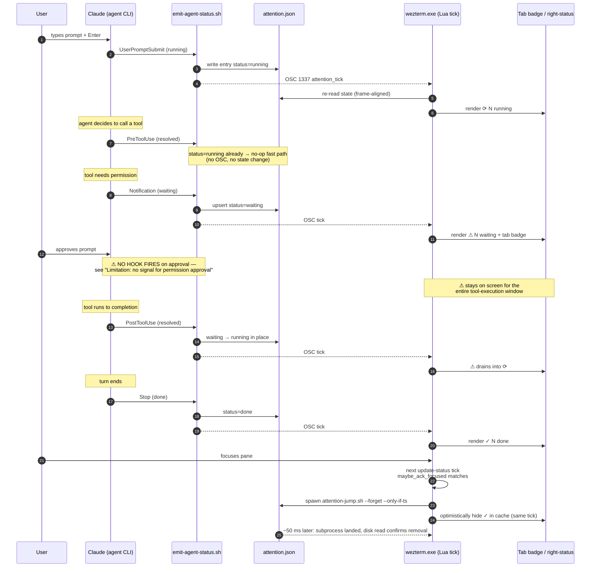
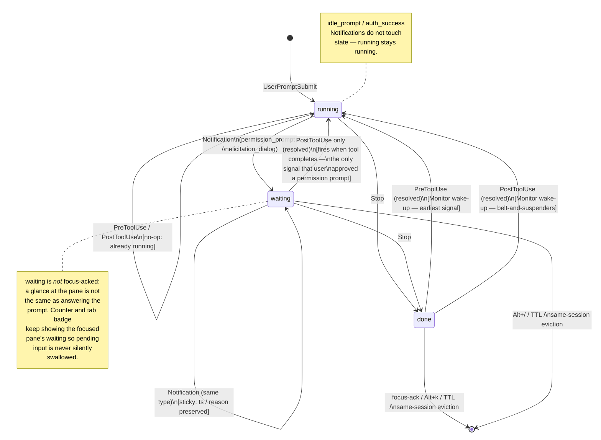
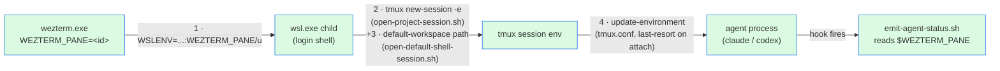

# Agent Attention

Use this doc when you need anything about the agent-attention pipeline: shared state file, Claude / Codex hook install or upgrade, status transitions, rendering, the keyboard entry points (`Alt+j` / `Alt+k` / `Alt+l` / `Alt+Shift+l` / `Alt+/`), focus-based auto-ack, or provider integration.

The high-level layering (hooks → shared JSON → OSC tick → Lua render) is summarised in [`architecture.md#interaction-layers`](./architecture.md#interaction-layers); this doc owns the implementation detail.

## Hook installation

The agent-attention feature expects agent CLI lifecycle hooks to call a provider adapter. Adapters under `scripts/runtime/agent-attention/adapters/` normalize provider payloads into the shared emitter at `scripts/runtime/agent-attention/emit.sh`, which is keyboard-first: when it runs it only decorates the pane, so installing it globally is safe and a no-op in non-WezTerm terminals. The legacy Claude path `scripts/claude-hooks/emit-agent-status.sh` remains as a compatibility wrapper around the Claude adapter.

> **Upgrading from an earlier version of this doc** — the hook argument for `UserPromptSubmit` changed from `cleared` to `running`. If your existing `~/.claude/settings.json` still points at `... emit-agent-status.sh cleared`, swap it for `running`. Claude Code re-reads `settings.json` on every hook firing, so the change takes effect on the next event (send a fresh prompt to exercise `UserPromptSubmit`) — no Claude restart needed. Use the verification command at the bottom of this section to confirm the new command is firing.

> **Upgrading from a four-hook install** — a fifth hook, `SessionStart` with `matcher: "clear"`, was added to drop the discarded session's `running` entry when the user runs `/clear`. Without it, the ⟳ counter stays stuck for up to 30 minutes (or until the next `UserPromptSubmit` on the same tmux session triggers same-session eviction). Merge the `SessionStart` block from the template below; no Claude restart needed. To confirm it is wired, run `/clear` in a pane that currently shows a ⟳, and watch the badge drop within one WezTerm status tick.

> **Upgrading from a five-hook install** — a sixth hook, `PreToolUse → resolved`, was added to cover the **Monitor wake-up** path. After a prior turn's `Stop` writes `done`, an async event on a streaming Monitor subscription can wake the agent and its first tool call (auto-allowed, no `UserPromptSubmit`) needs to flip `done → running` so the counter reflects that Claude is mid-turn again. `PreToolUse` fires when the agent decides to call a tool, *before* any permission prompt or tool execution, so the wake-up flip lands sooner than waiting for `PostToolUse`. Merge the `PreToolUse` block from the template below; no Claude restart needed. To confirm, trigger an async Monitor event after a prior `Stop` (or run `scripts/dev/test-agent-attention.sh` and watch the `done → running` case pass) and watch the `done` entry flip back to `⟳` on the next tool call.
>
> **Correction (2026-04-27)** — earlier wording in this doc claimed `PreToolUse → resolved` would also flip `waiting → running` "the moment the approve keystroke lands". That was wrong. Per the [official Claude Code hook docs](https://code.claude.com/docs/en/hooks.md), `PreToolUse` fires **once, before** the permission prompt appears — there is *no* hook event when the user clicks Yes on a `permission_prompt`. The only signal that the user actually approved is `PostToolUse`, which fires only after the tool finishes executing. Consequence: for an approved Bash that runs for minutes, the badge stays on `⚠ waiting` (with the original "needs your permission" reason) for the entire execution window, until `PostToolUse → resolved` lands. See [*Limitation: no signal for permission approval*](#limitation-no-signal-for-permission-approval) below.

> **Upgrading: closing the agent-side git-status lag** — `PostToolUse` and `Stop` each now carry a second hook entry that backgrounds `tmux-status-refresh.sh --force --refresh-client`. This is the agent-side counterpart to the shell prompt hook described in [`setup.md#tmux-status-prompt-hook`](./setup.md#tmux-status-prompt-hook): without it, file edits driven by Claude (Edit / Write / Bash `git …`) only show up in the tmux status segment after the 30s poll. The `tmux-status-refresh.sh` script's own `@tmux_status_force_debounce` (default 2s) absorbs PostToolUse spam, so high-frequency tool calls do not stampede git/node probes. Merge both new entries from the template below; no Claude restart needed. To confirm, send a prompt that runs `git status` or edits a tracked file and watch the tmux status segment update within a tick instead of after 30s.

### Claude install / update

Merge the block below into the `hooks` section of `~/.claude/settings.json` (do not replace the file). Each hook event has one shell invocation:

```json
{
  "hooks": {
    "UserPromptSubmit": [
      {
        "hooks": [
          { "type": "command", "command": "/home/yuns/github/wezterm-config/scripts/claude-hooks/emit-agent-status.sh running" }
        ]
      }
    ],
    "Notification": [
      {
        "hooks": [
          { "type": "command", "command": "/home/yuns/github/wezterm-config/scripts/claude-hooks/emit-agent-status.sh waiting" }
        ]
      }
    ],
    "Stop": [
      {
        "hooks": [
          { "type": "command", "command": "/home/yuns/github/wezterm-config/scripts/claude-hooks/emit-agent-status.sh done" },
          { "type": "command", "command": "bash /home/yuns/github/wezterm-config/scripts/runtime/tmux-status-refresh.sh --force --refresh-client >/dev/null 2>&1 &" }
        ]
      }
    ],
    "PreToolUse": [
      {
        "hooks": [
          { "type": "command", "command": "/home/yuns/github/wezterm-config/scripts/claude-hooks/emit-agent-status.sh resolved" }
        ]
      }
    ],
    "PostToolUse": [
      {
        "hooks": [
          { "type": "command", "command": "/home/yuns/github/wezterm-config/scripts/claude-hooks/emit-agent-status.sh resolved" },
          { "type": "command", "command": "bash /home/yuns/github/wezterm-config/scripts/runtime/tmux-status-refresh.sh --force --refresh-client >/dev/null 2>&1 &" }
        ]
      }
    ],
    "SessionStart": [
      {
        "matcher": "clear",
        "hooks": [
          { "type": "command", "command": "/home/yuns/github/wezterm-config/scripts/claude-hooks/emit-agent-status.sh pane-evict" }
        ]
      }
    ]
  }
}
```

Substitute the absolute path for your clone if different. `jq` is optional — with it, the hook reads `.session_id` / `.sessionId` from the piped hook payload and extracts `.message` / `.stop_reason` / `.stopReason` / `.prompt` as the state entry's `reason`; without it, the hook still writes the entry but keys it to `pane:<WEZTERM_PANE>` and uses canned per-status labels. There is no Windows dependency; the hook publishes an `attention.tick` event through the [event bus](./event-bus.md) (OSC `we_attention_tick` when `/dev/tty` is a regular pane).

### What each hook does

- `UserPromptSubmit → running` lights the `⟳ N running` counter the moment a turn begins so the user can see at a glance which panes are mid-turn.
- `Notification → waiting` raises the `⚠ N waiting` counter **only** for an allowlisted user-action type: `permission_prompt`, `elicitation_dialog`, or Grok's `approval_required`. Everything else on the Notification path is ignored — including empty `notification_type`, Claude's `idle_prompt` / `auth_success`, and Grok's `turn_complete` / `task_complete` / `session_ready`. Stop owns turn-end (`done`); idle is not a turn-end signal (a Monitor subscription can stay mid-turn while idle). Sticky: a second `waiting` on a session whose current status is already `waiting` is a no-op, so repeated prompts inside one turn do not oscillate the counter.
- `Stop → done` flips the entry to `done` when the turn ends, so the `✓ N done` counter surfaces work that finished while you were elsewhere. The companion `tmux-status-refresh.sh --force --refresh-client` invocation forces a final tmux status repaint so any git/branch state the turn touched lands within a tick instead of waiting on the 30s poll.
- `PreToolUse → resolved` covers the **Monitor wake-up** path: after a prior turn's `Stop` wrote `done`, an async event delivered to a streaming Monitor subscription can wake the agent, and its first tool call needs to flip `done → running` so the counter reflects that Claude is mid-turn again. `PreToolUse` fires once when the agent decides to call a tool — *before* any permission prompt and *before* tool execution — so this is the earliest signal we have for "agent woke up". For the auto-allowed common case where the entry is already `running`, the hook short-circuits via the fast path (`running` is a no-op) and emits a single `hook resolved no-op` log line for the diagnostics trail. **Note**: `PreToolUse` does *not* signal "user approved a permission prompt" — see *Limitation: no signal for permission approval* below.
- `PostToolUse → resolved` is the only signal that flips `waiting → running` after the user has approved a permission prompt. The hook fires when the tool **completes**, not when it starts, so the badge stays on `⚠ waiting` for the entire tool-execution window — milliseconds for fast tools, minutes for long Bash. It also serves as a belt-and-suspenders for the Monitor wake-up `done → running` flip (PreToolUse usually beats it; the redundancy is free because the second firing short-circuits on `running`). The companion `tmux-status-refresh.sh --force --refresh-client` invocation forces tmux to recompute the status segment after each tool call so file edits / `git` Bash calls reflect immediately; PostToolUse spam is absorbed by the script's 2s `@tmux_status_force_debounce` window.
- `SessionStart (matcher: "clear") → pane-evict` drops every entry on the current `(tmux_socket, tmux_session, tmux_pane)` when the user runs `/clear`. Without this hook, the discarded session's `running` entry has no mechanism of its own to leave state.json — `/clear` does not fire `Stop` and the session_id resets, so the stale `⟳` sits until the 30-minute TTL or until the next `UserPromptSubmit` on the same pane triggers same-pane eviction. Eviction keys on `tmux_pane` (the firing pane), not the broader `tmux_session`, because split-pane setups can host more than one Claude in the same tmux session — keying on session alone caused `/clear` in pane B to silently archive pane A's still-live entry. tmux pane ids (`%N`) are server-internal monotonic identifiers that survive split-window / swap-pane / break-pane (only true pane destruction recycles them), so they are stable enough to be the key. The matcher is scoped to `clear` so `startup` / `resume` / `compact` SessionStart variants do not touch session state.

Without `UserPromptSubmit → running` the `⟳ running` counter will never light up. Without `PreToolUse → resolved` the Monitor wake-up `done → running` flip waits for the slower `PostToolUse` (which fires only after the tool finishes). Without `PostToolUse → resolved` an approved `waiting` will *never* clear via the resolved path — only `Stop`, `Alt+/`, TTL, or same-session eviction would eventually drop it; the user would see a permanent `⚠` for the rest of the turn. Without `SessionStart → pane-evict`, `/clear` mid-turn will leave a stuck `⟳` for minutes.

### After editing settings.json

Claude Code re-reads `settings.json` on each hook firing, so an edit takes effect immediately — no Claude restart is required. Exercise the new hook by sending a prompt in each Claude pane, then verify from a WSL shell:

```bash
tail -200 ~/.local/state/wezterm-runtime/logs/runtime.log \
  | grep -a 'status="running"' \
  | sed -n 's/.*session_id="\([^"]*\)".*/\1/p' \
  | sort -u
```

You should see one UUID per active pane. If the list only shows `pane:<N>` entries (the script's fallback key when no Claude payload is piped in) or is empty, the `running` hook is not wired — double-check `~/.claude/settings.json` points at `... emit-agent-status.sh running` (not `cleared`) and that the hook script is executable.

#### Latency probe — investigating "status counter lags the visible prompt"

**Use this procedure whenever the status bar counter (`⚠ N waiting`, `✓ N done`, `⟳ N running`) is observably behind the visible UI by more than a frame.** It is the canonical diagnostic for "I see the permission prompt but the counter doesn't update for N seconds" and similar flavors.

Every hook invocation now writes:

- `entry_ts_ms` — captured at the very first line of the script, before any `case`/jq/tmux work. Closest available proxy for "hook handler entered".
- `elapsed_ms` — `entry → emit` in-script latency (jq + flock + git + DCS write). Healthy < 200 ms.
- `notification_type` — passed through from the hook payload so you can tell which `Notification` flavor fired (`permission_prompt`, `idle_prompt`, `auth_success`, …).

Two previously-silent paths now log so the hook-fire trail is complete:

- `notification ignored` — the `Notification → waiting` hook fired but the type was not on the waiting whitelist (empty type, `idle_prompt`, `auth_success`, `turn_complete`, …), so state was untouched. Use this to confirm the hook fired without a false ⚠, and to distinguish real permission prompts from Grok turn-complete toasts.
- `hook resolved no-op` — `PreToolUse` / `PostToolUse → resolved` fired on an entry that was already `running` (the common auto-allowed-tool fast path) or could not transition (e.g. the entry was missing and metadata was insufficient to upsert), so no OSC tick was emitted by design. PreToolUse fires before every tool call and almost always lands on a `running` entry, so this line is the dominant source of `attention` log volume — that is expected.

The Lua side's `tick received` log gains:

- `latency_ms` — gap between the shell-side OSC emit (`tick_ms`) and WezTerm dispatching `user-var-changed`. Subject to WSL/Windows clock skew, so treat sub-100 ms (including small negatives) as noise; signal is seconds-scale spikes.

A diagnostic-only `tick echo received` line also lands per OSC emit. The hook drops a sidecar `attention.tick.echo` via the file transport whenever the primary `attention.tick` picked OSC (see [event-bus.md](./event-bus.md) for the registration). Both lines carry the same `value=$tick_ms`, so pairing them disambiguates a missing OSC arrival: hook log present + `tick echo received` present + `tick received` absent ⇒ OSC was lost on the way (hook tty write → tmux DCS pass-through → wezterm user-var dispatch), not the hook itself. The handler logs only — it does **not** call `reload_state` — so an OSC drop still produces the user-visible "stale right-status / Alt+/ picker" symptom while you investigate.

##### One-shot waterfall

`scripts/dev/attention-latency-probe.sh` joins the WSL `runtime.log` and the Windows `wezterm.log` on `tick_ms` and prints a per-event waterfall with anomaly flags:

```bash
scripts/dev/attention-latency-probe.sh                  # last 20 events
scripts/dev/attention-latency-probe.sh --status waiting # waiting only
scripts/dev/attention-latency-probe.sh --pane %2        # one tmux pane
```

Anomaly markers:

- `⚠INSCRIPT>Nms` — in-script work was slow (> 200 ms; jq / flock / git contention).
- `⚠TICK>Nms` — OSC delivery (hook → wezterm) was slow (> 500 ms).
- `✗NO_TICK` — wezterm never logged a `tick received` for this emit's `tick_ms`. Fast path lost (DCS passthrough drop, wezterm event-loop stalled, tmux backpressure). Renderer falls back to the 250 ms periodic `update-status` tick — still works, just not within a frame.

##### Standing repro for the parallel-waiting issue

1. Open two tmux panes both running Claude in this repo.
2. In pane A, ask Claude to run a Bash command that needs permission.
3. While the prompt is up, in pane B, do the same.
4. Note wallclock when each visual prompt appears.
5. Note wallclock when the `⚠ N waiting` counter ticks `0 → 1 → 2`.
6. Run `scripts/dev/attention-latency-probe.sh --status waiting --last 10`.

Decision tree:

- **`entry_ts` lags noted UI wallclock by seconds** → upstream of us; Claude Code fired the `Notification` hook late. Nothing to fix in this repo. Confirm by checking whether the row was tagged `notification ignored` (Claude fired with `idle_prompt` first, only later with `permission_prompt`).
- **`entry_ts` matches the UI but `cross` (`latency_ms`) is seconds** → OSC pipeline. Look for tmux DCS drops, wezterm event-loop stalls, or `✗NO_TICK` rows that fell back to the periodic tick.
- **Both are tight but the counter still doesn't update** → renderer side. Check `render_status` log lines on the wezterm side — `attention.collect()` may be returning an unexpected list (TTL prune timing, focused-pane filter, sticky-waiting interaction, unreachable/paneless-orphan filter — see *Stale-entry recovery*).
- **Counter and `Alt+/` overlay disagree** (badge counts more than the picker lists, and `Alt+k` finds nothing) → the two surfaces are computing reachability differently. Both must agree by construction: badge counts come from `collect_buckets`→`entry_has_live_target`, picker rows/counts from `compute_picker_data`→`entry_reachable`. The classic cause is paneless-orphan entries (empty `tmux_session` + empty `wezterm_pane_id`) counted by one path but not the other — see *Stale-entry recovery*.

### Codex install / update

Codex now exposes lifecycle hooks in `~/.codex/hooks.json` or inline `[hooks]` tables in `~/.codex/config.toml` / project `.codex/config.toml`. The relevant events map cleanly onto the existing attention state machine: `UserPromptSubmit → running`, `PermissionRequest → waiting`, `Stop → done`, `PreToolUse` / `PostToolUse → resolved`, and `SessionStart` with matcher `clear → pane-evict`.

Use the template at `scripts/runtime/agent-attention/install/codex-hooks.json`, or merge this block into user-level `~/.codex/hooks.json`. Prefer the user-level file for this machine: project-local `.codex/hooks.json` only applies after that project layer is trusted, while the attention counter is a terminal-wide operator surface.

```json
{
  "hooks": {
    "UserPromptSubmit": [
      {
        "hooks": [
          { "type": "command", "command": "/home/yuns/github/wezterm-config/scripts/runtime/agent-attention/adapters/codex.sh running" }
        ]
      }
    ],
    "PermissionRequest": [
      {
        "hooks": [
          { "type": "command", "command": "/home/yuns/github/wezterm-config/scripts/runtime/agent-attention/adapters/codex.sh waiting" }
        ]
      }
    ],
    "Stop": [
      {
        "hooks": [
          { "type": "command", "command": "/home/yuns/github/wezterm-config/scripts/runtime/agent-attention/adapters/codex.sh done" },
          { "type": "command", "command": "bash /home/yuns/github/wezterm-config/scripts/runtime/tmux-status-refresh.sh --force --refresh-client >/dev/null 2>&1 &" }
        ]
      }
    ],
    "PreToolUse": [
      {
        "hooks": [
          { "type": "command", "command": "/home/yuns/github/wezterm-config/scripts/runtime/agent-attention/adapters/codex.sh resolved" }
        ]
      }
    ],
    "PostToolUse": [
      {
        "hooks": [
          { "type": "command", "command": "/home/yuns/github/wezterm-config/scripts/runtime/agent-attention/adapters/codex.sh resolved" },
          { "type": "command", "command": "bash /home/yuns/github/wezterm-config/scripts/runtime/tmux-status-refresh.sh --force --refresh-client >/dev/null 2>&1 &" }
        ]
      }
    ],
    "SessionStart": [
      {
        "matcher": "clear",
        "hooks": [
          { "type": "command", "command": "/home/yuns/github/wezterm-config/scripts/runtime/agent-attention/adapters/codex.sh pane-evict" }
        ]
      }
    ]
  }
}
```

After editing Codex hook config, start a new Codex thread or restart the current Codex pane, then run `/hooks` in Codex and trust the new command hooks. Codex loads project-local hooks only when the project `.codex/` layer is trusted; user-level hooks remain independent of project trust.

Codex adapter identity resolution currently accepts `.thread_id`, `.threadId`, `.session_id`, and `.sessionId`, falling back to `pane:<WEZTERM_PANE>` when the hook payload lacks a stable id. The fallback is acceptable for the hybrid-wsl one-agent-per-pane layout, but mixing multiple agent CLIs in one WezTerm pane is not supported.

When `~/.codex/config.toml` or the active project `.codex/config.toml` sets `approvals_reviewer = "auto_review"`, the Codex adapter treats `PermissionRequest` as reviewer-owned and maps it to `resolved` instead of `waiting`. Auto-review means there is no human prompt for `Alt+j` to handle; `PostToolUse` / `Stop` still publish the real follow-up state. Set `WEZTERM_ATTENTION_CODEX_AUTO_REVIEW_WAITING=off` to force the older behavior for diagnosis.

Unlike the Claude path, Codex `PermissionRequest` does not currently spawn `attention-prompt-watcher.sh`; in manual approval mode it stays `waiting` until `PostToolUse` / `Stop` unless a future Codex-specific prompt anchor is verified.

### Grok (Claude-compat hooks)

Grok discovers hooks from `~/.grok/hooks/*.json` **and**, by default, from Claude/Cursor settings (`~/.claude/settings.json`, etc. — see Grok's hooks guide). There is no separate `adapters/grok.sh` today: when Grok loads the Claude install block above, the same `emit-agent-status.sh` / `adapters/claude.sh` path runs.

That compatibility path caused a false `⚠ waiting` after successful turns:

1. Grok fires `Stop` → adapter writes `done` (correct).
2. Grok later fires `Notification` for terminal toast events such as `turn_complete` (message often `"Turn complete"`). Claude's hook command is still `… waiting`.
3. Grok payloads frequently use **camelCase** (`sessionId`, `hookEventName`, `notificationType`) and may omit Claude's `notification_type`. The old emitter only ignored `idle_prompt` / `auth_success` when `notification_type` was non-empty — **empty type fell through** and upserted `waiting`, overwriting the prior `done`.

Mitigations in this repo (no Grok config change required):

| Layer | Behavior |
|---|---|
| `adapters/claude.sh` | Reads snake_case **and** camelCase id/event/type fields; sets `provider=grok` when the payload is camelCase-only or `GROK_*` env is present (log separation). |
| `emit.sh` waiting gate | **Whitelist** on the Notification path: only `permission_prompt` / `elicitation_dialog` / `approval_required` raise ⚠. Empty type, `turn_complete`, `idle_prompt`, etc. log `notification ignored` and leave state alone. Non-Notification waiting (Codex `PermissionRequest`, `test-agent-attention.sh waiting`) still works. Completion-like reasons (`Turn complete`) are also rejected when they arrive without an allowlisted type (legacy unparsed path). |

Optional: install a dedicated `~/.grok/hooks/*.json` that maps only `approval_required` to waiting, or set `[compat.claude] hooks = false` in `~/.grok/config.toml` if you do not want Grok to share Claude hooks at all. The whitelist above keeps the shared Claude install safe either way.

#### Grok elicitation vs PostToolUse

`elicitation_dialog` (Grok Ask / `ask_user_question`) correctly raises `⚠ waiting`, but Grok then fires `PostToolUse → resolved` about **150–250 ms later while the Ask dialog is still on screen** (measured: 17 of 23 elicitation upserts were cleared this way). Treating that like Claude's permission `PostToolUse` ("user answered, tool finished") made `Alt+/` / `Alt+j` / the right-status `▲ waiting` counter go empty even though the pane still showed `Waiting on answers for …`.

Mitigation (no Grok config change):

| Layer | Behavior |
|---|---|
| `attention.json` entry | Waiting upserts store `waiting_kind` (`permission_prompt` / `elicitation_dialog` / `approval_required`). |
| `attention_state_transition_to_running` | Refuses to flip `waiting_kind=elicitation_dialog` unless `force=1`. Permission / legacy (no kind) still clear via PostToolUse. |
| `emit.sh` resolved | Logs `resolved skipped elicitation waiting` and exits without OSC when that kind is live. |
| `attention-prompt-watcher.sh` | Also spawned for `elicitation_dialog` / `approval_required` (not only Claude `permission_prompt`); Grok Ask anchors (`Waiting on answers for`, `Enter:submit`, `Tab:next answer`, `Shift+x:dismiss`) join the Claude footers; flips with `force=1` once the dialog leaves the pane. |

Clearance paths for elicitation waiting: watcher (dialog gone), `Stop → done`, next `UserPromptSubmit → running`, `Alt+/` dismiss, TTL. Not PostToolUse.

Regression coverage: `tests/hook-units/test_agent_attention_adapters.sh` (Grok camelCase session id, turn_complete must not overwrite `done`, `approval_required` still waits, elicitation sticky against resolved) and `tests/hook-units/test_lifecycle.sh` case 6c.

## End-to-end walkthrough

One full turn — prompt submitted, permission asked + approved, tool runs, turn ends, user re-focuses the pane — exercises every hook, both writes to `attention.json`, the OSC 1337 nudge channel, and the focus-based auto-ack. The diagram below walks one such turn step by step. State diagram (every transition the state machine accepts, regardless of order) lives further down under [*Hook → status map*](#hook--status-map).


```mermaid
sequenceDiagram
  autonumber
  participant U as User
  participant C as Claude (agent CLI)
  participant H as emit-agent-status.sh
  participant J as attention.json
  participant W as wezterm.exe (Lua tick)
  participant B as Tab badge / right-status

  U->>C: types prompt + Enter
  C->>H: UserPromptSubmit  (running)
  H->>J: write entry status=running
  H-->>W: OSC 1337 attention_tick
  W->>J: re-read state (frame-aligned)
  W->>B: render ⟳ N running

  Note over C: agent decides to call a tool
  C->>H: PreToolUse  (resolved)
  Note over H,J: status=running already → no-op fast path<br/>(no OSC, no state change)

  Note over C: tool needs permission
  C->>H: Notification  (waiting)
  H->>J: upsert status=waiting
  H-->>W: OSC tick
  W->>B: render ⚠ N waiting + tab badge

  U->>C: approves prompt
  Note over C,H: ⚠ NO HOOK FIRES on approval —<br/>see "Limitation: no signal for permission approval"
  Note over W,B: ⚠ stays on screen for the<br/>entire tool-execution window

  Note over C: tool runs to completion
  C->>H: PostToolUse  (resolved)
  H->>J: waiting → running in place
  H-->>W: OSC tick
  W->>B: ⚠ drains into ⟳

  Note over C: turn ends
  C->>H: Stop  (done)
  H->>J: status=done
  H-->>W: OSC tick
  W->>B: render ✓ N done

  U->>W: focuses pane
  W->>W: next update-status tick<br/>maybe_ack_focused matches
  W->>J: spawn attention-jump.sh --forget --only-if-ts
  W->>B: optimistically hide ✓ in cache (same tick)
  J-->>W: ~50 ms later: subprocess landed, disk read confirms removal
```

Edge legend: solid arrows = synchronous bash/Lua calls or in-process state mutations; dashed arrows = OSC 1337 nudges across the WSL ⇄ Windows boundary; the `J-->>W` final hop is the dedup-map invalidation after the async `--forget` write completes.

Two non-obvious properties this picture makes visible:

- **There is a gap with no hook coverage between user approval and tool completion.** Claude Code does not expose a hook for "user clicked Yes on permission_prompt". `PreToolUse` already fired earlier (before the prompt), and `PostToolUse` fires only when the tool finishes. For a long-running approved Bash, this gap can be minutes long, during which the badge correctly says `⚠ waiting` (the agent *is* blocked, just on tool-completion rather than user input). See [*Limitation: no signal for permission approval*](#limitation-no-signal-for-permission-approval) for the full rationale.
- **Focus-based auto-ack does the optimistic hide before the disk write lands.** The user perceives the `✓` counter dropping in the same tick as their focus change, even though the actual subprocess takes ~50 ms. The `--only-if-ts` guard keeps a fresh entry that landed during that window from being wiped — the guard is what makes the optimism safe.

## State file

State lives in a shared JSON file at `$runtime_state_dir/state/agent-attention/attention.json`. Two top-level fields:

- `entries` — the active set, keyed by the provider session/thread id when available and by `pane:<WEZTERM_PANE>` otherwise. Each entry stores `wezterm_pane_id`, tmux `socket`/`session`/`window`/`pane`, a `status` of `running`, `waiting`, or `done`, a free-text `reason`, optional `waiting_kind` while status is `waiting` (`permission_prompt` / `elicitation_dialog` / `approval_required`), the `git_branch` captured at hook-fire time (resolved from provider project dir env → tmux `pane_current_path` → `$PWD`), and an epoch-ms `ts`. Writes are serialized by flock and land via atomic tmp-rename; entries older than 30 minutes are pruned on every write.
- `recent` — a tombstone array of entries that left `entries` via any exit path. Same fields as an entry plus `last_status` (the status the entry held when archived), `last_reason`, `live_ts` (the entry's `ts` at archive time), and `archived_ts`. Dedup key is `(tmux_socket, tmux_session, tmux_pane)` — one tombstone per pane, so repeated `/clear`s or restarts in the same pane collapse into a single newest entry. Cap is 50 entries; TTL is 7 days. The picker shows recent entries under the `○ RCNT` band so the user can jump back to a previously-active session even after the live entry is gone. See *Recent archive* below.

## Transitions

- `scripts/runtime/agent-attention/emit.sh` is the sole state writer. Provider adapters map lifecycle events to statuses: `UserPromptSubmit` → `running` (a turn has begun), `Stop` → `done`, `PreToolUse` and `PostToolUse` → `resolved` (both go through the same conditional transition: `waiting` and `done` flip to `running` in place, a missing entry is upserted as `running`, and `running` is a no-op — see *Resolved transitions to running* below), `SessionStart` with matcher `clear` → `pane-evict` (see *SessionStart pane eviction* below). Claude/Grok `Notification` uses a **waiting whitelist** on `notification_type` — only `permission_prompt` / `elicitation_dialog` / `approval_required` → `waiting`; empty type, `idle_prompt`, `auth_success`, `turn_complete`, and other completion/idle flavors exit without touching state (see *Grok (Claude-compat hooks)* above). Codex `PermissionRequest` maps to `waiting` in manual approval mode, but maps to `resolved` when `approvals_reviewer = "auto_review"` is active because the reviewer agent owns that approval path. This gives three orthogonal meanings: `running` = "agent is mid-turn", `waiting` = "agent is blocked on human input", `done` = "turn finished, awaiting next prompt". The test-only `cleared` action is an explicit remove used by `scripts/dev/test-agent-attention.sh`; it is never wired to a provider hook.
- *Why both `PreToolUse` and `PostToolUse` fire `resolved`.* The two hooks fire at different points in the tool-call lifecycle and cover *different* transitions, not the same transition twice:
  - **`PreToolUse`** fires once when the agent decides to call a tool — *before* any permission prompt and *before* the tool starts executing. Per the [official Claude Code hook docs](https://code.claude.com/docs/en/hooks.md), there is no second firing on user approval. Its only useful transition is `done → running` for the **Monitor wake-up** case (a streamed event landed after a prior `Stop`, the agent woke and called a tool — first signal we have for "back to mid-turn"). For the common path where the entry is already `running`, the hook short-circuits as a no-op.
  - **`PostToolUse`** fires when the tool **completes**. For `waiting_kind=permission_prompt` (and legacy waiting with no kind) this is the only signal that flips `waiting → running` after the user has approved — Claude Code does not expose a hook for the approval keystroke itself, so that waiting necessarily persists for the full tool-execution window. **`waiting_kind=elicitation_dialog` is exempt**: Grok fires PostToolUse while the Ask dialog is still visible, so resolved leaves elicitation waiting alone; the prompt watcher (force=1) / Stop / next UserPromptSubmit clear it instead (see [*Grok elicitation vs PostToolUse*](#grok-elicitation-vs-posttooluse)). PostToolUse also catches the Monitor wake-up `done → running` flip as a belt-and-suspenders (PreToolUse usually beats it; if PreToolUse already flipped the entry, PostToolUse sees `running` and short-circuits via the fast path without lock, OSC tick, or log line).
  - The two hooks are *not* redundant for the same transition — removing either one loses real coverage. See *What each hook does* above and [*Limitation: no signal for permission approval*](#limitation-no-signal-for-permission-approval) below.
- *Tmux race guard.* `emit-agent-status.sh` skips the upsert (silent early exit, no state write, no OSC tick) when `TMUX` is set but `tmux display-message -F '#{pane_id}'` returns an empty pane id — typical during `tmux respawn-pane` after `session.refresh-current-session`, where the new agent process can race tmux's pane re-binding and the hook fires while only `socket_path` is resolvable. Without the guard, the entry would persist with `tmux_window=""` / `tmux_pane=""`, the Alt+/ picker would render the row's `tmux_seg` as `?`, and because the entry is `running` (focus-ack only clears `done` / `waiting`) it would survive until the 30-minute TTL prune. The skip is scoped to status mutations (`running` / `waiting` / `done`); `resolved` / `cleared` / `pane-evict` housekeeping still runs. The next hook from this session (typically within seconds — UserPromptSubmit, Stop, or PostToolUse) sees a fully-bound tmux pane and writes a clean entry. Logged under `category="attention" message="hook skipped on tmux race"`.
- *Waiting is sticky.* Inside `attention_state_upsert`, a `waiting` upsert on a session whose current status is already `waiting` is a no-op — `ts`, `reason`, and tmux coordinates all stay at their first-waiting values. Only a non-waiting upsert (normally `running` or `done`) transitions the entry out. This prevents the counter from oscillating when Claude fires multiple permission prompts inside a single turn, and it keeps the 30-minute TTL clock anchored to when the session first blocked for input instead of to the most recent prompt. `running` and `done` are not sticky — repeated upserts refresh `ts` and `reason`.
- *SessionStart pane eviction.* `/clear` does **not** fire a `Stop` hook for the discarded session, so the pre-clear session's `running` entry has no mechanism of its own to transition out — it sits in `state.json` until the 30-minute TTL or until the next `UserPromptSubmit` on the same pane triggers the same-pane eviction in `attention_state_upsert`. If the user waits several minutes before typing the next prompt (or `/clear`s a done/waiting session), the counter stays stuck on the stale status the whole time. The `SessionStart` hook with `matcher: "clear"` fires `emit-agent-status.sh pane-evict`, which calls `attention_state_evict_session` to drop every entry on the current `(tmux_socket, tmux_session, tmux_pane)` except the new session_id from the payload. The exception is defensive — at SessionStart time the new session has no entry yet, but it guards against a race where a UserPromptSubmit lands between the hook firing and `evict_session` acquiring the flock. No new entry is written; the new session's own `UserPromptSubmit` will produce the next `running` write. **Why pane (not session)** — split-pane setups can host more than one Claude in the same tmux session (worktree pane plus an auxiliary task pane), and an earlier (socket, session)-keyed sweep silently archived a sibling pane's still-live entry whenever any one of them ran `/clear`. Pane ids (`%N`) are server-internal monotonic identifiers that survive split-window / swap-pane / break-pane (only true pane destruction recycles them, which already invalidates the row), so they are stable enough to be the eviction key. This hook is a no-op outside tmux (the helper short-circuits when tmux coords are empty), and is matcher-scoped to `clear` so `startup`/`resume`/`compact` SessionStart variants do not touch session state — ghost entries from a WezTerm restart still rely on TTL or `Alt+/`, matching the pre-existing story in *Stale-entry recovery* below.
- *Resolved transitions to running.* The `PostToolUse` hook fires `emit-agent-status.sh resolved`, which calls `attention_state_transition_to_running`. A completed tool is treated as evidence that Claude is mid-turn — either the user resolved a permission prompt (`waiting`), or an async event woke the agent after a prior `Stop` (`done`). Branches by current status: (a) `waiting` flips to `running` in place (status and `ts` update, tmux coordinates preserved, reason cleared); (b) `done` flips to `running` in place using the same in-place update — this is the Monitor wake-up path: a persistent Monitor subscription can deliver a streamed event after the prior turn's Stop, and Claude's first tool call on that wake-up is the signal to flip the counter back; (c) *missing* upserts a fresh `running` entry using the hook-side tmux/wezterm metadata — this covers the focus-ack path, where `maybe_ack_focused` forgets the `waiting` row within one 250 ms tick, so by the time `PostToolUse` fires there is nothing to flip; (d) `running` is a no-op so auto-allowed tools do not spam OSC ticks on every call. Denied permission (tool never runs) leaves the `waiting` entry in place; it clears on focus-ack, or on the next `Stop` / `UserPromptSubmit` / TTL. The shell-side fast path peeks at the state file without the flock and short-circuits only on `running` so the hot path stays cheap; `done` intentionally takes the lock so the Monitor wake-up can actually transition. When the hook returns no-op, `emit-agent-status.sh` skips the OSC tick and the `attention` log entry entirely.
- After every write the hook publishes an `attention.tick` event through the unified [event bus](./event-bus.md) (`wezterm_event_send "attention.tick" "$tick_ms"` from `emit-agent-status.sh`). The bus picks OSC because the hook runs in a regular tmux pane with a writable `/dev/tty`, so the on-the-wire form stays `OSC 1337 SetUserVar=we_attention_tick=<base64(ms)>` (tmux DCS-wrapped when inside tmux). `wezterm-x/lua/titles.lua` registers `event_bus.on("attention.tick", …)` rather than handling the OSC directly, so when upstream eventually fixes popup DCS pass-through the same handler will fire from either transport without code changes. On tick the handler reloads `state.json` and re-renders the right-status segment in the same call, so the counter repaints within a frame rather than waiting up to `status_update_interval` (250ms) for the next periodic tick. A second file-transport event `attention.tick.echo` (same `tick_ms`) ships alongside every OSC tick: it logs receipt, and when the paired primary OSC value never arrives within ~30s it also drives a fallback `reload_state` + `refresh_right_status` so the badge still catches up within ~250ms instead of stalling on `running`. The OSC primary is unreliable specifically on Stop hooks (claude-cli's end-of-turn redraw appears to swallow the DCS sequence — empirically only ~1/10 `done` OSC ticks land), and without the fallback the `running` badge stays stuck until some other session's tick happens to trigger a reload. Echo log lines carry `osc_dropped=0|1 fallback_reload=0|1` to preserve the OSC-drop diagnostic signal. `update-status` stays the fallback refresher and owns the periodic housekeeping (TTL prune, focus-based auto-ack, draining file-transport events). The hook writes a sender-side trace to `$WEZTERM_RUNTIME_LOG_FILE` under category `attention` (fields `status`, `session_id`, `wezterm_pane`, `tmux_*`, `osc_emitted`, `event_transport`, `tick_ms`) so the bus pipeline can be diagnosed by pairing with `tick received` entries in the WezTerm log.
- *Exit paths.* An entry leaves `entries` through one of these paths. Paths marked **[archived]** copy the departing entry into `recent[]` (see *Recent archive* below) before removing it from `entries`; paths without the marker drop the entry without archiving (rare — currently only same-session in-place transitions, which technically aren't exits at all):
  1. **30-minute TTL** at the next prune (write-time or periodic). **[archived]**
  2. **`Alt+/` clear-all sentinel** — wipes every entry. **[archived]** (the user is resetting active state, not erasing history.)
  3. **Same-session overwrite** — a fresh `Stop` or non-waiting `Notification` on the same `session_id` (a `waiting` upsert against an existing `waiting` is a no-op; see *Waiting is sticky* above). Not an exit — the slot is reused for the same agent's next state, so nothing is archived.
  4. **Same-pane eviction by a different `session_id`** — an upsert from a *different* `session_id` that lands on the same `(tmux_socket, tmux_session, tmux_pane)`. A tmux pane hosts at most one active attention entry, so restarting an agent inside the same pane (e.g. a fresh `claude` invocation, or `/clear` racing the next prompt) evicts the prior one instead of double-counting. tmux_pane is part of the key so multi-pane tmux sessions (split-pane Claude setups) do not cross-evict each other; pane ids `%N` are server-internal monotonic identifiers that survive split-window / swap-pane / break-pane and only change on true pane destruction. **[archived]**
  5. **Jump-to-done forget** — a successful `Alt+k` / `Alt+/` jump to a `done` entry immediately spawns `attention-jump.sh --forget <session_id> --only-if-ts <ts>`. The `--only-if-ts` guard keeps a fresher `done` that reused the same `session_id` during the ~50 ms subprocess window from being wiped. **[archived]**
  6. **Periodic background prune** — see *Periodic cleanup* below. **[archived]** (shares the TTL prune helper.)
  7. **Focus-based auto-ack** — `done` only (`waiting` is intentionally excluded so a glance does not silently swallow a pending prompt). Uses the same `--forget` with `--only-if-ts` guard, gated by the `DONE_VISIBILITY_FLOOR_MS` window so the badge actually renders before it archives. See *Rendering* below. **[archived]**
  8. **Test-only `cleared`** — `scripts/dev/test-agent-attention.sh cleared` or the `--clear-all` sentinel; never wired to a provider hook. **[archived]** (cleared goes through the same remove path as `--forget`.)
  9. **`pane-evict` on `/clear`** — `SessionStart` with `matcher: "clear"` wipes every entry on the current `(tmux_socket, tmux_session, tmux_pane)` except the new `session_id`. See *SessionStart pane eviction* above. **[archived]**
  10. **Overflow rotation forget** — when the overflow tab's pane stops hosting `prev_session` (Alt+x picks a different session, workspace re-attach lands on a new session), the `tab.activate_overflow` event handler in `wezterm-x/lua/titles.lua` calls `attention.forget_by_tmux_session(prev_session)`. Without this, attention entries on `prev_session` sit in `entries` even though no wezterm pane is hosting them anymore — they would dangle until the 30-minute TTL or until the user finds and `Alt+j` / `Alt+/`-acks them by hand. The forget runs in the same tick as the rotation. **[archived]**
  11. **Reachability sweep on snapshot tick** — `write_live_snapshot` walks `state_cache.entries` and archives every `done` / `waiting` entry whose `tmux_session` has no wezterm host in the current `panes_map` / `sessions_map`. Catches every "slot stops hosting" path that doesn't go through `tab.activate_overflow` (spawn-cap eviction, workspace close, refresh-session). `running` is exempt — the agent may legitimately be in flight on a session whose host is just temporarily unmapped (e.g. one tick of overflow rotation before the map updates). Runs every `LIVE_SNAPSHOT_INTERVAL_MS` (1s). **[archived]**
  12. **Tmux `session-closed` hook** — `tmux.conf` registers `set-hook -ga session-closed` to spawn `attention-jump.sh --forget-session #{q:hook_session_name}`, which calls `attention_state_forget_session` and archives every entry on the dead tmux session. Zero-latency replacement for #11 when tmux can tell us the session is gone outright (kill-session, last client detach + destroy-unattached). #11 is the safety net for any path that destroys the host without notifying tmux. **[archived]**

  Note that the `resolved` transition (see *Resolved transitions to running* above) is **not** an exit path — it flips `waiting`/`done` to `running` in place (or upserts a fresh `running`) and the entry continues to occupy its slot until one of the paths above fires.
- *Recent archive.* Every exit path marked **[archived]** above pushes the departing entry onto `attention.json`'s top-level `recent[]` array via the shared `archive_into_recent` jq helper in `attention-state-lib.sh`. Each tombstone preserves the entry's tmux/wezterm coordinates plus `last_status` (the status held at archive time), `last_reason`, `live_ts` (the entry's `ts` at archive time), and `archived_ts`. Dedup key is `(tmux_socket, tmux_session, tmux_pane)` so repeated archives of the same pane (e.g. multiple `/clear`s in pane A, overflow rotation back-and-forth) collapse into the newest tombstone instead of accumulating one row per `session_id`, while sibling panes in the same tmux session each keep their own slot. An earlier (socket, session)-only key let one pane's archive silently overwrite another pane's history; pane ids `%N` are server-internal monotonic identifiers stable enough to be the third dimension. The picker is tmux-only (`Alt+/` short-circuits outside tmux), so any rows the hook writes from non-tmux contexts aren't jumpable — the recent-row keep-filter in `tmux-attention-menu.sh` drops them from display by requiring `tmux_socket`, `tmux_window`, and `tmux_pane` to all be non-empty *and* the pane to still be in the per-socket alive set (an unjumpable row would otherwise render as `?/?/?/<branch>` and dead-end on both the OSC payload — which short-circuits when socket/window are empty — and the `--session` fallback, which has no tmux coords to resolve). Newer `archived_ts` wins on collision; the array is capped at 50 entries (`ATTENTION_RECENT_CAP`) and TTL'd at 7 days (`ATTENTION_RECENT_TTL_MS`), enforced on every archive call so the array stays bounded even when the picker never opens. The `Alt+/` picker shows recent entries under a `○ RCNT` band after the live waiting/done/running rows; selecting one drops the file trigger described in *Picker dispatch* below, with `kind="recent"` and a re-resolved WezTerm pane id (the picker queries `tmux show-environment WEZTERM_PANE` on the target session before writing the trigger so the stored id, which is whatever was live at archive time, is replaced with the currently-live one — WezTerm reassigns pane ids on restart while tmux survives, and trusting the stored id would silently land the activate on a phantom). The Lua-side dispatch attempts the in-process mux activate; if the WezTerm pane is gone, `activated=false` shows up in the trigger jump log and the user sees the tmux side jump but the GUI not follow. As a separate safety net the picker also runs a cheap one-shot `tmux list-panes -a` per recent socket at popup-open time so dead recent rows are filtered out of display before the user can pick them, and the legacy `attention-jump.sh --recent --session <id> --archived-ts <ms>` path stays available as a fallback (it probes pane existence and removes the row from `recent[]` if dead).
- *Periodic cleanup.* `wezterm-x/lua/titles.lua`'s `update-status` handler calls `attention.maybe_prune()` on every tick. The call is self-throttled to `PRUNE_INTERVAL_MS = 60s`: at most once per minute it spawns `attention-jump.sh --prune --ttl 1800000` via `wezterm.background_child_process`, which runs the same shell-side TTL sweep as a hook write. Without this, entries from sessions that have gone idle for more than 30 minutes would sit in state.json indefinitely because the TTL prune only fires on writes, and the `--direct` fast path used by `Alt+j` / `Alt+k` / `Alt+l` does not write. The `attention.TTL_MS` constant in Lua mirrors the shell default so the display-time filter in `attention.collect()` / `attention.tab_badge()` hides aged entries immediately, before the next background prune physically removes them.

### Hook → status map


```mermaid
stateDiagram-v2
  [*] --> running: UserPromptSubmit
  running --> waiting: Notification\n(permission_prompt /\nelicitation_dialog)
  waiting --> waiting: Notification (same type)\n[sticky: ts / reason preserved]
  waiting --> running: PostToolUse only (resolved)\n[fires when tool completes —\nthe only signal that user\napproved a permission prompt]
  done --> running: PreToolUse (resolved)\n[Monitor wake-up — earliest signal]
  done --> running: PostToolUse (resolved)\n[Monitor wake-up — belt-and-suspenders]
  running --> done: Stop
  waiting --> done: Stop
  running --> running: PreToolUse / PostToolUse\n[no-op: already running]
  done --> [*]: focus-ack / Alt+k / TTL /\nsame-session eviction
  waiting --> [*]: Alt+/ / TTL /\nsame-session eviction
  note right of waiting
    waiting is *not* focus-acked:
    a glance at the pane is not
    the same as answering the
    prompt. Counter and tab badge
    keep showing the focused
    pane's waiting so pending
    input is never silently
    swallowed.
  end note
  note left of running
    idle_prompt / auth_success
    Notifications do not touch
    state — running stays running.
  end note
```

## Rendering

- `wezterm-x/lua/attention.lua` is render-only; it owns no mutation path. On `user-var-changed` for `attention_tick` (and as a fallback on every `update-status`) it re-parses state.json into an in-memory cache.
- A tab gets a badge whose color follows the **most recent** agent session hosted by that tab. A WezTerm tab hosts one tmux session = one **repo family**, and its tmux windows are that family's worktrees, so several agent sessions routinely land on the same tab; `tab_badge` picks exactly one — highest `ts`, regardless of status. The rejected alternative was status precedence first (`waiting` > `running` > `done`) with recency as the tiebreak: it survives the one case recency does not, a `waiting` that has sat unanswered for two minutes getting hidden the moment another worktree starts a turn. That case stays covered by the right-status `▲ N waiting` counter, `Alt+j`, and `Alt+/`, and "show the latest" is the stated intent for this surface, so recency wins; flipping back means ranking on `(status, ts)` instead of `ts` alone in `attention.tab_badge`. The badge renders by **recoloring the tab itself** — status background plus its matching text color, the same block pairing the right-status counters use. Tab colors resolve by priority: **focused > status > hover > inactive**. The focused tab always keeps the active pair and never wears a status: its background is the only thing saying which tab is focused (`use_fancy_tab_bar = false`), and the tab being looked at is the one whose status least needs announcing. Status outranks hover because the pointer is a secondary affordance in a keyboard-first strip and a status must not vanish under it. Nothing is added to the tab, so nothing about its width depends on whether a status is live. This replaced a prepended 1-cell `█` marker on 2026-08-19: a cell that exists only while a status is live re-flows the whole tab strip each time an agent starts or finishes a turn, and an agent flipping between `running` and `waiting` several times a minute made the titles twitch under the cursor. Reserving the cell on idle tabs also fixes the twitch but spends a column of every title on nothing; recoloring costs no width at all. Tinting only the foreground was tried in between and was too quiet to catch in peripheral vision, which is this surface's entire job. `attention.tab_badge` returns status alone — its `marker` field went away with the cell — and `attention.badge_colors` returns the block pair only; the `_glyph` slot belongs to the counter's leading mark, and the tab strip has no mark to tint. Note that `tab_badge`'s focus suppression (`waiting` / `done` hidden on the focused tab) no longer reaches the tab's color, since a focused tab is resolved before the badge is consulted; it still shapes what the render log reports. Naming the winning worktree in the title was built and reverted (2026-07-27): it ate the title's width budget at `tab_max_width = 24` and re-labeled the tab every time a different worktree became the newest. Which worktree it is belongs to `Alt+g`, which shows the whole family at once. Tab strip is dense, so this surface carries no glyph vocabulary at all and diverges from the right-status / picker set: amber for `waiting`, blue for `running`, green for `done` — Tailwind tokens described below — cyan focus, amber/green soft-action, sky ambient — so urgency and location separate them. Repo convention puts every WezTerm tab on a single pane (tmux owns splits), so all entries on a tab share one `wezterm_pane_id` and the active-pane filter is sufficient. The right-status segment renders three counters `▲ N waiting  ✓ N done  ● N running` unconditionally with one-cell gaps so the bar width stays stable. The glyphs are monochrome 1-cell text code points, not color emoji (swapped from `🚨` / `✅` / `🔄` on 2026-08-19): the neighbouring segments are typographic (`CDP·…`, `D·151G`, `M·88%`) and the emoji read as a foreign body next to them. Color still carries the status; the shape is what keeps the three slots apart once they all dim to zero. The same set is used by both pickers — `Alt+/` adds `○` recent, `◆` session-bridge watch, and `✕` for the clear-all sentinel (`native/picker/cmd_attention.go::coloredBadge`, mirrored in `scripts/runtime/tmux-attention/render.sh`). Change one surface and the other two have to move with it. The three counter glyphs are per-machine configurable through `attention.icons` in `wezterm-x/local/constants.lua` (`{ waiting = '▲', done = '✓', running = '●' }`; `''` renders that counter without a glyph, and a non-string value is ignored so a malformed override cannot paint `nil` into the bar). That key reaches the WezTerm surface only — the pickers hold their own copy and a machine that retunes the glyphs will read differently in `Alt+/`. The colors come from the palette instead (`tab_attention_{waiting,done,running}_{bg,fg}`), which the disk / memory warning states and the SB waiting state also read — retuning them moves all of those together. A third key per status, `tab_attention_{waiting,done,running}_glyph`, tints **only** the counter's leading mark so it separates from the near-black label sharing its block; it is a deeper shade of the block's own hue rather than a fourth color, because the mark has to read as part of the badge and not as a second status. **Palette policy (Tailwind-first).** Focus and the three attention statuses take their hexes from the [Tailwind default color palette](https://tailwindcss.com/docs/colors) — pick a named token (`cyan-500`, `amber-200`, …), then copy its published hex into `wezterm-x/lua/constants.lua` (and keep `appearance-presets.lua` / `local.example/constants.lua` in lockstep). Do **not** hand-mix OKLCh/RGB for these roles; the earlier equal-weight OKLCh ladder drifted and made mid-turn blue compete with focus. Shade carries weight: focus uses a saturated `*-500` chip; waiting/done/running use softer `*-200` fills with `*-900` label / `*-700` glyph text. Running stays on **sky** (not cyan) so it cannot be mistaken for the focused chip.

  | role | bg token | fg / glyph tokens | hex (bg) |
  | --- | --- | --- | --- |
  | focus (`tab_active_*`) | `cyan-500` / `white` | — | `#06b6d4` / `#ffffff` |
  | waiting | `amber-200` | `amber-900` / `amber-700` | `#fde68a` |
  | done | `green-200` | `green-900` / `green-700` | `#bbf7d0` |
  | running | `sky-200` | `sky-900` / `sky-700` | `#bae6fd` |

Reskin by swapping to another Tailwind token of the same role weight (e.g. focus → `cyan-600`, waiting → `amber-300`); keep the token name in the inline comment next to the hex so the next retune does not re-invent the source. This key is unique to the counters — nothing else reads it — and a palette that omits it falls back to `_fg`, rendering the counter exactly as it did before the split (2026-08-19). At zero the counter drops to `tab_bar_background` / `new_tab_fg` **including** the glyph: the dim state is meant to be quiet, and a mark still wearing its status color next to a `0` invites a double-take. Order leads with the action item (`▲`), followed by the recently-finished pile (`✓`), and ambient in-flight context (`●`) last. When a counter is zero, that slot dims to `tab_bar_background` / `new_tab_fg` at `Intensity = Normal` — the segment becomes visually quiet rather than disappearing, so locations in the status bar are predictable and the eye does not have to re-scan when a task completes.
- *Focused-pane behavior matrix.* The hook **and** the renderer apply the same focus-skip rule, so the badge / right-status / disk state stay coherent.

  | status   | unfocused pane                | focused pane                                           |
  | -------- | ----------------------------- | ------------------------------------------------------ |
  | running  | upserts, badge `● +1`        | **upserts, badge `● +1`** — informational counter, the user wants to see in-flight work even on the pane they are looking at |
  | waiting  | upserts, badge `▲ +1`        | hook focus-skips (no upsert) AND removes any prior entry for the same session_id; renderer also drops it from the count |
  | done     | upserts, badge `✓ +1`        | same as waiting — focus-skip + remove + render-drop  |

  "Focused" means **both** signals agree: the firing tmux pane is the active pane in its session (`tmux-focus/<safe_socket>__<safe_session>.txt`), AND the hook's `WEZTERM_PANE` equals the wezterm-side currently-focused pane id (`live-panes.json.focused_wezterm_pane_id`, written by `titles.lua`'s `window-focus-changed` handler). Either signal missing or disagreeing → fall through to the normal upsert (over-noticing beats under-noticing). On a focus-skipped waiting/done, the hook also fires an `attention.tick` event so the Lua state_cache reloads from disk in the same tick — without it the disk delete would not propagate to the badge until the next non-skipped hook fired.

  This makes "focus the pane = ack waiting/done for this session" a single rule across both surfaces, while keeping `running` visible everywhere.

  Inactive tabs and tabs whose tmux-focused pane differs from the entry's `tmux_pane` still show their full badge set, so multi-pane tmux sessions keep their per-pane precision. The tmux-focus lookups share a `tmux_focus_cache` that resets on every `reload_state`, so one render tick costs one file read per `(socket, session)` instead of one per entry.
- *Third consumer: the `Alt+g` worktree picker.* The tab badge answers "does this repo family need me", and `Alt+g` answers "which worktree". `scripts/runtime/tmux-worktree-menu.sh` reads `attention.json` directly (one `/mnt/c` read + one jq at prefetch time, ~4-5 ms measured on a keypress path — the wezterm tick side is untouched, so the cross-FS rule in [`performance.md`](./performance.md) is unaffected) and joins entries onto worktree rows by `tmux_window`: a tmux window **is** a worktree, so the join is exact. It reads the state file rather than the `live-panes.json` snapshot that `Alt+/` consumes because the state file is the source of truth rather than a derived 1 Hz snapshot; cost is the same either way. **Live `.entries` only** — the same input the tab badge and the right-status counters use, so an empty status cell on a worktree row means exactly what an absent badge means: nothing is pending there right now. The 30-minute TTL is applied in the jq so the picker cannot show an entry the Lua side already hides, and rows are sorted by status precedence so the first row seen for a window wins when split panes inside one worktree window produce more than one. Archived `recent[]` tombstones were joined here too between 2026-07-27 and later the same day, rendered as a dimmed `last ✓ 3m`; they were dropped because on-disk tombstones live for **7 days** (the 30-minute TTL governs `.entries` only), so worktrees kept advertising `last ● 4h` / `last ✓ 10h` long after every WezTerm surface had gone quiet — and `last:running` is not even a result, it means the record was evicted mid-run. Restoring them means re-adding the `recent[]` branch to the jq *plus* a short TTL of its own and a `last_status == "running"` filter; the Go side has a regression lock (`TestWorktreeArchivedStatusRendersNothing`) that must be updated in the same change. Row shape: [`tmux-ui.md`](./tmux-ui.md).
- Multi-agent within one WezTerm pane is supported: each agent has its own `session_id`, so entries never collide. The right-status counter reflects real tasks, not panes.
- *Focus-based auto-ack.* `attention.maybe_ack_focused(window, pane)` runs every `update-status` tick. Whenever the tick's active WezTerm pane matches the `wezterm_pane_id` of a live `done` entry **and** tmux-pane-level focus also matches, it spawns `attention-jump.sh --forget <session_id> --only-if-ts <ts>` with no grace delay *and* optimistically drops the entry from the in-memory cache in the same tick, so the `✓` counter and the tab badge clear immediately rather than waiting for the ~50 ms subprocess to land the write on disk. `attention.reload_state` re-applies the hide (via the `hidden_entries` map, keyed by `session_id` → `ts`) until the next disk read confirms the entry is gone or has been replaced by a fresh `ts`, which prevents a counter bounce while the subprocess is in flight.
  - *Visibility floor for done* (`DONE_VISIBILITY_FLOOR_MS = 1500`). When the entry has been `done` for less than the floor, focus-ack is deferred to a later tick. Without this, the chain Stop hook → `attention.tick.echo` fallback reload (because OSC drops on `done` are routine, see [`docs/event-bus.md`](./event-bus.md)) → next update-status tick can complete inside one frame on the focused pane and the badge never visibly renders the transition — the entry slides straight from `running` to `recent[]` and the user sees `○ RCNT` where they expected `✓ done`. `waiting` is exempt: it is an action item, not a knowledge signal, and gating it would only postpone the inevitable ack without buying any clarity.

  - *Why `done` AND `waiting` get acked, but not `running`.* The user spec ("focused 的 tmux pane 不触发 waiting 和 done 的加一操作") treats focusing the pane as the acknowledgement for action items. The earlier policy excluded `waiting` on the rationale "a glance is not an answer", but the spec was updated to include both — the hook focus-skip path on the next done/waiting also removes any prior entry for the same session_id, so a stale `running` from an earlier transition does not stay stuck even though `running` itself is never acked. `running` stays informational ("agent is doing something") because the user wants the counter even on the focused pane.

  - *Why `--only-if-ts` matters.* During the ~50 ms subprocess window a fresh entry (same `session_id`, new `ts`) could land via a hook; the guard keeps the subprocess from wiping it. `reload_state` seeing a mismatched `ts` then clears the hide so the fresh entry surfaces in the next render.

  - *Why the tmux-pane check is needed.* A WezTerm pane commonly hosts a whole tmux session, so WezTerm pane id alone cannot distinguish "user is looking at the agent pane" from "user has moved to another tmux pane inside the same session". Both must match before auto-ack fires.

  - *Where tmux focus comes from.* `scripts/runtime/tmux-focus-emit.sh` writes the active `pane_id` into `<state_dir>/state/agent-attention/tmux-focus/<safe_socket>__<safe_session>.txt` (no flock — each session owns its file). `tmux.conf` wires it onto two hooks: `after-select-pane` covers in-tmux pane switches, and `client-focus-in` covers wezterm-side tab or workspace switches (wezterm OSC focus-in to the tmux client fires it with `#{pane_id}` resolving to the client's currently-active pane). Without the client hook the focus file would freeze at the last in-tmux switch (Alt+1 / Alt+p land back on a tab whose wezterm pane never changed and whose tmux client never called select-pane), and `is_entry_focused` would miss the agent pane the user just landed on. `pane-focus-in` is intentionally not used: tmux 3.4 silently ignores `set-hook -g pane-focus-in` because the hook only exists in pane scope, so a global binding never lands on the server.

  - *Naming-key invariant.* Both sides of the focus file — the shell writer in `tmux-focus-emit.sh` and the Lua reader in `attention.cached_tmux_focus` — key the filename by `#{session_name}`, which is also what `emit-agent-status.sh` records as `tmux_session` in state.json. Using `#{session_id}` there instead would make `is_entry_focused` silently miss on every lookup because state entries carry the name, and that silent miss disables the focused-pane filter, the tab-badge suppression, and `maybe_ack_focused` all at once.

  - *Cost control.* Lua reads the focus file via a per-tick cache keyed by `(socket, session)`, so multiple candidate entries sharing the session cost one read. Each `(session_id, ts)` pair is scheduled at most once (dedup map is pruned against the live state), so the tick loop does not re-spawn the subprocess while focus stays put. On tmux-focus mismatch or missing focus file, the entry is skipped *and* dedup stays unset, so the next tick rechecks after the user's tmux pane switch fires `client-focus-in` / `after-select-pane` and the state file catches up. Entries without tmux coordinates (non-tmux panes, legacy rows) fall back to WezTerm-pane-only matching.

  - *Match by `tmux_session`, not `wezterm_pane_id`.* The hook records `wezterm_pane_id` from `$WEZTERM_PANE` at fire time, but a wezterm pane id is **mux-global and lifecycle-bound**: spawn-cap eviction, workspace close + reopen, refresh-session, and the overflow tab's switch-client rotation all change the pane id without changing the session identity. `is_entry_focused`, `activate_in_gui`, and `tab_badge` all resolve the focused wezterm pane to the tmux session it currently hosts (via `tab_visibility.session_for_pane`) and compare that to `entry.tmux_session`. One exception: the overflow placeholder (`…`) resolves in-memory only, because pane ids get recycled and the on-disk tier keeps answering for the tab that owned the id before — which put one agent's badge on two tabs at once; see [`tab-visibility.md`](./tab-visibility.md) *Recycled pane ids*. `wezterm_pane_id` on the entry remains as a hint (handy for diagnostics) but is not part of any matching decision.
    - **In-memory tier** of the pane→session map: `_G.__WEZTERM_PANE_TMUX_SESSION[pane_id] = session`, written by `spawn_overflow_tab` (initial browse session) and refreshed by `titles.lua`'s `tab.activate_overflow` event handler after each Alt+t pick. Covers the rotating overflow pane.
    - **On-disk tier**: `<state>/pane-session/<wezterm_pane_id>.txt` written by `scripts/runtime/open-project-session.sh` at managed-session creation. Covers visible managed tabs.
    - Reverse lookup (`tab_visibility.pane_for_session`) walks both tiers so `activate_in_gui` can find the wezterm pane currently hosting an entry's session, even when the entry's stored `wezterm_pane_id` points at a long-killed pane.
  - *All four jump entry points jump correctly through the same path.* `Alt+j` / `Alt+k` / `Alt+l` pass `opts.tmux_session` directly from the `attention.entries` row. The `Alt+/` picker payload appends the resolved tmux session as the trailing v1 field (`v1|jump|...|<session>` and `v1|recent|...|<session>`); both Go picker and bash-fallback producers resolve the name via `tmux -S <socket> display-message -t <window> '#S'`. Lua's `parse_jump_payload` is nil-tolerant — older payloads without the trailing field still parse, falling back to the literal `wezterm_pane_id` when the session hint is absent.

The full overflow-tab + spawn-cap layout that drives these stale-id cases is documented in [`docs/tab-visibility.md`](./tab-visibility.md).

## Keyboard

The four entry points share one rule: they require a tmux-backed pane, and outside tmux they show the standard `... is only available when the current pane is running tmux` toast (consistent with `Alt+v` / `Alt+g` / `Alt+o` / `Ctrl+k` / `Ctrl+Shift+P`).

- `Alt+j` / `Alt+k` / `Alt+l` / `Alt+Shift+l` are Lua `action_callback`s (not tmux forwarders). They call `attention.pick_next` on the current state (scoped to `waiting`, `done`, and `running` respectively; `Alt+Shift+l` is `running` with `opts.reverse`), then `attention.activate_in_gui` performs `SwitchToWorkspace` when needed, plus mux-level `tab:activate()` and `pane:activate()` so the target becomes visible even across WezTerm OS windows and workspaces. The tmux `select-window`/`select-pane` runs in the background via `scripts/runtime/attention-jump.sh --direct --tmux-socket … --tmux-window … [--tmux-pane …]` spawned through `wsl.exe` from Lua — the entry already carries the coordinates, so the fast path skips the state re-read, `jq` invocations, and the redundant `wezterm.exe cli activate-pane`. Entries without tmux coordinates (legacy / partial) fall back to `--session <id>`, which runs the full resolution path.
  - *`pick_next` filters by tmux pane, not wezterm pane, and walks the pool round-robin.* In this repo's split-pane layout a single wezterm pane commonly hosts a whole tmux session whose split panes have independent focus. Focused-slot detection delegates to `M.is_entry_focused`, which requires both the focused wezterm pane to host the entry's `tmux_session` AND the tmux client's active pane to match `entry.tmux_pane`. A sibling tmux pane in the same wezterm pane therefore stays a valid jump target. The earlier filter (`entry.wezterm_pane_id == current_pane_id`) treated every entry on the user's wezterm pane as "self" and silently dropped sibling-tmux-pane candidates — when the agent in the other split finished, Alt+k returned nil and the user had no keyboard path to it. Legacy / non-tmux entries (no `tmux_session`) keep the historical wezterm-pane comparison so they still cycle correctly. Order is oldest-`ts`-first; once the focused entry's index is known, the next press returns the following slot and wraps. The previous "return the first non-focused" scan ping-ponged between the two oldest whenever the pool had 3+ entries (from A→B, from B→A, never C). Coverage: `tests/lua-units/test_pick_next.lua` walks the multi-tmux-pane single-wezterm-pane topology, the 3-entry round-robin case, plus the cross-wezterm-pane and legacy-fallback regressions.
- After `activate_in_gui` succeeds on a `done` entry (via either `Alt+k` or `Alt+/`), the Lua side additionally spawns a background `attention-jump.sh --forget <session_id> --delay 3 --only-if-ts <ts>` as a safety-net cleanup. In practice the focus-based auto-ack described under *Rendering* fires first (on the next `update-status` tick after the jump lands) with the zero-delay path and the optimistic in-memory hide, so the counter drops almost immediately — the three-second delayed forget only matters if focus-ack never ran (for example, the user jumped away before the next tick). `waiting` entries are *not* auto-acked by focus: jumping with `Alt+j` lands on the prompt but does not clear the counter — the user must actually answer (the badge clears later, when the approved tool finishes and `PostToolUse → resolved` fires; if the user denies, the badge clears on the next `Stop` / `UserPromptSubmit` / TTL) or use `Alt+/` to dismiss explicitly. `running` entries are also never forgotten by a jump: `Alt+l` is an informational peek at in-flight work, and the `●` counter stays until the turn leaves `running` via a real status transition (`waiting` / `done` / eviction / TTL).
- `Alt+/` is a forwarded shortcut: the WezTerm `attention.overlay` handler first calls `attention.write_live_snapshot(constants.attention.live_panes_file)` so a fresh `pane_id → {workspace, tab_index, tab_title}` JSON is on disk at `state/agent-attention/live-panes.json` (atomic temp + rename, payload includes `ts` epoch ms), then forwards `\x1b/` to the tmux pane. The same writer is also re-fired on every `update-status` tick, throttled to one rewrite per `LIVE_SNAPSHOT_INTERVAL_MS` (1s by default — tracked via `last_live_snapshot_ms`, which both writers share so an Alt+/ press resets the throttle). The tick refresh is what makes the read side trivial: `tmux-attention-menu.sh` just `jq -c '.panes // {}'`s the file with no freshness gate and no trace adoption, because the producer side maintains the snapshot continuously rather than coupling it to the press. The earlier press-time-only design was racy across the WSL/Windows mount — `os.rename` was not always visible to the bash reader before the forwarded `\x1b/` reached tmux, and the menu would then read a multi-minute-old file, fail a 5-second freshness gate, and render every label as `?/?/`. Tmux's `M-/` binding runs `scripts/runtime/tmux-attention-menu.sh`, which opens `tmux display-popup -E scripts/runtime/tmux-attention-picker.sh`. The picker reads state.json *and* the snapshot file directly — no `wezterm.exe cli list` round-trip from the popup pty, no dependency on `WEZTERM_UNIX_SOCKET` env propagating through tmux into the popup. After a WezTerm restart the snapshot may briefly carry pane-id keys from the previous instance; the first `update-status` tick after `wezterm.lua` reloads (≤250 ms) overwrites them, and a missing key still degrades to `?` per slot anyway. Rows are shaped: `<workspace>/<repo>/<tmux_window>_<tmux_pane>/<branch>  <marker> <reason>  (<age>[, no pane])`. Identity is the tmux session, so the tab segment is the **session repo** (parsed from `tmux_session = wezterm_<ws>_<repo>_<hex>`), not the wezterm tab index — a session keeps its label across spawn-cap eviction, workspace close+reopen, and overflow rotation, even though those events change the wezterm tab id. Slot separators are `/`; within the tmux slot the glue is `_` so no terminal-convention glyphs (`#`, `@`, `:`, `%`) leak into the label. Unknown components render as `?`; when all four are unknown the prefix is omitted entirely. Combined with the per-pane dedup at the write layer (`attention_state_upsert` drops other entries sharing the same `(tmux_socket, tmux_session, tmux_pane)`), this guarantees one row per active tmux pane.
  - **Type-to-filter input.** The popup mirrors the command palette UX: row 2 carries an always-visible `Search:` input (dim `Type to filter (Tab cycles status)…` placeholder when empty). Every printable ASCII keystroke goes straight into the substring filter — no `/` mode to enter — and the filter matches case-insensitively against the row body, which already contains `<workspace>/<tab>/<tmux>/<branch>  <reason>`. `Backspace` removes the last char; `Ctrl+U` clears the whole query in one keystroke. `Up`/`Down` navigate the filtered list, `Enter` dispatches via the file-trigger jump path (see *Picker dispatch* below). `Esc` clears a non-empty query first (popup stays open) and closes on the second press; `\x1b/` (a forwarded second `Alt+/`) and `Ctrl+C` are unconditional closes that work even with a non-empty query, preserving the open-shortcut-as-toggle contract. `j`/`k` vim shortcuts are intentionally not bound — they would otherwise eat printable keystrokes that the user wants to type into the filter.
  - **Status filter chip.** `Tab` cycles an orthogonal status filter `all → waiting → done → running → sb → all`, shown as a colored chip in the title (`[▲ waiting]` / `[✓ done]` / `[● running]` / `[◆ SB watch]`). Status filter and substring filter AND together — substring narrows whatever passes the status cycle. **`sb` rows** are session-bridge Ctrl+K w watch jobs (not agent-attention hooks); they are injected by `scripts/runtime/session-bridge-watch-picker-rows.sh` when building the Alt+/ TSV. **Enter** jumps to the watched tmux pane; **`Ctrl+X`** soft-stops that watch (`active=false`, job file kept for audit; row drops from the live list only — does **not** delete agent-attention entries). Plain `x` is always a search character so you can filter for “x”. The `clear all · N entries` sentinel is hidden whenever any filter is active so it cannot be confused with a real entry; it returns when both filters are at their default. When the combined filter excludes everything, the picker shows `No matches — Esc clears search, Tab cycles status, Backspace edits.` in place of the rows; the popup stays open so the user can recover without retyping.
  - The popup owns the keyboard while it is up — pressing `Alt+/` again sends `\x1b/` directly to the picker process, which exits — so the same chord opens and closes the overlay. Selecting the `——  clear all · N entries  ——` sentinel calls `attention-jump.sh --clear-all`; unlike the old InputSelector path, the popup cannot reach a WezTerm pane to inject an `attention_tick` OSC, so the badges/counter catch up on the next `update-status` tick (~1s) instead of in the same frame. Use it to recover from stale entries (WezTerm restart, agents killed without hooks firing).
  - **Picker dispatch (event bus).** Active and recent jumps publish an `attention.jump` event through the unified [event bus](./event-bus.md). The picker (Go in `cmd_attention.go`, bash fallback in `tmux-attention-picker.sh`) calls `wezbusSend("attention.jump", payload)` / `wezterm_event_send "attention.jump" "$payload"` with `v1|jump|<sid>|<wp>|<sock>|<win>|<pane>` (active) or `v1|recent|<sid>|<archived_ts>|<wp>|<sock>|<win>|<pane>` (recent). `tmux-attention-menu.sh` injects `WEZTERM_EVENT_FORCE_FILE=1` + `WEZBUS_EVENT_DIR=…` into the popup env so the bus reliably picks the file transport (the picker always runs inside a `display-popup -E` sub-pty whose DCS pass-through doesn't reach wezterm). The picker exits immediately; tmux tears down the popup. WezTerm's `update-status` tick (250ms cadence) calls `event_bus.poll_files`, which drains every pending event file and dispatches to the registered `attention.jump` handler in `titles.lua`. The handler runs `attention.parse_jump_payload`, `attention.activate_in_gui` for the in-process mux activate (same code path Alt+j/k/l use, including `SwitchToWorkspace` and cross-OS-window focus), and spawns `attention-jump.sh --direct` for the tmux side. Worst-case latency 250 ms (next tick after Enter); typical 0–125 ms. Recent rows have one extra step before the picker publishes: it queries `tmux show-environment WEZTERM_PANE` on the target session and prefers that over the stored `wezterm_pane_id`, since a recent entry's stored id is whatever was live at archive time and WezTerm reassigns ids on restart while tmux survives. The clear-all sentinel still uses `tmux run-shell -b ... --clear-all` (no GUI focus to perform).
  - **Why a bus, not direct OSC or cli.** The picker can't reach wezterm directly: tmux's `display-popup -E` does not forward DCS pass-through up to the parent client tty (verified — a hand-crafted OSC SetUserVar from the popup never fires `user-var-changed` on the wezterm side, even with `set -g allow-passthrough all`), and `wezterm.exe cli activate-pane` is fragile across WSL/Windows + tmux ([wezterm#4456](https://github.com/wezterm/wezterm/issues/4456) / [#4439](https://github.com/wezterm/wezterm/issues/4439) / [#4417](https://github.com/wezterm/wezterm/issues/4417), all open — stale gui-sock-* pids reject every cli call). The event bus picks per-context: hooks running in regular panes ride OSC (sub-frame); the picker rides file (≤250 ms). Consumers don't see the difference. If upstream tmux fixes popup pass-through, dropping the `WEZTERM_EVENT_FORCE_FILE=1` injection in `tmux-attention-menu.sh` is enough to upgrade the picker to OSC — no schema or handler changes. Full design + how to add new events: [`event-bus.md`](./event-bus.md).

## WEZTERM_PANE propagation

The state entry's `wezterm_pane_id` comes from `$WEZTERM_PANE` in the hook's env. wezterm_pane_id is no longer used as identity (the tmux session is — see *Exit paths* path #4), but it is still recorded as a diagnostic hint for cross-process logs. For the value to survive the hybrid-wsl boundary, four links must line up — break any one and the entry records `pane:<N>` instead of the actual pane id, which makes diagnostic correlation harder (focus-based auto-ack still works because it matches via `tmux_session`):


```mermaid
flowchart LR
  W["wezterm.exe<br/>WEZTERM_PANE=&lt;id&gt;"] -->|"1 · WSLENV=...:WEZTERM_PANE/u"| WSL["wsl.exe child<br/>(login shell)"]
  WSL -->|"2 · tmux new-session -e<br/>(open-project-session.sh)<br/>+3 · default-workspace path<br/>(open-default-shell-session.sh)"| TS["tmux session env"]
  TS -->|"4 · update-environment<br/>(tmux.conf, last-resort on attach)"| AGT["agent process<br/>(claude / codex)"]
  AGT -->|"hook fires"| HK["emit-agent-status.sh<br/>reads $WEZTERM_PANE"]

  classDef link fill:#dafbe1,stroke:#1f6feb
  class W,WSL,TS,AGT,HK link
```

- Link 1 — `wezterm-x/lua/ui.lua` sets `WSLENV=TERM:COLORTERM:TERM_PROGRAM:TERM_PROGRAM_VERSION:WEZTERM_PANE/u` so `wsl.exe` forwards the variable into WSL.
- Link 2 — `scripts/runtime/open-project-session.sh` seeds `tmux new-session -e WEZTERM_PANE=$WEZTERM_PANE` on create and `tmux set-environment` on reuse.
- Link 3 — `scripts/runtime/open-default-shell-session.sh` does the same for the default-workspace fallback session.
- Link 4 — `tmux.conf` sets `update-environment WEZTERM_PANE` as a last-resort copy on client attach.

Existing agent processes do **not** inherit env changes retroactively. To pick up `WEZTERM_PANE` after configuring the chain, the agent (or its hosting pane) has to restart into a shell that inherits the refreshed session env.

## Stale-entry recovery

- When an entry's `wezterm_pane_id` is empty, `attention-jump.sh` falls back to `tmux -S <socket> show-environment -t <session> WEZTERM_PANE` to recover the pane id from session env. `Alt+/` rows mark such entries with a trailing `no pane` suffix so the user sees up front which ones will go tmux-only if fallback fails.
- Ghost entries from WezTerm restarts (stale pane ids) drift out on the 30-minute TTL or can be wiped immediately via the `Alt+/` clear-all sentinel. Agents that resume with the same `session_id` self-heal their entry on the next hook fire.
- *Jump resolves by `tmux_session` first, then the stored pane id.* When a session moves WezTerm panes **without** a hook fire — promotion out of the overflow tab (`Alt+t` / auto-promote), spawn-cap eviction respawn, workspace close+reopen — the entry's `wezterm_pane_id` goes stale. `attention.activate_in_gui` therefore resolves the live pane from the entry's `tmux_session` (via the unified pane→session map that `write_live_snapshot` rebuilds from live mux each tick) **before** trusting the stored `wezterm_pane_id`; the stored id is only the pre-first-snapshot fallback (and is used only when it still hosts the entry's session). Without this ordering, promoting a folded repo out of overflow made `Alt+/` / `Alt+k` land on whatever now occupied the old pane — a sibling tab or the overflow placeholder (`…`). All four call sites (`titles.lua` picker dispatch, `Alt+j` / `Alt+k` / `Alt+l` in `action_registry.lua`) pass the `tmux_session` hint. Coverage: `tests/lua-units/test_activate_in_gui_stale_pane.lua` ("session promoted out of the overflow tab"). Note: the recent-row path in the Go/bash picker already re-resolves the live `WEZTERM_PANE` via `tmux show-environment`; active rows rely on this Lua-side session-first resolution instead.
- *Paneless orphans (no jump target anywhere).* An agent hook that fires outside any managed WezTerm/tmux pane — e.g. an OpenClaw-spawned agent with neither `WEZTERM_PANE` nor `TMUX_PANE` in scope — produces an entry with **empty `tmux_session` AND empty `wezterm_pane_id`**. Such an entry can never be jumped (`Alt+k`) or focus-acked, so it used to accumulate as a phantom that the right-status counter *counted* while the `Alt+/` picker *filtered* — the badge said `✓ 5 done`, the overlay listed one, and `Alt+k` had nothing to jump to. Two aligned guards close this:
  - **Write side** (`emit.sh`): `running`/`waiting`/`done` upserts are skipped when both `WEZTERM_PANE` and the resolved tmux pane are empty (logged as `hook skipped: no wezterm/tmux pane`). The "WezTerm pane but no tmux" case is a supported non-tmux jump target and is *not* skipped; housekeeping statuses (`resolved`/`cleared`/`pane-evict`) still run.
  - **Read side** (`attention.lua`): the badge predicate `entry_has_live_target` no longer short-circuits an empty `tmux_session` to "treat as live". It falls through to the `wezterm_pane_id` check, so an entry with neither a live session nor a stored pane returns `false` — matching `entry_reachable` (the picker predicate). Badge counts and picker rows therefore agree on paneless orphans. Regression coverage: `tests/lua-units/test_picker_data.lua` ("paneless orphan … is not counted"). Any orphans already on disk stop being counted on the next `update-status` tick after the config reload and are physically removed by the 30-minute TTL prune (or `Alt+/` clear-all).

## Limitation: no signal for permission approval

This is a fundamental constraint of Claude Code's hook surface, not a bug in this pipeline. Re-discovered enough times that it has its own section.

**The constraint.** Per the [official Claude Code hook docs](https://code.claude.com/docs/en/hooks.md), the hook events around a permission-prompted tool call are:

| Event              | Fires when                                                         | Available payload                       |
|--------------------|--------------------------------------------------------------------|-----------------------------------------|
| `PreToolUse`       | Agent decides to call a tool — *once*, before any prompt or run    | `tool_name`, `tool_input`, `tool_use_id` |
| `Notification`     | Permission UI / elicitation dialog appears                         | `notification_type`, `message`          |
| **(user clicks Yes)** | **No hook fires.**                                              | —                                       |
| `PostToolUse`      | Tool **completes** (only fires if the tool actually ran)           | `tool_name`, `tool_input`, `tool_response`, `duration_ms` |

There is no field on `PreToolUse` indicating "this is firing post-approval", and there is no separate `PermissionApproved` (or similar) event. `PermissionRequest` exists as a way to *bypass* the prompt programmatically (`behavior: "allow"`), but it does not surface the user's manual decision.

**Consequence for this pipeline.** A permission-prompted Bash that the user approves goes:

```
PreToolUse (no-op, already running)
  → Notification(permission_prompt) → status=waiting, reason="Claude needs your permission to use Bash"
  → [user clicks Yes — no hook, status untouched]
  → [bash runs for N seconds/minutes — no hook, status still waiting]
  → PostToolUse → status=running (waiting cleared)
  → Stop → status=done
```

Net effect: **the badge stays on `⚠ waiting` for the entire tool-execution window after approval**, even though the user has acted and the agent is no longer blocked on user input. The `waiting` semantics are accurate in spirit (the agent *is* blocked, on tool completion rather than user input), but the displayed reason ("needs your permission to use Bash") becomes stale — it does not reflect that the user has already responded.

**Why this is correct (or at least, the best available).** Several alternative designs were considered and rejected:

- **Schedule a polled `tmux capture-pane` to detect when the prompt UI leaves the screen.** Brittle (TUI re-render races), expensive (a polling loop per waiting entry), and tightly couples this pipeline to the agent CLI's TUI strings. Out of scope.
- **Wrap the agent process and inject our own `running` emit on approve.** Requires shimming the agent CLI, which violates the boundary that `emit-agent-status.sh` is a pure observer of Claude's hook stream.
- **Drop `waiting` immediately on approval optimistically.** Cannot — there is no signal of approval to optimize against.
- **Auto-allow more tools via `PermissionRequest` hook.** Reduces the number of times this lag is observable, but does not eliminate the case where the user *does* see a manual prompt.

**What this means in practice.**

- **For the user**: with the prompt-watcher mitigation below, the badge flips to `⟳ running` within ~1 second of the prompt leaving the screen. If the badge still sits on `⚠ waiting` for more than a few seconds after you press Yes, capture the pane (`tmux capture-pane -t <pane> -p | tail -20`) to confirm the prompt is actually gone — focus going to the wrong pane on approval is the most common cause.
- **For implementers**: do *not* re-add a "PreToolUse → resolved flips waiting → running" claim. It has been added and removed multiple times — every revision rediscovers the constraint above. If you find evidence Claude Code has added an approval hook upstream, update the table at the top of this section, drop the prompt-watcher in `scripts/runtime/attention-prompt-watcher.sh`, and remove its spawn from `emit-agent-status.sh` in the same PR.

### Local mitigation: prompt-watcher

`scripts/runtime/attention-prompt-watcher.sh` closes the gap by sniffing pane content. When `emit-agent-status.sh` upserts a `waiting` entry from `Notification(permission_prompt)`, it forks the watcher (detached via `setsid` + `disown`); the watcher polls `tmux capture-pane -t <pane> -p` once per second and, when the Claude TUI's prompt anchor is no longer visible, flips `waiting → running` via `attention_state_transition_to_running`. The wezterm side picks up the change on its next 250 ms `update-status` tick — total user-visible lag is ≤ 1.25 s.

**Anchor.** Three regex alternatives, any one matching means the prompt is still up: `Esc to cancel` (leftmost footer item, present in every permission_prompt and elicitation dialog regardless of tool type — the primary anchor), `Tab to amend` (middle footer of bash permission_prompt; bash-only but kept for redundancy) and `Yes, and don.t ask again` (option #2 row of the default prompt shape — not always present; any prompt variant whose option #2 is a tool-specific allow row drops it, which is why the `Esc to cancel` primary matters). All three are *footer / option-list* strings that the TUI only emits inside the prompt itself — they never appear in conversational text, so the watcher is not fooled by chat content that happens to discuss permission prompts in plain English. (An earlier draft used `Do you want to proceed?` as the anchor; that was abandoned during smoke-testing when it false-positived on a Claude pane whose chat history contained that exact phrase from a meta-discussion.) We deliberately do *not* match the rotating thinking-word indicators (`✽ Finagling…`, `✶ Cogitating…`, …) or the `Running… (… · timeout …)` line, because (a) those rotate / can change wording, and (b) the prompt-anchor approach already covers ctrl+b ctrl+b background mode (the prompt vanishes the same way whether the bash is foreground or backgrounded).

**Anchor-seen baseline + consecutive-miss debounce.** A single failed anchor match does *not* flip. Two layers gate the transition: (1) the watcher tracks whether the anchor has ever been observed since spawn — until at least one capture matches, every miss is dropped silently because `Notification` fires before the TUI finishes painting the prompt footer, so an early miss is meaningless (we don't know if a prompt was even drawn yet); (2) once a baseline sighting exists, `CONSECUTIVE_MISS_THRESHOLD` (default 2) requires that many polls in a row to all miss the anchor before flipping, with any matching capture resetting the streak. This shape keeps post-approve detection fast (≈ 2 s after the user clicks Yes, gated only by debounce — no separate time-based startup grace) while filtering one-frame redraw artifacts. The earlier single-miss design false-flipped at `elapsed_s` as low as 0–10 s while the prompt was still on screen (62 % of watcher runs flipped — many before the user could plausibly have responded). The "approve faster than the TUI paints" edge case (would require resolving in < 1 s of `Notification` firing, before the modal is laid out) safely falls through to PostToolUse, equivalent to the upstream-only behaviour you'd see with `WEZTERM_ATTENTION_WATCHER_DISABLED=1`.

**Approve vs cancel.** The watcher does not try to distinguish them. Either way the agent is no longer blocked on user input, so flipping to `running` is correct. A cancel that ends the turn fires `Stop → done` shortly after, which transitions running → done; the brief running blip is acceptable. A cancel that leaves the agent mid-turn (e.g. user denied so Claude tries another tool) lands on running naturally.

**Lifecycle / safety.** Each watcher:

- Holds a per-pane `flock` on `${XDG_RUNTIME_DIR:-/tmp}/wezterm-attention-watcher/<sha>.lock` so a second spawn for the same pane (sticky waiting, repeat permission_prompt) exits silently.
- Self-exits when status ≠ waiting (PostToolUse / Stop / TTL prune / `/clear` pane-evict / `Alt+/` clear-all all set this), the tmux pane is gone, or the 30-minute hard cap fires (matches attention TTL).
- Calls `attention_state_transition_to_running` which re-checks status under flock — a concurrent PostToolUse that lands first short-circuits cleanly. `running` is a no-op.

**Logging.** Each watcher writes one of these lines to the runtime log:

- `watcher started` — at spawn (with `poll_s` / `max_s` / pane coords)
- `watcher flipped waiting to running` — when the anchor disappears and the transition succeeds (with `elapsed_s` from spawn)
- `watcher flip noop` — anchor disappeared but the transition was a no-op (PostToolUse beat us)
- `watcher exit status changed` — entry left waiting via another path
- `watcher exit pane gone` — tmux pane no longer exists
- `watcher exit timeout` — 30-minute hard cap

Pair these with the `hook emitted agent status` lines from `emit-agent-status.sh` to reconstruct any specific waiting cycle.

**Tunables (env vars).**

- `WEZTERM_ATTENTION_WATCHER_DISABLED=1` — suppress watcher spawn entirely (falls back to the upstream-only behaviour: waiting persists until PostToolUse).
- `WEZTERM_ATTENTION_WATCHER_POLL_S=<int>` — poll interval, default `1`.
- `WEZTERM_ATTENTION_WATCHER_MISS_THRESHOLD=<int>` — consecutive missing-anchor polls needed before flipping, default `2`. Lower = faster but more false-flips on TUI redraw; higher = slower detection of real approve/cancel.
- `WEZTERM_ATTENTION_WATCHER_MAX_S=<int>` — hard cap, default `1800` (30 min).

**Failure modes.**

- *Claude TUI changes the prompt question wording.* Anchor stops matching → next poll flips to running prematurely (the prompt may still be up). Stop will fire `done` shortly if the user actually cancelled; otherwise the user pressing Yes a moment later is harmless because the entry is already running. Update `PROMPT_ANCHOR` in `attention-prompt-watcher.sh` and `Local mitigation: prompt-watcher` here in the same PR.
- *TUI scrolls the prompt above the visible region.* Currently impossible — Claude TUI always anchors the prompt to the bottom of the visible area, and `tmux capture-pane -p` (no `-S`) reads exactly that area. If a future TUI release scrolls prompts off-screen, switch to `-p -S -<N>` with a generous N (and document the trade-off).
- *Watcher process killed externally (OOM, manual kill).* The flock is released, no state transition happens, badge stays on waiting until PostToolUse. Same fallback behaviour as `WEZTERM_ATTENTION_WATCHER_DISABLED=1`.

## Performance

The Alt+/ popup is the hottest chord on this surface (50-100+ presses/day) and the entire popup hot path has its own performance contract, bench harness, and cross-FS routing rule. See [`performance.md`](./performance.md).

## Smoke test

`scripts/dev/test-agent-attention.sh` drives the real hook end-to-end and asserts state-file + OSC tick behaviour. See [`diagnostics.md#smoke-tests`](./diagnostics.md#smoke-tests) for subcommands.
