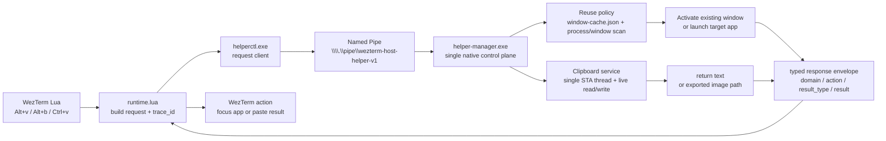

# Architecture

Use this doc when you need ownership boundaries, entry points, or runtime design constraints.

## Source Of Truth

- This repository is the source of truth.
- Windows runtime files are generated from this repo by the `wezterm-runtime-sync` skill in `skills/wezterm-runtime-sync/`.
- Live targets include `%USERPROFILE%\.wezterm.lua`, `%USERPROFILE%\.wezterm-x\...`, and `%USERPROFILE%\.wezterm-native\...`.

## Entry Points

- `wezterm.lua`: top-level WezTerm config and keybindings
- `wezterm-x/workspaces.lua`: managed workspace definitions
- `wezterm-x/lua/logger.lua`: WezTerm-side structured diagnostics helper
- `wezterm-x/local/`: gitignored machine-local overrides copied by the sync skill when present
- `config/worktree-task.env`: tracked repo profile for the self-contained `worktree-task` skill
- `skills/wezterm-runtime-sync/`: runtime sync workflow, prompt rendering, and prompt regression scripts
- `skills/worktree-task/`: linked worktree task skill with unified CLI, core libraries, and built-in providers
- `scripts/runtime/open-project-session.sh`: tmux bootstrap for managed project tabs
- `scripts/runtime/run-managed-command.sh`: managed startup command launcher
- `scripts/runtime/runtime-log-lib.sh`: shared runtime logging helper
- `wezterm-x/scripts/`: thin runtime bootstrap and install scripts plus remaining cross-platform shell helpers copied by the sync skill
- `native/host-helper/windows/src/HelperManager/`: Windows `helper-manager.exe` server project
- `native/host-helper/windows/src/HelperCtl/`: Windows `helperctl.exe` console client project
- `native/host-helper/windows/src/Shared/`: shared Windows host-helper protocol, transport, and support models
- `tmux.conf`: tmux layout and status rendering
- `agent-profiles/`: hosted source for versioned user-level agent profiles; not the project-level instruction source for this repo

## Startup Invariants

- Managed project tabs bootstrap through `scripts/runtime/open-project-session.sh`.
- Linked task worktree windows bootstrap through the built-in tmux provider under `skills/worktree-task/scripts/providers/tmux-agent.sh`.
- The built-in task-worktree tmux provider must derive repo-family session reuse and task-window ownership from live git context instead of stored tmux metadata.
- `open-project-session.sh` launches managed commands inside an interactive login shell so the environment matches the right-side shell pane.
- `run-managed-command.sh` is a thin wrapper that logs and execs the command.
- Managed launcher profiles live in `wezterm-x/lua/constants.lua` and resolve to concrete startup commands before tmux session creation.
- The tmux layout is the stable execution layer: left pane runs the configured primary command and right pane remains a shell in the same directory.
- One-shot task prompts belong only to the newly created task worktree window; they must not overwrite the repo-family session's stored default startup command.

## Windows Host

- In `hybrid-wsl`, WezTerm Lua is only responsible for request generation, helper bootstrap, and request-side diagnostics.
- `%LOCALAPPDATA%\wezterm-runtime\` is the Windows runtime state root. It keeps `logs/`, `state/`, `cache/`, and `bin/` in one place.
- `%LOCALAPPDATA%\wezterm-runtime\bin\helper-manager.exe` is the active Windows host control plane.
- `%LOCALAPPDATA%\wezterm-runtime\bin\helperctl.exe` is the thin console IPC client that WezTerm Lua, tmux-side scripts, and smoke tests invoke when they need a request or response.
- `%USERPROFILE%\.wezterm-native\host-helper\windows\` is the published source tree that sync installs from; `%LOCALAPPDATA%\wezterm-runtime\bin\` is the stable installed binary location that the runtime actually launches.
- `native/host-helper/windows/release-manifest.json` is the version-pinned release fallback declaration. When Windows `dotnet` is available, the installer publishes from the synced native source tree; otherwise it downloads and verifies the manifest-selected GitHub release asset before replacing `%LOCALAPPDATA%\wezterm-runtime\bin\`.
- `wezterm-x/scripts/` is intentionally thin on Windows. It keeps the helper installer, launcher, and bootstrap pieces, but the old Windows request handlers and worker-plugin chain are no longer part of the active design.

### Request Flow

### Constraints

- The hot path should stay on one chain: `Lua -> helperctl.exe -> named pipe -> helper-manager.exe -> response`.
- `helper-manager.exe` is the single decision point for VS Code directory normalization, Chrome debug instance reuse, and clipboard text or image decisions.
- Response types stay explicit: current-window reuse returns `result_type=window_ref`, clipboard reads return `clipboard_text` or `clipboard_image`.
- Reuse logic depends on persisted cache, process command-line matching, visible window scanning, and foreground binding compensation.
- Clipboard reads and writes must stay in an STA-aware path so Windows data formats remain stable.

## Posix Host

- `posix-local` does not have a native host helper yet.
- When `posix-local` gets a host helper, it should follow the same split as Windows: WezTerm Lua remains a request producer, while a stable per-user native agent owns focus or open logic, clipboard monitoring, reuse policy evaluation, and structured decision logging.
- The preferred install shape is a stable per-user binary outside the synced runtime tree, with platform-specific source under `native/host-helper/<platform>/` and a thin bootstrap or installer layer under `wezterm-x/scripts/`.

## Worktree Task

- Use the `worktree-task` skill when you want a fresh agent CLI implementation session in a linked worktree instead of continuing in the current worktree.
- The skill creates linked worktrees under the repository parent's `.worktrees/<repo>/` directory.
- `WEZTERM_CONFIG_REPO` is required. Use `skills/worktree-task/scripts/worktree-task configure --repo /absolute/path` as the stable recovery path whenever it is missing.
- This repository's tracked worktree-task profile lives at `config/worktree-task.env`.
- Machine-local agent selection belongs in `wezterm-x/local/shared.env` as `MANAGED_AGENT_PROFILE=claude|codex|...`.
- Managed workspace launchers and the built-in `tmux-agent` provider execute the actual agent CLI inside the resolved login shell so PATH and shell startup files come from one stable source.
- Runtime launch uses a temporary prompt file only long enough for the new pane to start; the repository does not keep a prompt archive.
