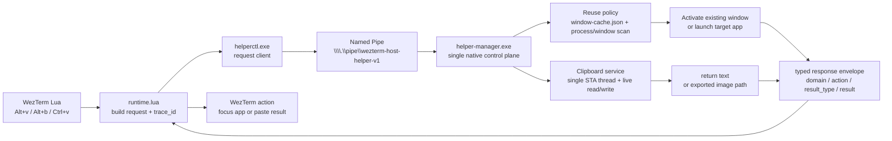

# Architecture

Use this doc when you need ownership boundaries, entry points, or runtime design constraints.

## Source Of Truth

- This repository is the source of truth.
- Windows runtime files are generated from this repo by the `wezterm-runtime-sync` skill in `skills/wezterm-runtime-sync/`.
- Live targets include `%USERPROFILE%\.wezterm.lua`, `%USERPROFILE%\.wezterm-x\...`, and `%USERPROFILE%\.wezterm-native\...`.

## Interaction Layers

This config nests two terminal multiplexers — WezTerm outside, tmux inside a single pane of each managed project tab — and several concept names collide between the two layers. Keep the ownership split below in mind when routing a new binding, script, or diagnostic.

### Nested structure

```
WezTerm process
  └─ OS window
     └─ Workspace  (default / work / config / ...)
        └─ Tab
           └─ WezTerm pane
              └─ tmux  (inside a managed project tab)
                 └─ tmux session  (one per repo family)
                    └─ tmux window  (one per linked git worktree)
                       └─ tmux pane  (left agent / right shell layout)
```

### Semantic mapping in this repo

- **WezTerm tab** = one project / repo family. A managed project tab typically runs exactly one tmux session.
- **tmux window** = one git worktree inside that repo family. `Alt+g` / `Alt+Shift+g` create or select tmux windows; see [`workspaces.md`](./workspaces.md).
- **tmux pane** = the intra-worktree split (usually left agent / right shell).
- **WezTerm pane** outside tmux only appears in the `default` workspace or while a managed tab is still bootstrapping.

### Ownership rule

- Cross-tab and cross-workspace navigation lives on the WezTerm layer (`Alt+n` / `Alt+Shift+n` / `Alt+1..9` for tabs; `Alt+d` / `Alt+w` / `Alt+c` / `Alt+p` for workspaces). The key → action wiring is driven by `wezterm-x/commands/manifest.json` + `wezterm-x/lua/ui/action_registry.lua` (handler closures) + `wezterm-x/lua/ui/keymaps.lua` (builds `config.keys` by iterating the manifest and dispatching through the registry).
- `tmux.conf` owns pane splits, copy-mode, mouse handling, worktree-window switching, and status-line rendering. Its chord key tables (`command-chord`, `worktree-chord`) are **generated** from the same `manifest.json` by `scripts/runtime/render-tmux-bindings.sh` into `wezterm-x/tmux/chord-bindings.generated.conf` (gitignored), which `tmux.conf` loads via `source-file -q`. The renderer runs during `wezterm-runtime-sync`.
- WezTerm keys that mutate tmux state (`Alt+v` / `Alt+g` / `Alt+Shift+g` / `Alt+o` / `Ctrl+k` / `Ctrl+Shift+P`) resolve through the registry on the WezTerm side; they forward into the active tmux-backed pane via short escape sequences (`\x1bv`, `\x0b`, etc.) so tmux owns the execution. The tmux `bind-key -n M-v / M-g / User0-2` lines that receive those bytes are transport infrastructure and stay inline in `tmux.conf`, not user-customizable.
- Per-machine keybinding overrides live in `wezterm-x/local/keybindings.lua`, addressed by manifest `id`. The WezTerm path consumes them directly at reload (`wezterm-x/lua/ui/keybinding_overrides.lua`); the tmux-chord path consumes the same file at sync time via the bash renderer. Both sides share one source of truth and one override file.
- Agent attention is layered: hooks (`scripts/claude-hooks/emit-agent-status.sh`) write a shared JSON file at `$runtime_state_dir/state/agent-attention/attention.json` via `scripts/runtime/attention-state-lib.sh` and nudge WezTerm with an OSC 1337 `attention_tick`. `wezterm-x/lua/attention.lua` reads the file on every tick / `update-status` and renders tab badges plus the right-status counter — no pane walking, no user_var state. Jump is Lua-driven: `Alt+,` / `Alt+.` (and `Alt+/` selection) pick a target from state, issue `SwitchToWorkspace` + mux `tab:activate()` + `pane:activate()` for cross-workspace GUI focus, and spawn `scripts/runtime/attention-jump.sh --session <id>` in the background for `tmux select-window`/`select-pane`.

### Naming guidance for code and docs

- "Window" is ambiguous. Use **WezTerm OS window**, **tmux window**, or **workspace** — never bare "window" in a sentence that crosses layers.
- "Pane" is also overloaded. Use **WezTerm pane** vs **tmux pane** when the layer matters.
- "Tab" is unambiguous — it only exists in WezTerm.
- In `wezterm-x/commands/manifest.json`, `context: tmux-backed` implies the command only makes sense when the focused WezTerm pane is running tmux; `layer: wezterm | tmux | tmux-chord` identifies which keymap owns the binding.

## Command Manifest

`wezterm-x/commands/manifest.json` is the single source of truth for invocable commands across the WezTerm keymap, the tmux chord tables, the tmux-owned command palette, and the `docs/keybindings.md` reference. Consumers (WezTerm keymap builder, tmux chord renderer, palette reader, hotkey usage report) resolve commands by `id` and must not re-declare keys, actions, or palette entries outside the manifest.

Entry schema:

- `id` string. Stable dotted identifier used as the cross-reference handler registries and codegen keys resolve to.
- `label` string. Short human-facing title shown in palette and docs.
- `description` string. One-line explainer reused by the palette popup and docs.
- `scope` string. Docs/UI grouping. One of: `workspaces`, `project-navigation`, `commands-and-splits`, `window-and-pane-navigation`, `clipboard`, `session-maintenance`.
- `context` string. Where the command is usable. One of: `any`, `tmux-backed`, `hybrid-wsl`.
- `binding` object, optional. Declares how the command executes. Two shapes:
  - WezTerm layer: `{ "handler": "<name>", "args": <optional static args> }`. `handler` is the key into `wezterm-x/lua/ui/action_registry.lua`; the handler function receives optional static `args` (from manifest) and per-hotkey `args` (e.g. `Alt+N` passes `N`) and returns a wezterm action.
  - tmux-chord layer: `{ "kind": "tmux-chord-leaf", "table": "command-chord" | "worktree-chord", "exec": "<tmux action chain>", "switch_first": <optional bool> }`. `exec` is a raw tmux action string (may embed `#{...}` interpolations); the renderer wraps it with chord-hint clear + usage-bump + a `switch-client -T root` that defaults to running after `exec` (`switch_first: true` moves it before `exec` for modal actions like `command-prompt`).
- `args_schema` object, optional. For parametrized ids (`tab.select-by-index`): `{ "kind": "integer" | "string" | "object", "range"?, "enum"?, "shape"? }`. Consumed by the override loader to validate user-supplied args.
- `hotkeys` array. Zero or more bindings; each item has `keys` (e.g. `Alt+v`, `Ctrl+k v`), `layer` (`wezterm` or `tmux-chord`), and optional `args` (for parametrized ids).
- `hotkey_display` string, optional. Render-only override for the palette hotkey column; when present, replaces the comma-joined `hotkeys[].keys` text (e.g. `Alt+1..9` instead of `Alt+1,Alt+2,...,Alt+9`). Does not affect codegen — the real bindings still come from `hotkeys[]`.
- `palette` object, optional. Present only when the command should appear in the tmux command palette. Either `display_only: true` (the entry is rendered for search/discovery and running it prints a toast asking the user to use the hotkey), or a real entry with `accelerator` (single-char hint), `command` (argv array executed by `tmux-command-run.sh`; elements may contain the `{repo_root}` placeholder which is replaced with the current repository root at register time), and optional `confirm_message`, `success_message`, `failure_message`.

Invariants:

- `id` is unique across the manifest.
- `hotkeys[].keys` is unique across the manifest (for the default key; user overrides may introduce temporary shadows until resolved).
- Every wezterm-layer `binding.handler` must be registered in `action_registry.lua`, and every tmux-chord `binding` must carry `table` + `exec`.
- `palette.accelerator` is unique within a given runtime-mode visibility set.
- `context = hybrid-wsl` entries only run when the active runtime mode matches.

Adding a new shortcut means: (1) new item in `manifest.json` with `binding`; (2) for wezterm-layer, new handler function in `action_registry.lua`; (3) for tmux-chord leaves, the `exec` string covers everything — no code changes elsewhere. Rerun `wezterm-runtime-sync` after edits so the tmux chord table regenerates.

## Entry Points

- `wezterm.lua`: top-level WezTerm config and keybindings
- `wezterm-x/workspaces.lua`: managed workspace definitions
- `wezterm-x/commands/manifest.json`: single source of truth for invocable commands (see `Command Manifest`)
- `wezterm-x/lua/logger.lua`: WezTerm-side structured diagnostics helper
- `wezterm-x/lua/attention.lua`: reads the shared agent-attention state file, renders tab badges + right-status counter, and schedules the background delayed `--forget` for focus-based auto-ack when the currently-focused WezTerm pane **and** active tmux pane match a live `done` entry (render-owning; delegates all mutation to `attention-jump.sh`)
- `scripts/runtime/attention-state-lib.sh`: shared bash helpers for read / upsert / remove / prune of the attention state file, with flock for concurrent writes
- `scripts/claude-hooks/emit-agent-status.sh`: user-level Claude Code hook emitter that updates state.json and sends the OSC 1337 `attention_tick` nudge
- `scripts/runtime/attention-jump.sh`: WSL-side orchestrator for attention jumps — runs `tmux select-window`/`select-pane`, recovers a missing `wezterm_pane_id` from tmux session env when needed, and falls back to `wezterm.exe cli activate-pane` for contexts where Lua isn't driving the GUI side (explicit CLI invocation, `--clear-all`). Also owns the `--forget` and `--prune` entrypoints that implement the delayed auto-clear (used by both `Alt+.`/`Alt+/` jumps and the focus-based auto-ack) and the periodic TTL sweep
- `scripts/runtime/tmux-worktree-menu.sh` + `tmux-worktree-picker.sh` + `tmux-worktree/render.sh`: tmux-popup picker for `Alt+g`, designed around a **frame-priming** model so first paint is bound by *bash startup alone* instead of by lib sourcing variance or external-binary spawn. The menu wrapper (1) resolves repo-family context, (2) **prefetches** the worktree list (`tmux_worktree_list` + per-row `tmux_worktree_find_window`) into a `mktemp` TSV, (3) sources `tmux-worktree/render.sh` and pre-renders the very first frame to a second `mktemp` file using popup dimensions derived from `tmux display-message #{client_width/height}` minus the 2-cell border, (4) passes both files (plus `current_worktree_root` / `repo_label`) as extra args to `tmux display-popup -E`. The picker's first action — *before any sourcing* — is `printf '\033[?25l'; printf '%s' "$(<frame_file>)"`, using bash's `$(<file)` slurp instead of `cat` to avoid a fork+exec on the hot path; the popup is populated within milliseconds of opening even on cold WSL2 disk caches, and only after that does the script source libs, parse the prefetch TSV, and enter the input loop. `render.sh` exposes `worktree_picker_emit_frame` as the single source of truth for frame bytes — both the menu pre-render and the picker's `render_picker` call it, guaranteeing the priming write and the live frame are byte-identical (no visible swap on hand-off). The frame uses absolute `\033[<row>;1H` positioning with no embedded `\n` so a single `printf '%s'` flushes to the popup PTY in one write (sidesteps bash's tty line-buffering, which previously made fast renders look line-by-line); `\033[J` at the tail clears any leftover rows below. The picker only re-renders on `Up`/`Down` (`needs_render` flag) — duplicate `Alt+g` presses forwarded as `\x1bg` are matched as an exit key, so the same chord that opened the popup also closes it (`Alt+g` is a true toggle, mirroring the `Alt+/` attention picker; `Esc` and `Ctrl+C` remain as fallbacks). `read_key` disambiguates bare `Esc` from a multi-byte sequence with `read -t 0` (peek-only — succeeds iff more bytes are already buffered) instead of a fixed timeout, so closing on `Esc` no longer pays a 10ms wait. On selection the picker fires `tmux-worktree-open.sh` via `tmux run-shell -b` and exits immediately, so the popup closes before any (potentially template-driven) tmux window creation runs. menu.sh also skips the `tmux has-session` probe in the picker's prefetch path since it already validated the session
- `scripts/runtime/tmux-focus-emit.sh`: wired from tmux `pane-focus-in` / `after-select-pane` hooks to record the currently-active tmux pane per `(socket, session)` into a per-session file, so `attention.maybe_ack_focused` can require tmux-pane-level focus (not just WezTerm pane focus) before auto-acking a `done` entry
- `wezterm-x/local/`: gitignored machine-local overrides copied by the sync skill when present
- `config/worktree-task.env`: tracked repo profile for the `worktree-task` runtime
- `skills/wezterm-runtime-sync/`: runtime sync workflow, prompt rendering, and prompt regression scripts
- `scripts/runtime/worktree/`: linked worktree task runtime — `worktree-task` CLI, `open-task-window` (Ctrl+k g d/t/h create entry), `reclaim-current-window` (Ctrl+k g r reclaim entry), core libraries under `lib/`, built-in providers under `providers/`
- `scripts/runtime/open-project-session.sh`: tmux bootstrap for managed project tabs
- `scripts/runtime/primary-pane-wrapper.sh`: traps INT/HUP/TERM around the managed agent and execs the login shell on exit so the primary pane survives agent death
- `scripts/runtime/run-managed-command.sh`: managed startup command launcher
- `scripts/runtime/agent-clipboard.sh`: repo-local WSL wrapper that writes text or image files to the Windows clipboard through the host helper
- `scripts/runtime/runtime-log-lib.sh`: shared runtime logging helper
- `wezterm-x/scripts/`: thin runtime bootstrap and install scripts plus remaining cross-platform shell helpers copied by the sync skill
- `native/host-helper/windows/src/HelperManager/`: Windows `helper-manager.exe` server project
- `native/host-helper/windows/src/HelperCtl/`: Windows `helperctl.exe` console client project
- `native/host-helper/windows/src/Shared/`: shared Windows host-helper protocol, transport, and support models
- `native/host-helper/windows/scripts/`: Windows host-helper release packaging scripts used by GitHub Actions
- `tmux.conf`: tmux layout and status rendering
- `agent-profiles/`: hosted source for versioned user-level agent profiles; not the project-level instruction source for this repo

## Startup Invariants

- Managed project tabs bootstrap through `scripts/runtime/open-project-session.sh`.
- Linked task worktree windows bootstrap through the built-in tmux provider under `scripts/runtime/worktree/providers/tmux-agent.sh`.
- The built-in task-worktree tmux provider must derive repo-family session reuse and task-window ownership from live git context instead of stored tmux metadata.
- `open-project-session.sh` launches managed commands inside an interactive login shell so the environment matches the right-side shell pane.
- The managed command runs under `primary-pane-wrapper.sh`, which traps INT/HUP/TERM and execs the user's login shell after the agent returns. Logs each transition under `category=primary_pane` so pane deaths can be diagnosed post-mortem.
- `run-managed-command.sh` is a thin wrapper that logs and execs the command.
- Managed launcher profiles live in `wezterm-x/lua/constants.lua` and resolve to concrete startup commands before tmux session creation.
- The tmux layout is the stable execution layer: left pane runs the configured primary command and right pane remains a shell in the same directory.
- One-shot task prompts belong only to the newly created task worktree window; they must not overwrite the repo-family session's stored default startup command.

## Windows Host

- In `hybrid-wsl`, WezTerm Lua is only responsible for request generation, helper bootstrap, and request-side diagnostics.
- `%LOCALAPPDATA%\wezterm-runtime\` is the Windows runtime state root. It keeps `logs/`, `state/`, `cache/`, and `bin/` in one place.
- `%LOCALAPPDATA%\wezterm-runtime\bin\helper-manager.exe` is the active Windows host control plane.
- `%LOCALAPPDATA%\wezterm-runtime\bin\helperctl.exe` is the thin console IPC client that WezTerm Lua, tmux-side scripts, and smoke tests invoke when they need a request or response.
- `scripts/runtime/agent-clipboard.sh` is the repo-local high-level clipboard writer for agent workflows. It stays in WSL, ensures the synced Windows helper is healthy, and then calls `helperctl.exe`; it should be preferred over raw IPC in agent-facing automation.
- Sync also writes `~/.wezterm-x/agent-tools.env` in the target home so external agent platforms can discover repo-local wrappers such as `agent-clipboard.sh` without inferring repository paths.
- `%USERPROFILE%\.wezterm-native\host-helper\windows\` is the published source tree that sync installs from; `%LOCALAPPDATA%\wezterm-runtime\bin\` is the stable installed binary location that the runtime actually launches.
- `native/host-helper/windows/release-manifest.json` is the version-pinned release fallback declaration. When Windows `dotnet` is available, the installer publishes from the synced native source tree; otherwise it downloads and verifies the manifest-selected GitHub release asset before replacing `%LOCALAPPDATA%\wezterm-runtime\bin\`.
- `wezterm-x/scripts/` is intentionally thin on Windows. It keeps the helper installer, launcher, and bootstrap pieces, but the old Windows request handlers and worker-plugin chain are no longer part of the active design.

### Request Flow



### Constraints

- The hot path should stay on one chain: `Lua -> helperctl.exe -> named pipe -> helper-manager.exe -> response`.
- `helper-manager.exe` is the single decision point for VS Code directory normalization, Chrome debug instance reuse, clipboard text or image decisions, and foreground-window IME state queries.
- Response types stay explicit: current-window reuse returns `result_type=window_ref`, clipboard reads return `clipboard_text` or `clipboard_image`, IME queries return `ime_state` with flat `mode` / `lang` / `reason` fields.
- Reuse logic depends on persisted cache, process command-line matching, visible window scanning, and foreground binding compensation.
- Clipboard reads and writes must stay in an STA-aware path so Windows data formats remain stable.

## Posix Host

- `posix-local` does not have a native host helper yet.
- When `posix-local` gets a host helper, it should follow the same split as Windows: WezTerm Lua remains a request producer, while a stable per-user native agent owns focus or open logic, clipboard monitoring, reuse policy evaluation, and structured decision logging.
- The preferred install shape is a stable per-user binary outside the synced runtime tree, with platform-specific source under `native/host-helper/<platform>/` and a thin bootstrap or installer layer under `wezterm-x/scripts/`.

## Worktree Task

- Use the `worktree-task` runtime when you want a fresh agent CLI implementation session in a linked worktree instead of continuing in the current worktree.
- It creates linked worktrees under the repository parent's `.worktrees/<repo>/` directory.
- `WEZTERM_CONFIG_REPO` is required. Use `scripts/runtime/worktree/worktree-task configure --repo /absolute/path` as the stable recovery path whenever it is missing.
- This repository's tracked worktree-task profile lives at `config/worktree-task.env`.
- Machine-local agent selection belongs in `wezterm-x/local/shared.env` as `MANAGED_AGENT_PROFILE=claude|codex|...`.
- Managed workspace launchers and the built-in `tmux-agent` provider execute the actual agent CLI inside the resolved login shell so PATH and shell startup files come from one stable source.
- Runtime launch uses a temporary prompt file only long enough for the new pane to start; the repository does not keep a prompt archive.
