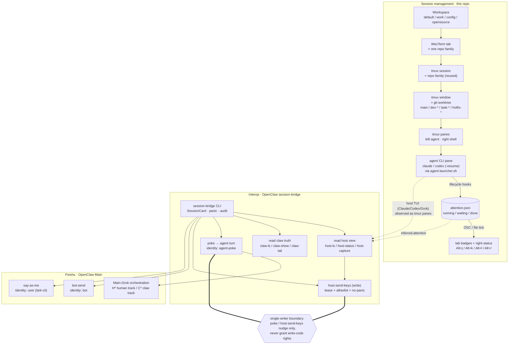
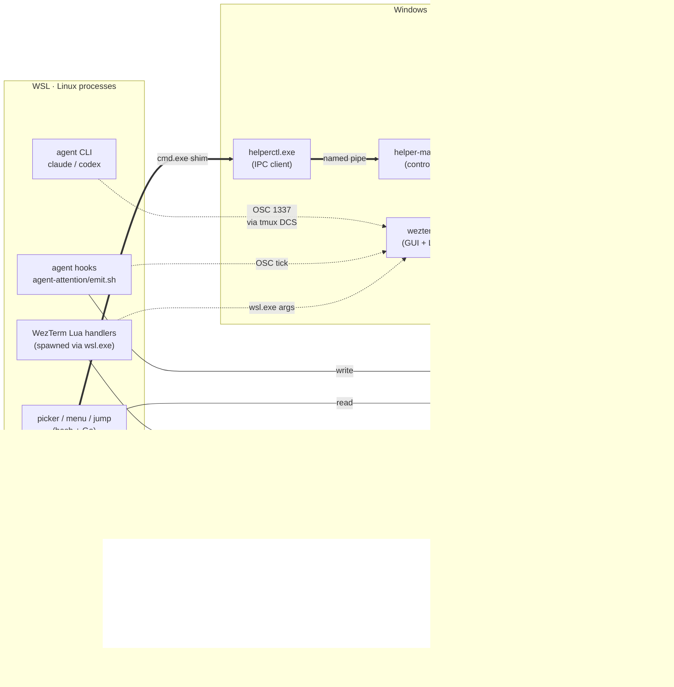
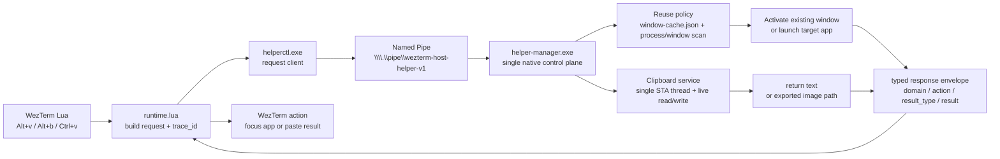

# Architecture

Use this doc when you need ownership boundaries, entry points, or runtime design constraints.

## Source Of Truth

- This repository is the source of truth.
- Windows runtime files are generated from this repo by `skills/wezterm-runtime-sync/scripts/sync-runtime.sh` (repo-local workflow under `skills/wezterm-runtime-sync/` — not a Claude Code Skill; run the script with Bash).
- Live targets:
  - Windows-side (consumed by `wezterm.exe`): `%USERPROFILE%\.wezterm.lua`, `%USERPROFILE%\.wezterm-x\...`, `%USERPROFILE%\.wezterm-native\...`.
  - WSL-side (consumed by WSL-resident agents — Claude Code, Codex CLI, etc.): `$HOME/.wezterm-x/agent-tools.env`. This is the host-effects discovery marker; schema and contract live in [`setup.md#agent-toolsenv-schema`](./setup.md#agent-toolsenv-schema).

## Interaction Layers

This config nests two terminal multiplexers — WezTerm outside, tmux inside a single pane of each managed project tab — and several concept names collide between the two layers. Keep the ownership split below in mind when routing a new binding, script, or diagnostic.

### Nested structure

```
WezTerm process
  └─ OS window
     └─ Workspace  (default / work / config / ...)
        └─ Tab
           └─ WezTerm pane
              └─ tmux  (inside a managed project tab)
                 └─ tmux session  (one per repo family)
                    └─ tmux window  (one per linked git worktree)
                       └─ tmux pane  (left agent / right shell layout)
```

### Semantic mapping in this repo

- **WezTerm tab** = one project / repo family. A managed project tab typically runs exactly one tmux session.
- **tmux window** = one git worktree inside that repo family. `Alt+g` / `Alt+Shift+g` create or select tmux windows; see [`workspaces.md`](./workspaces.md).
- **tmux pane** = the intra-worktree split (usually left agent / right shell).
- **WezTerm pane** outside tmux only appears in the `default` workspace or while a managed tab is still bootstrapping.

### Ownership rule

- Cross-tab and cross-workspace navigation lives on the WezTerm layer (`Alt+n` / `Alt+Shift+n` / `Alt+1..9` for tabs; `Alt+d` / `Alt+w` / `Alt+c` / `Alt+p` for workspaces). The key → action wiring is driven by `wezterm-x/commands/manifest.json` + `wezterm-x/lua/ui/action_registry.lua` (handler closures) + `wezterm-x/lua/ui/keymaps.lua` (builds `config.keys` by iterating the manifest and dispatching through the registry).
- `tmux.conf` owns pane splits, copy-mode, mouse handling, worktree-window switching, and status-line rendering. Its chord key tables (`command-chord`, `worktree-chord`) are **generated** from the same `manifest.json` by `scripts/runtime/render-tmux-bindings.sh` into `wezterm-x/tmux/chord-bindings.generated.conf` (gitignored), which `tmux.conf` loads via `source-file -Fq`. The renderer runs during `wezterm-runtime-sync`.
- WezTerm keys that mutate tmux state (`Alt+v` / `Alt+g` / `Alt+Shift+g` / `Alt+/` / `Alt+o` / `Ctrl+p` / `Ctrl+k` / `Ctrl+Shift+P`) resolve through the registry on the WezTerm side; they forward into the active tmux-backed pane via short escape sequences (`\x1bv`, `\x1b/`, `\x0b`, etc.) so tmux owns the execution. The tmux `bind-key -n M-v / M-g / M-/ / User0-3` lines that receive those bytes are transport infrastructure and stay inline in `tmux.conf`, not user-customizable.
- Per-machine keybinding overrides live in `wezterm-x/local/keybindings.lua`, addressed by manifest `id`. The WezTerm path consumes them directly at reload (`wezterm-x/lua/ui/keybinding_overrides.lua`); the tmux-chord path consumes the same file at sync time via the bash renderer. Both sides share one source of truth and one override file.
- Agent attention is layered: provider adapters under `scripts/runtime/agent-attention/adapters/` normalize Claude / Codex hook payloads; `scripts/runtime/agent-attention/emit.sh` writes shared state via `scripts/runtime/attention-state-lib.sh` and publishes an `attention.tick` event through the [event bus](./event-bus.md) (`wezterm_event_send` → OSC `we_attention_tick` when the producer has a regular pane tty, else file). `wezterm-x/lua/titles.lua` registers the bus handler and reloads state for tab badges + right-status (render lives in `wezterm-x/lua/attention.lua`; no pane walking, no user_var state). Jump path splits by entry point: `Alt+j` / `Alt+k` / `Alt+l` are Lua-driven `--direct` calls; `Alt+/` is forwarded into tmux and runs the popup picker. Full pipeline: [`agent-attention.md`](./agent-attention.md).

### Naming guidance for code and docs

- "Window" is ambiguous. Use **WezTerm OS window**, **tmux window**, or **workspace** — never bare "window" in a sentence that crosses layers.
- "Pane" is also overloaded. Use **WezTerm pane** vs **tmux pane** when the layer matters.
- "Tab" is unambiguous — it only exists in WezTerm.
- In `wezterm-x/commands/manifest.json`, `context: tmux-backed` implies the command only makes sense when the focused WezTerm pane is running tmux; `layer: wezterm | tmux | tmux-chord` identifies which keymap owns the binding.

## Session & Interop Overview

This section is the single map for two cross-cutting concerns that otherwise span four docs: **session management** (how a repo becomes a WezTerm tab, a tmux session, a worktree window, and an agent pane, with its attention state) and **interop** (how OpenClaw's `session-bridge` reads and — under gates — nudges those host sessions, and how identities reach Feishu). Depth lives in the linked docs; this is the orientation layer.


```mermaid
flowchart TB
  subgraph SM["Session management · this repo"]
    direction TB
    WS["Workspace<br/>default / work / config / opensource"]
    TAB["WezTerm tab<br/>= one repo family"]
    SESS["tmux session<br/>= repo family (reused)"]
    WIN["tmux window<br/>= git worktree<br/>main / dev-* / task-* / hotfix-*"]
    PANE["tmux panes<br/>left agent · right shell"]
    AGENT["agent CLI pane<br/>claude / codex (-resume)<br/>via agent-launcher.sh"]
    ATT[("attention.json<br/>running / waiting / done")]
    WS --> TAB --> SESS --> WIN --> PANE --> AGENT
    AGENT -->|"lifecycle hooks"| ATT
    ATT -->|"OSC / file tick"| BADGE["tab badges + right-status<br/>Alt+j / Alt+k / Alt+l / Alt+/"]
  end

  subgraph SB["Interop · OpenClaw session-bridge"]
    direction TB
    CLI["session-bridge CLI<br/>SessionCard · panic · audit"]
    RHOST["read host view<br/>host-ls / host-status / host-capture"]
    RCLAW["read claw truth<br/>claw-ls / claw-show / claw-tail"]
    POKE["poke → agent turn<br/>identity: agent-poke"]
    KEYS["host-send-keys (write)<br/>lease + allowlist + no-panic"]
    CLI --> RHOST
    CLI --> RCLAW
    CLI --> POKE
    CLI --> KEYS
  end

  subgraph FS["Feishu · OpenClaw Main"]
    direction TB
    MAIN["Main-Grok orchestration<br/>H* human track / C* claw track"]
    BOT["bot-send<br/>identity: bot"]
    SAY["say-as-me<br/>identity: user (lark-cli)"]
  end

  AGENT -. "host TUI (Claude/Codex/Grok)<br/>observed as tmux panes" .-> RHOST
  ATT -. "inferred.attention" .-> RHOST
  RHOST --> KEYS
  POKE --> MAIN
  CLI --> BOT
  CLI --> SAY
  KEYS === SW{{"single-writer boundary:<br/>poke / host-send-keys nudge only,<br/>never grant write-code rights"}}
  POKE === SW
```

### Session management

The nesting and ownership rules are in [*Interaction Layers*](#interaction-layers) above; the lifecycle detail is in [`workspaces.md`](./workspaces.md). Key facts this repo commits to:

- **Naming / reuse.** A managed WezTerm tab maps to one repo family and attaches to **one tmux session per repo family**, reused across that repo's linked worktrees. Each git worktree is one tmux window; each window splits into a left agent pane and a right shell pane. Managed workspaces are `work` / `config` / `opensource`; `default` is the built-in WezTerm workspace.
- **Worktree sessions.** `worktree-task` creates linked worktrees under `.worktrees/<repo>/` and opens them as additional windows in the same session. Directory prefixes encode lifecycle (`dev-*` / `task-*` / `hotfix-*`), created by `Ctrl+k g d/t/h` and reclaimed by `Ctrl+k g r`; branch naming is independent. Full lifecycle + reclaim safety: [`workspaces.md#task-worktree-lifecycle-model`](./workspaces.md#task-worktree-lifecycle-model).
- **Agent pane lifecycle.** Every agent-CLI launch terminates at `scripts/runtime/agent-launcher.sh <profile>` (the single env-loading + boot-cue site); resume variants (`sh -c 'claude --continue || exec claude'`) fall back to a fresh session on a brand-new worktree. `primary-pane-wrapper.sh` execs the login shell after the agent exits so the pane survives agent death. See [*Startup Invariants*](#startup-invariants).
- **Attention state.** Provider hooks → `agent-attention/emit.sh` → `attention.json` (`running` / `waiting` / `done`, keyed by session id or `pane:<N>`) → event bus tick → tab badges + right-status counter; jump via `Alt+j` / `Alt+k` / `Alt+l` (Lua `--direct`) and `Alt+/` (tmux popup). This is the same state file the interop layer reads. Full pipeline: [`agent-attention.md`](./agent-attention.md).

### Interop (host TUI ↔ session-bridge ↔ Feishu)

The host TUI agents (`claude` / `codex`, plus `grok` when run natively) live inside the tmux panes above. OpenClaw's **Session Adapter Kit** (`openclaw/scripts/session-bridge.sh`) is a **narrow adapter, not a second session store or a second TUI** — full contract in [`session-bridge.md`](../openclaw/docs/session-bridge.md); agent-track architecture in [`agent-architecture.md`](../openclaw/docs/agent-architecture.md).

- **Read wide.** Host side projects live tmux panes into `SessionCard[]` (`host-ls` / `host-status` / `host-capture`), degrading gracefully when tmux is unreachable; `host-status` folds this repo's `attention.json` into `inferred.attention`. Claw side wraps `openclaw sessions*` (`claw-ls` / `claw-show` / `claw-tail`).
- **Write narrow, three identities (never mixed).** `agent-poke` (`poke` runs one agent turn), `bot` (`bot-send`, dry-run unless `--confirm`), `user` (`say-as-me` via lark-cli). `host-send-keys` into a host pane requires **lease + allowlist + no active panic**, refuses `C-c/C-z/C-d`, and every write is audited.
- **Panic freeze.** `session-bridge panic on` denies every write path (poke, lease mint, host-send-keys) and does not auto re-arm.
- **Single-writer boundary.** `poke` / `host-send-keys` only push *interaction* into a session; they never grant the right to write code to the same cwd in parallel. On a C2 handoff, Main still stops typing. This is the L0 single-writer rule surfacing at the interop edge.

### Status: built / convention / not built

| Area | Component | State |
|---|---|---|
| Session | WezTerm ⊃ tmux nesting, repo-family session reuse, agent pane resume + survival | **Built** |
| Session | Worktree lifecycle (`dev/task/hotfix`, `Ctrl+k g d/t/h/r`), branch-independent naming | **Built** |
| Session | Attention pipeline (hooks → `attention.json` → badges + `Alt+j`/`k`/`l`/`/`) | **Built** |
| Interop | Read (host + claw), `poke`, `panic`, `audit` (P1) | **Built** |
| Interop | `lease` + `host-send-keys` + `bot-send` + attention inference + audit receipt (P2) | **Built** |
| Interop | `say-as-me` (P3, lark-cli user identity) | **Built**, default `--dry-run` — **convention**: `--confirm` to actually send |
| Interop | Single-writer boundary (nudge ≠ write-code rights; Main stops on C2) | **Convention** (not machine-enforced) |
| Host | `posix-local` native host helper (focus/open, clipboard, reuse policy) | **Not built** — Windows-only today; see [*Posix Host*](#posix-host) |
| Interop | Feishu as a second full TUI / a CRDT session store | **Not built — explicit non-goal** ([`session-bridge.md`](../openclaw/docs/session-bridge.md) §0) |

## Command Manifest

`wezterm-x/commands/manifest.json` is the single source of truth for invocable commands across the WezTerm keymap, the tmux chord tables, the tmux-owned command palette, and the `docs/keybindings.md` reference. Consumers (WezTerm keymap builder, tmux chord renderer, palette reader, hotkey usage report) resolve commands by `id` and must not re-declare keys, actions, or palette entries outside the manifest.

Entry schema:

- `id` string. Stable dotted identifier used as the cross-reference handler registries and codegen keys resolve to.
- `label` string. Short human-facing title shown in palette and docs.
- `description` string. One-line explainer reused by the palette popup and docs.
- `scope` string. Docs/UI grouping. One of: `workspaces`, `project-navigation`, `commands-and-splits`, `window-and-pane-navigation`, `clipboard`, `session-maintenance`.
- `context` string. Where the command is usable. One of: `any`, `tmux-backed`, `hybrid-wsl`.
- `binding` object, optional. Declares how the command executes. Two shapes:
  - WezTerm layer: `{ "handler": "<name>", "args": <optional static args> }`. `handler` is the key into `wezterm-x/lua/ui/action_registry.lua`; the handler function receives optional static `args` (from manifest) and per-hotkey `args` (e.g. `Alt+N` passes `N`) and returns a wezterm action.
  - tmux-chord layer: `{ "kind": "tmux-chord-leaf", "table": "command-chord" | "worktree-chord", "exec": "<tmux action chain>", "switch_first": <optional bool> }`. `exec` is a raw tmux action string (may embed `#{...}` interpolations); the renderer wraps it with chord-hint clear + usage-bump + a `switch-client -T root` that defaults to running after `exec` (`switch_first: true` moves it before `exec` for modal actions like `command-prompt`).
- `args_schema` object, optional. For parametrized ids (`tab.select-by-index`): `{ "kind": "integer" | "string" | "object", "range"?, "enum"?, "shape"? }`. Consumed by the override loader to validate user-supplied args.
- `hotkeys` array. Zero or more bindings; each item has `keys` (e.g. `Alt+v`, `Ctrl+k v`), `layer` (`wezterm` or `tmux-chord`), and optional `args` (for parametrized ids).
- `hotkey_display` string, optional. Render-only override for the palette hotkey column; when present, replaces the comma-joined `hotkeys[].keys` text (e.g. `Alt+1..9` instead of `Alt+1,Alt+2,...,Alt+9`). Does not affect codegen — the real bindings still come from `hotkeys[]`.
- `palette` object, optional. Present only when the command should appear in the tmux command palette. Either `display_only: true` (the entry is rendered for search/discovery and pressing Enter prints a toast asking the user to use the hotkey — reserved for actions whose execution requires the WezTerm GUI process and cannot be reproduced by a tmux-side command, e.g. `wezterm.action.ActivateTab*`, `SwitchToWorkspace`, `QuickSelectArgs`, or anything that calls `wezterm.background_child_process` with a window handle), or a real entry with `accelerator` (single-char hint), `command` (argv array executed by `tmux-command-run.sh`; elements may contain the `{repo_root}` placeholder, and the command sees `COMMAND_PANEL_SESSION_NAME` / `COMMAND_PANEL_WINDOW_ID` / `COMMAND_PANEL_CWD` / `COMMAND_PANEL_CLIENT_TTY` in the environment), and optional `confirm_message`, `success_message`, `failure_message`. Handlers that only forward a key into the tmux pane (e.g. `pane.rotate_next`, `worktree.picker`) should expose a `command` rather than `display_only` so palette-Enter dispatches the underlying tmux action directly.

Invariants:

- `id` is unique across the manifest.
- `hotkeys[].keys` is unique across the manifest (for the default key; user overrides may introduce temporary shadows until resolved).
- Every wezterm-layer `binding.handler` must be registered in `action_registry.lua`, and every tmux-chord `binding` must carry `table` + `exec`.
- `palette.accelerator` is unique within a given runtime-mode visibility set.
- `context = hybrid-wsl` entries only run when the active runtime mode matches.

Adding a new shortcut means: (1) new item in `manifest.json` with `binding`; (2) for wezterm-layer, new handler function in `action_registry.lua`; (3) for tmux-chord leaves, the `exec` string covers everything — no code changes elsewhere. Rerun `wezterm-runtime-sync` after edits so the tmux chord table regenerates.

## Entry Points

- `wezterm.lua`: top-level WezTerm config and keybindings
- `wezterm-x/workspaces.lua`: managed workspace definitions
- `wezterm-x/commands/manifest.json`: single source of truth for invocable commands (see `Command Manifest`)
- `wezterm-x/lua/logger.lua`: WezTerm-side structured diagnostics helper
- Agent-attention pipeline (`wezterm-x/lua/attention.lua`, `scripts/runtime/agent-attention/{emit.sh,adapters/*.sh}`, `scripts/runtime/attention-{state-lib,jump}.sh`, `scripts/claude-hooks/emit-agent-status.sh` compatibility wrapper, `scripts/runtime/tmux-{attention,focus}-*.sh`, `scripts/runtime/tmux-attention-{menu,picker}.sh`): see [`agent-attention.md`](./agent-attention.md) for the per-file ownership.
- `scripts/runtime/tmux-worktree-menu.sh` + `tmux-worktree-picker.sh`: tmux-popup picker for `Alt+g`. The menu wrapper prefetches the worktree list into a TSV file (7 columns: `label path branch window_id status age reason`, the last three joined from `attention.json` by tmux window id — see [`agent-attention.md`](./agent-attention.md)) before opening `tmux display-popup -E` so the popup paints content on the first frame; the picker dispatches via `tmux run-shell -b tmux-worktree-open.sh` and exits immediately so the popup closes before window creation finishes. Performance contract: [`performance.md`](./performance.md).
- `wezterm-x/local/`: gitignored machine-local overrides copied by the sync skill when present
- `config/worktree-task.env`: tracked repo profile for the `worktree-task` runtime; sync-time mirrored to `<runtime_dir>/repo-worktree-task.env` so Windows-side wezterm.exe Lua can read it (the WSL path in `repo-root.txt` is unreachable from Win32 file APIs). `wezterm-x/lua/constants.lua` reads the local copy first; the env file is the single source of truth for `<base>` / `<base>_resume` profile commands.
- `skills/wezterm-runtime-sync/`: runtime sync workflow, prompt rendering, and prompt regression scripts
- `scripts/runtime/worktree/`: linked worktree task runtime — `worktree-task` CLI, `open-task-window` (Ctrl+k g d/t/h create entry), `reclaim-current-window` (Ctrl+k g r reclaim entry), core libraries under `lib/`, built-in providers under `providers/`
- `scripts/runtime/open-project-session.sh`: tmux bootstrap for managed project tabs
- `scripts/runtime/primary-pane-wrapper.sh`: traps INT/HUP/TERM around the managed agent and execs the login shell on exit so the primary pane survives agent death
- `scripts/runtime/run-managed-command.sh`: managed startup command launcher
- `scripts/runtime/agent-clipboard.sh`: repo-local WSL wrapper that writes text or image files to the Windows clipboard through the host helper
- `scripts/runtime/runtime-log-lib.sh`: shared runtime logging helper
- `wezterm-x/scripts/`: thin runtime bootstrap and install scripts plus remaining cross-platform shell helpers copied by the sync skill
- `native/host-helper/windows/src/HelperManager/`: Windows `helper-manager.exe` server project
- `native/host-helper/windows/src/HelperCtl/`: Windows `helperctl.exe` console client project
- `native/host-helper/windows/src/Shared/`: shared Windows host-helper protocol, transport, and support models
- `native/host-helper/windows/scripts/`: Windows host-helper release packaging scripts used by GitHub Actions
- `tmux.conf`: tmux layout and status rendering
- `agent-profiles/`: hosted source for versioned user-level agent profiles; not the project-level instruction source for this repo

## Startup Invariants

- Managed project tabs bootstrap through `scripts/runtime/open-project-session.sh`.
- Linked task worktree windows bootstrap through the built-in tmux provider under `scripts/runtime/worktree/providers/tmux-agent.sh`.
- The built-in task-worktree tmux provider derives repo-family session reuse and task-window ownership from live git context, not from stored tmux metadata.
- `open-project-session.sh` launches managed commands inside an interactive login shell so the environment matches the right-side shell pane.
- The managed command runs under `primary-pane-wrapper.sh`, which traps INT/HUP/TERM and execs the user's login shell after the agent returns. Logs each transition under `category=primary_pane` so pane deaths can be diagnosed post-mortem.
- `run-managed-command.sh` is a thin wrapper that logs and execs the command.
- Managed launcher profiles live in `wezterm-x/lua/constants.lua` and resolve to concrete startup commands before tmux session creation.
- Every agent-CLI launch path — workspace first-open, `Alt+g` on-demand window, `refresh-current-window`, and tab-overflow cold-spawn — terminates at `scripts/runtime/agent-launcher.sh <profile>`. The launcher is the single env-loading site (it sources `scripts/runtime/runtime-env-lib.sh::runtime_env_load_managed`) so secrets reach the agent regardless of whether the chain traverses a zsh rc file, and the single boot-cue site (it prints a one-line `Loading <agent> ...` banner before exec'ing the agent so the pane shows what it's doing during the multi-second `claude --continue` / `codex resume --last` window). Adding a new entry path means routing it through `agent-launcher.sh`; do not invoke `claude` / `codex` / `grok` directly from a `tmux new-window` / `respawn-pane` call site. Agent selection layers (global / workspace / repo): [`workspaces.md#agent-selection-layers`](./workspaces.md#agent-selection-layers). Shell paths that resolve the resume argv (Alt+g, refresh, cold-spawn) share `scripts/runtime/worktree/lib/resume-command.sh::resolve_managed_primary_command`. The `${WEZTERM_REPO}` placeholder in `config/worktree-task.env` is expanded there and in `wezterm-x/lua/config/managed_cli.lua::parse_managed_cli_env` — keep those expand sites in lockstep. Disable the banner with `WEZTERM_NO_LOADING_BANNER=1`.
- Claude auth profiles: `claude` (OAuth/team) and `claude-sub2api` (gateway). Profile selection is `MANAGED_AGENT_PROFILE` in `wezterm-x/local/shared.env`; gateway secrets live in `~/.config/claude-profiles/sub2api.env` and are loaded only by the sub2api launcher branch — never via `shell-env.d` auto-glob. Full setup: [`setup.md#claude-auth-profiles`](./setup.md#claude-auth-profiles).
- User-level secrets live under `~/.config/shell-env.d/*.env` (mode 600, dir mode 700). `runtime_env_load_managed` and `~/.zshrc` both glob this directory in lex order, so adding a secret means dropping a file there — no loader edits, no rc-file edits. Load order (later wins): (1) `wezterm-x/local/shared.env` for repo-machine config (e.g. `WAKATIME_API_KEY`, `MANAGED_AGENT_PROFILE`); (2) `shell-env.d/*.env` for user secrets. See [`setup.md#env-loading-model`](./setup.md#env-loading-model).
- The tmux layout is the stable execution layer: left pane runs the configured primary command and right pane remains a shell in the same directory.
- One-shot task prompts belong only to the newly created task worktree window; they must not overwrite the repo-family session's stored default startup command.

## Windows Host

- In `hybrid-wsl`, WezTerm Lua is only responsible for request generation, helper bootstrap, and request-side diagnostics.
- `%LOCALAPPDATA%\wezterm-runtime\` is the Windows runtime state root. It keeps `logs/`, `state/`, `cache/`, and `bin/` in one place.
- `%LOCALAPPDATA%\wezterm-runtime\bin\helper-manager.exe` is the active Windows host control plane.
- `%LOCALAPPDATA%\wezterm-runtime\bin\helperctl.exe` is the thin console IPC client that WezTerm Lua, tmux-side scripts, and smoke tests invoke when they need a request or response.
- Repo-local high-level wrappers (`scripts/runtime/agent-clipboard.sh` and friends) and the `$HOME/.wezterm-x/agent-tools.env` discovery marker are documented in [`setup.md#repo-local-runtime-wrappers`](./setup.md#repo-local-runtime-wrappers) (schema: [`setup.md#agent-toolsenv-schema`](./setup.md#agent-toolsenv-schema)); agent-facing automation should prefer those wrappers over raw `helperctl.exe` IPC. The marker lives on the WSL home, not under `%USERPROFILE%\.wezterm-x\`, because the wrappers it advertises are bash scripts only callable from WSL.
- `%USERPROFILE%\.wezterm-native\host-helper\windows\` is the published source tree that sync installs from; `%LOCALAPPDATA%\wezterm-runtime\bin\` is the stable installed binary location that the runtime actually launches.
- `native/host-helper/windows/release-manifest.json` is the version-pinned release fallback declaration. When Windows `dotnet` is available, the installer publishes from the synced native source tree; otherwise it downloads and verifies the manifest-selected GitHub release asset before replacing `%LOCALAPPDATA%\wezterm-runtime\bin\`. Cutting a release / updating the manifest / side-loading: [`host-helper-release.md`](./host-helper-release.md).
- `wezterm-x/scripts/` is intentionally thin on Windows. It keeps the helper installer, launcher, and bootstrap pieces, but the old Windows request handlers and worker-plugin chain are no longer part of the active design.
- The `vscode` / `focus_or_open` helper request takes an optional `file` field alongside `requested_dir`. The window is still resolved and reused by `distro + folder` (so all files of a repo share one window); when `file` is present the helper reveals it on top — launches append `--file-uri`, and the reuse-existing-window path issues a follow-up `--reuse-window --file-uri`. The WSL entry points are `open-current-dir-in-vscode.sh --file <abs>` and the agent-facing `open-file-in-vscode.sh <file>` wrapper (used to auto-open a generated proposal for review).

### Communication Overview

Three independent channels cross the WSL ⇄ Windows boundary; everything else in the codebase is a layer on top of these three:

1. **Named-pipe IPC** for synchronous requests (`Alt+v` / `Alt+b` / `Ctrl+v` etc.). WSL bash spawns `helperctl.exe`, which talks to `helper-manager.exe` over `\\.\pipe\wezterm-host-helper-v1` and gets a typed response back. Latency budget: ~50-150 ms.
2. **OSC 1337 escape codes** for async nudges (attention ticks, IME-state pushes). The agent CLI or hook script writes the OSC byte sequence to its tty; tmux DCS-wraps it; `wezterm.exe` consumes it and re-renders within one frame. Latency: under one paint frame (~16 ms).
3. **Shared NTFS state files under `/mnt/c`** for poll-style reads where both sides need the data at their own cadence. WSL processes write (hooks, jump scripts), Windows processes read on every tick (Lua status update, helper liveness watcher). Cross-FS routing rule lives in [`performance.md`](./performance.md).

**Design rule for channel (3) — continuous maintenance over press-coupled writes.** When a producer writes a `/mnt/c` file that another process is about to read in response to the same user gesture, do not couple the write to the gesture (synchronous "write file → trigger consumer"). The cross-FS visibility of an `os.rename` is not synchronous between WSL and Windows views of NTFS: a reader on the other side of the mount can land on the previous file content for tens to hundreds of milliseconds after the writer has logically completed. Any defensive freshness gate the reader adds to detect stale data ends up firing on the legitimate write→read race and the consumer falls back to a degraded view.

Instead, schedule the write from a periodic source so the file is *already* recent enough whenever any consumer reads it. WezTerm's `update-status` tick is the natural producer for any data WezTerm derives; throttle to one rewrite per `*_INTERVAL_MS` constant tuned against the data's staleness budget. Keep the press-time write too if you want zero staleness when the producer is awake — both writers should share a single `last_*_ms` so a press resets the throttle. The reader then drops the freshness gate, drops any clever multi-field framing on top of the file, and reads the data structure plainly. Reference incident: commit `defb56b` (`live-panes.json` was written only on `Alt+/` press; menu.sh tripped on the rename-race ≈10% of presses and rendered every popup row as `?/?/...`; the fix was the tick-driven refresh in `attention.maybe_refresh_live_snapshot`).

This rule applies only to channel (3). The named-pipe channel is request/response so it's natively synchronous; OSC is sub-frame and not file-backed; reserve the rule for the file channel.


```mermaid
flowchart LR
  subgraph WSL["WSL · Linux processes"]
    direction TB
    W_LUA["WezTerm Lua handlers<br/>(spawned via wsl.exe)"]
    W_HOOK["agent hooks<br/>agent-attention/emit.sh"]
    W_AGENT["agent CLI<br/>claude / codex"]
    W_BASH["picker / menu / jump<br/>(bash + Go)"]
  end

  subgraph FS["/mnt/c · shared NTFS state"]
    direction TB
    F_ATT[("attention.json")]
    F_LIVE[("live-panes.json")]
    F_FOCUS[("tmux-focus/*.txt")]
    F_CHROME[("chrome-debug/state.json")]
    F_HELPER[("helper-install-state.json")]
  end

  subgraph WIN["Windows · host processes"]
    direction TB
    H_WEZ["wezterm.exe<br/>(GUI + Lua tick)"]
    H_CTL["helperctl.exe<br/>(IPC client)"]
    H_MGR["helper-manager.exe<br/>(control plane)"]
    H_CHR["Chrome<br/>(headless / visible)"]
    H_VSC["VS Code"]
  end

  W_BASH ==>|"cmd.exe shim"| H_CTL
  H_CTL ==>|"named pipe"| H_MGR
  H_MGR --> H_CHR
  H_MGR --> H_VSC

  W_AGENT -.->|"OSC 1337<br/>via tmux DCS"| H_WEZ
  W_HOOK  -.->|"OSC tick"| H_WEZ
  W_LUA   -.->|"wsl.exe args"| H_WEZ

  W_HOOK -- write --> F_ATT
  W_BASH -- read --> F_ATT
  W_LUA  -- "tick + Alt+/" --> F_LIVE
  W_BASH -- read --> F_LIVE
  W_BASH -- write --> F_FOCUS
  H_WEZ  -- "tick read" --> F_ATT
  H_WEZ  -- "tick read" --> F_LIVE
  H_WEZ  -- "tick read" --> F_FOCUS
  H_MGR  -- write --> F_CHROME
  H_MGR  -- write --> F_HELPER
  H_WEZ  -- "tick read" --> F_CHROME

  classDef pipe stroke:#1f6feb,stroke-width:2px
  classDef osc  stroke:#9a6700,stroke-width:2px,stroke-dasharray:5 3
```

Edge legend: bold solid arrows = synchronous named-pipe IPC; dashed arrows = OSC 1337 nudges; thin solid arrows = file reads/writes against `/mnt/c` (the routing rule and per-file rationale live in [`performance.md`](./performance.md)).

### Request Flow

The named-pipe channel above, zoomed in to one Alt+v / Alt+b / Ctrl+v press:


```mermaid
flowchart LR
  A["WezTerm Lua<br/>Alt+v / Alt+b / Ctrl+v"] --> B["runtime.lua<br/>build request + trace_id"]
  B --> C["helperctl.exe<br/>request client"]
  C --> D["Named Pipe<br/>\\\\.\\pipe\\wezterm-host-helper-v1"]
  D --> E["helper-manager.exe<br/>single native control plane"]
  E --> F["Reuse policy<br/>window-cache.json + process/window scan"]
  E --> G["Clipboard service<br/>single STA thread + live read/write"]
  F --> H["Activate existing window<br/>or launch target app"]
  G --> I["return text<br/>or exported image path"]
  H --> J["typed response envelope<br/>domain / action / result_type / result"]
  I --> J
  J --> B
  B --> K["WezTerm action<br/>focus app or paste result"]
```

### Constraints

- The hot path should stay on one chain: `Lua -> helperctl.exe -> named pipe -> helper-manager.exe -> response`.
- `helper-manager.exe` is the single decision point for VS Code directory normalization, Chrome debug instance reuse, clipboard text or image decisions, and foreground-window IME state queries.
- Response types stay explicit: current-window reuse returns `result_type=window_ref`, clipboard reads return `clipboard_text` or `clipboard_image`, IME queries return `ime_state` with flat `mode` / `lang` / `reason` fields.
- Reuse logic depends on persisted cache, process command-line matching, visible window scanning, and foreground binding compensation.
- The VS Code max-window cap (`WEZTERM_VSCODE_MAX_WINDOWS`) counts real top-level editor windows via `EnumWindows` (visible, unowned, non-tool-window, titled), never `Process.MainWindowHandle`: Electron runs every VS Code window under one `Code.exe` process, so `MainWindowHandle` only ever surfaces one of them and would make the cap count ~1 regardless of how many windows are open.
- Before displacing anything at the cap, the helper checks whether the target folder is **already on screen**, by matching `"<folder-leaf> [WSL: <distro>]"` against visible window titles. This is the one place the helper reads window titles, and it is deliberate: VS Code de-dupes by folder, so `--reuse-window` on an already-open folder focuses *that* window and leaves the one the helper aimed at untouched — writing the registry as if the aim had held makes it claim a folder lives in a window that never received it, and that lie never self-heals because every later request hits the same bad key. Neither the registry (only knows windows the helper opened or focused) nor command-line matching (Electron: one `Code.exe`, so `matched_process_count` is 0) can see session-restored windows; the title is the only available evidence. Known limits: a custom `window.title` template breaks the match, and it degrades to the displacing path rather than to anything worse.
- When that cap is hit and the folder is *not* already open, the window to reuse is picked by **Z order over the same `EnumWindows` snapshot the cap counted** — last entry wins, i.e. least recently activated. It must not be scoped to the helper's window-cache registry: the registry only holds windows the helper itself launched or focused, and VS Code restores its own session on restart (invalidating every cached `hwnd`), so a registry-scoped pick routinely sees 1-of-N entries and locks onto a single window forever. Z order is the only least-recently-used signal that covers hand-opened and session-restored windows too.
- Clipboard reads and writes must stay in an STA-aware path so Windows data formats remain stable.

## Posix Host

- `posix-local` does not have a native host helper yet.
- When `posix-local` gets a host helper, it should follow the same split as Windows: WezTerm Lua remains a request producer, while a stable per-user native agent owns focus or open logic, clipboard monitoring, reuse policy evaluation, and structured decision logging.
- The preferred install shape is a stable per-user binary outside the synced runtime tree, with platform-specific source under `native/host-helper/<platform>/` and a thin bootstrap or installer layer under `wezterm-x/scripts/`.

## Worktree Task

The `worktree-task` runtime creates linked worktrees under the repository parent's `.worktrees/<repo>/` directory and opens them as additional tmux windows in the same repo-family session. Architectural ownership only:

- Tracked profile lives at `config/worktree-task.env`; machine-local agent selection lives at `wezterm-x/local/shared.env` (`MANAGED_AGENT_PROFILE`).
- `WEZDECK_REPO` is required (legacy `WEZTERM_CONFIG_REPO` still accepted); recover with `scripts/runtime/worktree/worktree-task configure --repo /absolute/path`.
- The built-in `tmux-agent` provider executes the agent CLI inside the resolved login shell so PATH and rc files match the user's normal terminal.
- Runtime launch uses a temporary prompt file only long enough to start the new pane; no prompt archive is kept.

Lifecycle prefixes (`dev-` / `task-` / `hotfix-`), reclaim safety rules, branch-naming policy, base-ref strategy, and `Ctrl+k g {d,t,h,r}` quick-create wiring: see [`workspaces.md#task-worktree-lifecycle-model`](./workspaces.md#task-worktree-lifecycle-model).
