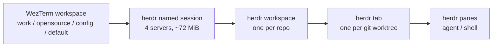

# Multiplexer Comparison: tmux vs herdr

Read this doc when you weigh replacing tmux as this repo's inner multiplexer,
when you plan feature work that a tmux upgrade could absorb, or when you need
the measured numbers behind either decision instead of re-deriving them. The
most durable half is [*Upstream tmux 3.8*](#upstream-tmux-38-changes-the-calculus):
a mapping from herdr's differentiators to native tmux equivalents, usable as the
worklist for the next tmux upgrade.

Measured against **herdr 0.8.0** and **tmux master (post-3.7c)** on
**2026-08-18**. Both move fast — re-verify before acting.

## Evaluation record

**Outcome: tmux stays. No herdr code exists in this repo.**

On 2026-08-18 herdr 0.8.0 was installed and driven for real: the `default`
workspace ran herdr natively (no tmux nesting) behind a temporary
`WEZTERM_DEFAULT_SHELL_MUX` switch in `open-default-shell-session.sh`. That
switch, its `local.example/shared.env` knob, and its
`architecture.md#startup-invariants` bullet were **removed the same day** once
the tmux 3.8 findings landed, because upstream tmux is absorbing the features
that motivated the port. What survives is this comparison.

Machine-local leftovers are not tracked here and may still exist:
`~/.local/bin/herdr` and `~/.config/herdr/config.toml`. See
[*Reproducing this evaluation*](#reproducing-this-evaluation).

## What herdr subsumes, and what it cannot

Sizes are `git ls-files | wc -l` over each subsystem, measured 2026-08-18.

| Subsystem | Lines | Files | Verdict |
| --- | --- | --- | --- |
| attention pipeline | 6,111 | 13 | **Split.** herdr natively detects agent state and ships `herdr integration install <agent>` for 16 agents; that replaces detection. Cross-workspace aggregation, WezTerm tab badges, and `Alt+j` / `Alt+k` / `Alt+l` orchestration have no herdr equivalent — herdr assumes it is the outermost container. |
| worktree subsystem | 5,390 | 32 | **Mostly stays.** `[worktrees]` + `herdr worktree` cover create/open/remove against a plain `<dir>/<repo>/<branch-slug>` layout. The dev/task/hotfix semantics, repo-family reuse, task-prompt injection, reclaim, and the `${WEZTERM_REPO}` expansion are ours. |
| tmux tests | 4,736 | 37 | Follows whatever it covers. |
| tab visibility / overflow | 3,198 | 11 | **Deletable under B or C.** Exists because repos outnumber `Alt+1..9` slots; herdr's sidebar lists every workspace at once and `switch_workspace` + `[keys.indexed]` addresses the same problem natively. |
| popup / picker / menu | 2,637 | 11 | **Mostly deletable**, except any popup a script or cron starts — see constraint 7. |
| keybinding single source of truth | 1,559 | 3 | **Retarget, do not delete.** `manifest.json` stays; `render-tmux-bindings.sh` becomes a `config.toml` `[[keys.command]]` renderer; `tmux.conf` (320 lines) goes. |
| tmux status bar | 1,306 | 10 | **Deletable.** Verified 2026-08-18: `state_icon` / `workspace` / `branch` / `git_status` are built-in sidebar tokens, so the node + WakaTime segments and their external pusher were dropped entirely rather than ported. |
| tmux-reset | 1,299 | 5 | **Likely deletable** — herdr persists sessions and has `[session]` agent resume plus pane-history replay. Its layout-rebuild + managed-command replay semantics need a real test first. |
| event bus | 292 | 2 | **Deletable**, but inverted: ours is external → WezTerm Lua; herdr's is `events.subscribe` on a socket, which requires a resident subscriber. |
| tmux install / version gate | 240 | 3 | **Deletable.** Single binary, `herdr update`, and the "tmux 3.7+ floor" disappears. |

Total tmux coupling: **≈26,800 lines across 127 files** (851 direct `tmux …`
call sites, no abstraction layer — `TMUX_BIN` exists only in
`openclaw/scripts/session-bridge/`).

Unaffected by any mux choice, **≈11,900 lines**: Windows host-helper / IPC
(5,942), skills — adversarial-review / brainstorm / agent-fanout (4,057),
OOM + disk + diagnostics guards (1,681), agent launch chain (268). WezTerm-layer
work is also untouched: tab bar, right-status `M·` / `S·` / `D·` / `CDP·`
badges (`mem_status.lua`, `disk_status.lua`, `chrome_debug_status.lua`),
appearance presets, workspace switching.

## Measured constraints

Each of these changes a design decision, so they are recorded with the
observation that produced them.

1. **One server process per named session, ~18 MiB each.** Observed 17.3 MiB
   and 18.4 MiB RSS for two sessions. tmux runs **one** server for all 17
   sessions at 22.6 MiB. Extrapolated: 17 herdr sessions ≈ 306 MiB (+283 MiB);
   10 project tabs ≈ 180 MiB. On this machine that competes directly with the
   guard thresholds in [`diagnostics.md`](./diagnostics.md).
2. **Focus is a single session-level field.** `workspace list` reports exactly
   one `focused=true`, and `herdr workspace focus <id>` moves it for every
   attached client. Two clients on one session are two views of the same
   workspace — "one session, N WezTerm tabs each showing a different repo" is
   not expressible.
3. **Official guidance is consolidation.** From [Concepts](https://herdr.dev/docs/concepts/):
   "Use workspaces first. Use named sessions when you need completely separate
   panes, sockets, and persisted runtime state." and "Use one workspace per
   repo, task, or investigation." Per-tab named sessions are the documented
   escape hatch, not the default — and they are the expensive shape per (1).
4. **Sidebar only, and it is narrow.** No bottom status bar exists.
   `sidebar_width` is clamped to 18–36 columns; at most 16 rows and 16 tokens
   per row. A 30-column sidebar truncated `⬢ v22.23.1 · AI 6 h… · Code …`, so
   multi-segment rows must be split. Token styling accepts only `fg`, `bold`,
   `dim` — no background, so tmux's `#[fg=…,bg=…]` inline styling has no
   equivalent.
5. **No `#(shell)` and no `status-interval`.** Custom values are pushed:
   `herdr {pane,workspace} report-metadata <id> --source <ID> --token NAME=VALUE
   [--ttl-ms N]`, rendered as `$name` tokens. TTL expiry is the "value went
   stale" mechanism (missing values hide with their separators). Anything that
   must stay fresh needs an external timer.
6. **No `set-hook` equivalent.** The socket API is newline-delimited JSON with
   `events.subscribe`, covering workspace/tab/pane/layout/worktree events
   including `pane.agent_status_changed`, `pane.output_matched`, and
   `pane.focused` — broader than tmux hooks, but push-based on a long-lived
   connection. Our 3 `set-hook` registrations become a resident watcher with
   its own lifecycle, restart, and logging.
7. **No ad-hoc popup CLI.** Popups exist as `[[keys.command]]` with
   `type = "popup"` (plus `type = "shell"` / `"pane"`, `width` / `height` in
   cells or percentages) and as `herdr plugin pane open --placement popup`.
   There is no `herdr popup <cmd>`, so script- and cron-driven popups
   (`reminder.sh`, `tmux-popup-active.sh`) require authoring a herdr plugin.
   `herdr plugin` exists in 0.8.0 even though the top-level usage omits it.
8. **Pane environment injection replaces `$TMUX` probing.** Panes carry
   `HERDR_ENV=1`, `HERDR_PANE_ID`, `HERDR_TAB_ID`, `HERDR_WORKSPACE_ID`, and
   `HERDR_SOCKET_PATH`. `HERDR_SOCKET_PATH` is also how a CLI call selects a
   named session — each one has its own socket under
   `~/.config/herdr/sessions/<name>/herdr.sock`. Cleaner than
   `#{pane_id}` + format strings.
9. **IDs are positional; labels are not unique.** `w1`, `w1:t1`, `w1:p1` —
   readable but position-derived, not content-derived like
   `wezterm_<ws>_<repo>_<hex>`. Labels default to the directory basename, so
   two workspaces on the same directory both render as the same name. Any port
   of `attention.json` must key off an explicit `--label` ↔ id map instead of a
   parseable session name.
10. **No per-pane background.** `[theme]` offers global tokens plus
    `[theme.custom] panel_bg`; pane distinction comes from `pane_borders` and
    the accent color. Two consequences: the cream active/inactive pane tint of
    [`appearance-presets.md`](./appearance-presets.md) cannot be reproduced, and
    the **secondary** Grok tint fight in [`tmux-ui.md#grok-build-in-tmux`](./tmux-ui.md#grok-build-in-tmux)
    (opaque `#eeeeee` vs cream `window-style` / `window-active-style`) has no
    differential left to flash against. That does **not** remove the **primary**
    FocusGained `terminal.clear()` flash (any multiplexer still triggers
    upstream’s heal; macOS can hide it via sub-frame client redraw, WSL→Windows
    does not — even a ~31×15 pane still flashed). The cream patch stays optional
    for tint; the standing mitigation for whole-content flash is
    `scripts/runtime/grok-with-focus-filter.sh --install` (wrapper at
    `~/.grok/bin/grok`, ELF at `grok.real`) in that same section. Never
    visually confirmed on herdr: the evaluation switch was removed before
    that test ran — see Open questions.
11. **Config reloads live.** `herdr server reload-config` returned
    `status=applied, diagnostics=[]` and the attached client repainted with the
    new sidebar layout. No client restart, no session loss.
12. **Integrations write into agent config dirs.** `herdr integration install
    claude` targets `~/.claude/hooks/herdr-agent-state.sh`; sibling targets
    exist for codex, grok, copilot and 13 more. Additive alongside this repo's
    own attention hooks (an event can carry several hooks), so both pipelines
    can run during evaluation. Not installed yet.
13. **Unrelated but load-bearing: `wezterm cli spawn` cannot pass args to
    `wsl.exe` here.** `wezterm.exe cli spawn --new-window -- wsl.exe -d <distro>
    -e touch /tmp/spawn-proof` never executes (no file created); bare
    `wsl.exe` starts but exits within seconds. `--new-window` with no PROG works
    and goes through `default_prog`. This is a WezTerm-CLI-side problem, not a
    herdr one; the repo's Lua path (`SpawnCommandInNewWindow` with
    `{'wsl.exe','-d',distro,'--','bash',script}`) is unaffected. Any future
    "open a window running X" helper should go through Lua, not `cli spawn`.

## Upstream tmux 3.8 changes the calculus

Checked 2026-08-18 against `tmux/tmux` master. **3.7c shipped 2026-08-17** (this
machine runs 3.7b); the master `CHANGES` section is titled "CHANGES FROM 3.7c TO
3.8", so the following is unreleased but committed. It lands most of what herdr
differentiates on — natively, on one server, with our 26,800 lines of tmux
coupling still valid.

| herdr differentiator | tmux 3.8 native equivalent | Consequence for this repo |
| --- | --- | --- |
| `events.subscribe` over a JSON socket | Hooks and control-mode notifications rebuilt on internal **events carrying key/value payloads**. `set-hook -B` registers a *monitor* that checks a format every second and fires on change (`-T` only when true), `refresh-client -B` subscription syntax, `show-hooks -B`, `wait-for -E` waits on hooks/notifications/user events, `set-hook -E` fires one immediately, `wait-for -v` shows a hook's keys. New hooks for client create/destroy, pane activity, pane mode and prompt changes, pane movement/resize, session group changes, window create/close/zoom. | The [event bus](./event-bus.md) (292 lines) keeps its OSC/file transport into WezTerm Lua, but the tmux-side plumbing collapses onto native monitors instead of hand-rolled polling. Removes the main reason a herdr port needed a resident watcher. |
| Zero-config agent state detection | **OSC 133 escape sequences now trigger events**: `pane-command-started`, `pane-command-finished`, `pane-shell-prompt`. Plus `pane_last_output_time` as a format and a `t/d` modifier giving a time difference in seconds. | A provider-agnostic attention path. `scripts/runtime/agent-attention/adapters/` currently has only `claude.sh` and `codex.sh` — Grok has no attention coverage at all. OSC 133 events plus `pane_last_output_time` would cover any agent without a vendor hook. |
| Popups / overlays as first-class UI | **Floating panes**: `new-pane` / `split-window` with `-T` title, `-B` border lines, `-W` wait-for-exit; **modal panes** via `new-pane -O` (one per window, blocks interaction elsewhere); move/resize/drag including mouse; `break-pane` floats a tiled pane and `join-pane` tiles a floating one; `choose-tree -h` / `choose-client -h` hide the pane containing the mode and `-k` kills it on exit; `pane-border-status` gains `top-floating` / `bottom-floating`; default bindings under `C-b g`. `display-panes` is now a mode that can run inside another pane. Menus belong to the window and appear on all clients. | Upgrades the substrate under 78 `display-popup` call sites. Cron-driven reminders get a modal pane instead of a popup that dies on close. Most importantly: **a persistent sidebar — the thing herdr's UI is built around — becomes expressible as a floating pane**, which `display-popup` never allowed. |
| Sidebar list + fast switching | `switch-mode`, a fast switcher bound by default to `Tab` (windows) and `S-Tab` (sessions). Additional pane sort orders, `z` sort order for floating panes, `-f` filters on `kill-pane -a` / `kill-window -a` / `kill-session -a`. | Overlaps the `Alt+/` picker and worktree cycling; the picker subsystem (2,637 lines) can shrink onto native modes rather than being ported anywhere. |
| Theme awareness | Builtin light and dark themes, a `theme` option controlling detect / terminal / force-light / force-dark, `themeblack` / `themewhite` / `themegreen` style names expanded as formats, `tree-mode-selection-style`, and — decisive here — **the terminal's own theme is reported to panes instead of being guessed from the background** (issue 5343). | May retire the **secondary** GrokDay `#eeeeee` tint patch in [`tmux-ui.md#grok-build-in-tmux`](./tmux-ui.md#grok-build-in-tmux) if Grok stops guessing light bg. It does **not** fix the **primary** FocusGained full-clear flash (gate is multiplexer detection, not theme guess). Better than herdr’s “no per-pane background” (constraint 10) because cream active/inactive tint can survive. |
| Status animation for agent activity | `#{A/count:frames}` renders a frame series as an animation in the status line (issue 5412). | An "agent working" spinner with no external script and no timer. |
| Synchronized-output correctness | Post-3.7c master: **DECRQM used to detect mode 2026**, and "Flush output before ending sync". | Directly in the area [`ime-flicker-and-sync-output.md`](./ime-flicker-and-sync-output.md) documents; the repo tmux floor may want to move again. |
| Misc worth borrowing | `set-option` / `set-hook` take formats with a `-F` flag; `dim=` and `link=` / `nolink` style attributes; `O:` loops over options and `V:` over environments; `I` reports client terminal info; `m` supports multiple terms and fuzzy matching; `client_colours`, `pane_start_command_list`, `pane_modal_flag`, `window_modal_pane`; `new-window -E` / `respawn-pane -E` for empty panes; `mouse` now defaults to on; control-mode fixes for clients hanging on exit and notifications to exiting clients (issues 5356, 5357). | Fuzzy `m` and `O:` loops simplify status and picker formats. The control-mode fixes matter for [`session-bridge`](../openclaw/docs/session-bridge.md), which parses control/format output. |

What tmux 3.8 still will **not** provide, and herdr will:

- A built-in agent state machine with vendor integrations for 16 agents
  (`herdr integration install <agent>`). We already own the equivalent for
  Claude and Codex; the gap is Grok and anything new.
- A real JSON API. tmux control mode stays a line-oriented text protocol.
- Built-in git worktree management (ours is more specialized anyway).
- Per-session process isolation — which constraint 1 shows is a memory
  liability here, not a feature.

**Revised recommendation.** Keep iterating on the custom layer on tmux, and
treat herdr as a source of design ideas plus a benchmark, not a migration
target. The three things that made herdr attractive — event subscriptions with
payloads, a persistent sidebar, and theme-correct agent rendering — arrive in
tmux 3.8 without giving up per-repo WezTerm tabs, the badge granularity, the
manifest-driven three-layer keymap, or 280 MiB of RAM. The `default` workspace
stays on herdr for hands-on comparison; nothing else moves until the open
questions below close.

## Option space (analyzed, not adopted)

Kept because it is the reasoning a future revisit would otherwise repeat. The
deletion volume is decided by one question: which layer owns the workspace/tab
model.

### A — herdr owns everything

One herdr session; WezTerm keeps a single window as a host. Matches herdr's
official model exactly.

- Deletes ≈16,000–18,000 lines: tab visibility + overflow + `workspace_manager`,
  the badge/jump/picker half of attention, status bar, tmux-reset, event bus,
  `tmux.conf`, most pickers, and their tests.
- Gives up WezTerm tab badges, `Alt+1..9` cross-repo tabs, the pane tint, and
  the three-layer manifest (wezterm / tmux / chord) collapses to herdr keys plus
  a prefix table. Multi-level chords are unverified.

### B — one herdr session per WezTerm tab

The direct tmux analogue: WezTerm tab ↔ herdr session ↔ one repo family.

- Deletes ≈5,000–7,000 lines: status bar, tmux-reset, install/version gate,
  copy-mode + IME/sync-output workarounds, `tmux.conf`, part of worktree/picker.
- **Costs ~18 MiB per repo** (constraint 1) and is the documented escape hatch
  rather than the recommended model (constraint 3). Keeps tab visibility /
  overflow and still needs a herdr ↔ WezTerm id-mapping watcher.

### C — herdr session per WezTerm workspace (recommended)

Map the herdr session to the *context* level that already exists in this repo,
not to the repo level.



- ~72 MiB instead of ~306 MiB, and no "everything in one window".
- Each session internally follows the official workspaces-first model.
- herdr has one nesting level more than tmux (session / workspace / tab / pane
  vs session / window / pane), so repo → worktree → split maps natively instead
  of encoding worktree semantics in tmux window metadata options.
- Deletes the per-repo WezTerm tab layer, where the complexity concentrates:
  tab visibility + overflow (3,198) and most of the attention badge machinery.
- Estimated deletion: **≈10,000–12,000 lines**.
- Costs: no cross-repo `Alt+1..9`; badges drop from per-repo to per-context
  granularity (4 entities), so "which repo" moves into the herdr sidebar.

## What a migration would still require us to build

Workspace switching itself needs **no** new work: it is
`wezterm.action.SwitchToWorkspace` (6 call sites) driven by `manifest.json` →
`action_registry.lua`, and it does not care what runs inside the pane — the
`default` workspace already proves this. What does need building, in order of
size:

1. **Per-workspace first-open spawn (small).** `workspace_manager.lua` →
   `runtime.project_session_args` → `open-project-session.sh` must gain a herdr
   branch that starts `herdr --session <workspace>` and turns the repo list in
   `wezterm-x/workspaces.lua` into `herdr workspace create --cwd <repo>
   --label <name>` calls. Same switch pattern already proven for `default_prog`.
2. **Cross-workspace attention aggregation (largest remaining piece).** The jump
   action is reusable (`attention.lua:1213` is already `SwitchToWorkspace`); what
   must be rewritten is how it knows *where* to jump. Today that is
   `attention.json` plus `parse_session_workspace` reverse-parsing
   `wezterm_<ws>_<repo>_<hex>` (3 call sites). Under C there is no tmux session
   name to parse, so a resident watcher must subscribe to
   `pane.agent_status_changed` across the 4 sockets and aggregate to "which
   WezTerm workspace holds a waiting agent".
3. **`Alt+/` global picker (medium).** Must iterate the 4 session sockets via
   `HERDR_SOCKET_PATH` (verified working), or accept that the cross-context view
   is maintained WezTerm-side by the same watcher.

This is the structural cost of keeping a container above herdr, and it is why
the official recommendation is a single window: the moment another container
exists, cross-container state aggregation is yours to build.

## Reproducing this evaluation

Nothing in the repo is needed; the switch was 48 lines in
`open-default-shell-session.sh` (an early `exec herdr --session <name>` branch
gated on an env knob, falling through to tmux when the binary is missing) plus
a pinned backend in `tests/tmux-reset/cases/13-*`. Re-adding it is cheap.

```bash
curl -fsSL https://herdr.dev/install.sh | sh   # binary into ~/.local/bin, no sudo
herdr --session scratch                        # attach a TUI; ctrl+b q detaches
herdr session list                             # sessions and their sockets
herdr session stop <name>                      # stop one session's server
rm -f ~/.local/bin/herdr ~/.config/herdr/config.toml
```

Two gotchas that cost time on 2026-08-18 and are not herdr's fault:

- `wezterm cli spawn` cannot pass arguments to `wsl.exe` here (constraint 13) —
  drive new windows from Lua `SpawnCommandInNewWindow` instead.
- `runtime_env_load_shell` sources `shared.env` with plain assignments, so the
  file overrides anything the caller exported. Any backend switch read from
  `shared.env` needs a caller pin captured *before* the load, or tests cannot
  select a backend on a machine that sets one.

## Open questions

These are the reasons to revisit this doc. Each is dated with how to close it,
per the repo convention.

- **2026-08-18 — tmux 3.8 release timing is unknown.** Every borrow in
  *Upstream tmux 3.8* is committed to master but unreleased, and the repo
  install policy prefers system/package tmux
  ([`ime-flicker-and-sync-output.md`](./ime-flicker-and-sync-output.md)). Close
  it by watching `gh api repos/tmux/tmux/releases --jq '.[0].tag_name'`; until
  then treat the table as a worklist, not an available API.
- **2026-08-18 — Upgrade this machine from 3.7b to 3.7c.** Released 2026-08-17
  as a bug-fix release. Close it by upgrading, then running
  `scripts/dev/test-lua-units.sh` and `tests/tmux-reset/run.sh`.
- **2026-08-18 — Can OSC 133 events replace the per-agent attention
  adapters?** `scripts/runtime/agent-attention/adapters/` has only `claude.sh`
  and `codex.sh`, so Grok has no attention coverage; tmux 3.8's
  `pane-command-started` / `pane-command-finished` / `pane-shell-prompt` plus
  `pane_last_output_time` would be provider-agnostic. Close it by building tmux
  master, emitting the events from a Grok pane, and comparing the transitions
  against `attention.json` as produced by the Claude adapter. This is the
  highest-value borrow on the list.
- **2026-08-18 — Does tmux 3.8 theme reporting fix the Grok background
  tint conflict?** Secondary only — see [`tmux-ui.md#grok-build-in-tmux`](./tmux-ui.md#grok-build-in-tmux).
  Grok paints opaque `#eeeeee` when it guesses light; 3.8 reports the terminal's
  real theme to panes (issue 5343). Close it by testing against master with
  `scripts/dev/patch-grok-theme-wezdeck.sh` reverted; if clean, retire the patch
  and the `WEZDECK_GROK_BG` knob. Does **not** close the FocusGained full-clear
  flash (that needs an upstream gate narrow or the PATH focus-filter; macOS
  sub-frame redraw can hide it, WSL→Windows cannot — see the same section).
  Beats herdr’s “no per-pane background” outcome (constraint 10) because cream
  active/inactive tint can survive.
- **2026-08-18 — Is a persistent sidebar worth building on floating panes?**
  herdr's always-visible agent list was its most convincing UI element, and
  `new-pane -O` / floating panes make one expressible for the first time —
  `display-popup` never allowed a persistent overlay. Close it by prototyping a
  floating pane that renders the `Alt+/` picker content continuously and
  deciding whether it beats the on-demand popup.
- **2026-08-18 — Can tmux 3.8 monitors replace hand-rolled polling in the event
  bus?** `set-hook -B` checks a format every second and fires on change, with
  `wait-for -E` / `set-hook -E` / `wait-for -v` around it. Close it by porting
  one existing poller (candidate: the tab-stats or status refresh path) to a
  monitor hook on master and comparing latency and CPU against today's numbers
  in [`performance.md`](./performance.md).
- **2026-08-18 — `tests/tmux-reset` case 19 fails on master.** Pre-existing and
  unrelated to this evaluation: verified by stashing the herdr changes and
  re-running (`expected agent-cli:mockagent`, `actual agent-cli:claude`,
  consistent with `MANAGED_AGENT_PROFILE` in `shared.env` overriding the test's
  mock profile because `runtime_env_load_shell` sources with plain assignments).
  Close it by making the case pin its own profile.
