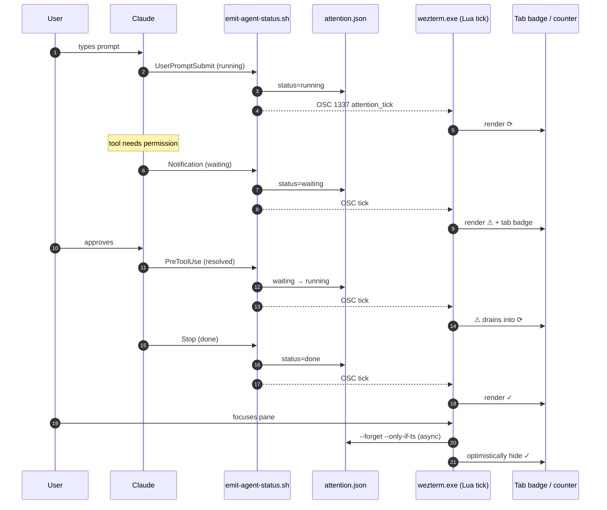
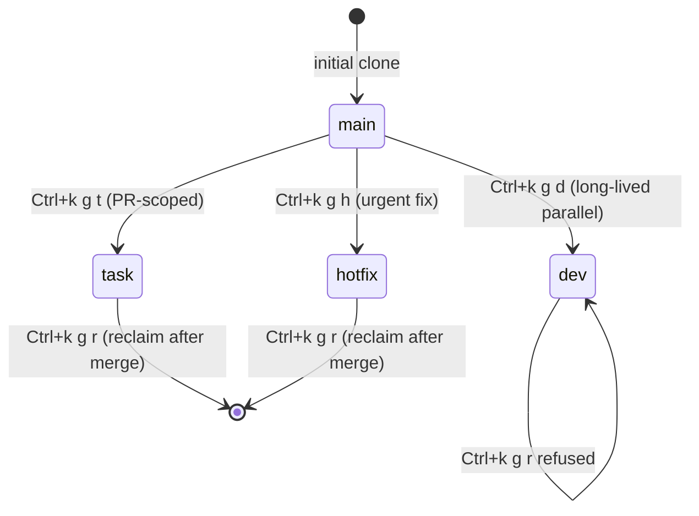
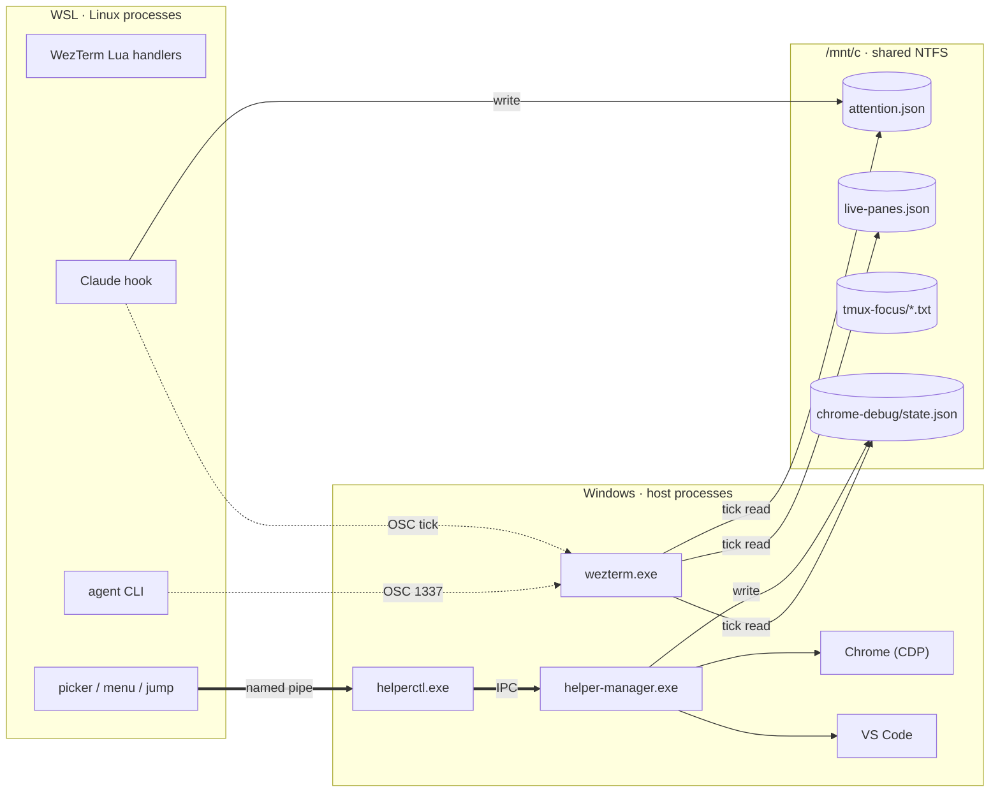
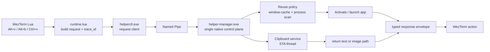

# WezDeck — A Flight Deck for Your AI Agents

> *Built on WezTerm + tmux + git worktrees.*
> *仓库源码在 `wezterm-config`，对外品牌叫 **WezDeck**。*
>
> **三篇导航**：本篇是 **"现在长什么样"** 入门篇（10 分钟）。想看 v0 → v5 演进 + 一天日常切面 → [evolution](./ai-dev-environment-evolution.md)（30 分钟）。想看作者前端视角的 personal reflection → [v1.0](./personal-terminal-platform-v1.0.md)（8 分钟）。

---

## 一句话

WezDeck 是一套面向多 agent 时代的 personal terminal platform：

- **每个 WezTerm tab = 一个 repo**
- **每个 tmux window = 一个 git worktree**
- **每个 pane 可以挂一个 agent CLI**（`claude` / `codex` / 任何带 hook 的）
- **`Alt+/` 跨所有 pane 跳到下一个 pending 任务**
- **`Ctrl+k g {d,t,h}` 一键开新 worktree + 配套 agent**

不是一份 dotfiles，是一个**有控制面的工作环境**。

---

## 为什么写这篇

2025 年起 agent CLI（Claude Code、Codex、Gemini 等）成熟之后，终端重新变成主战场。但默认终端不够：

- **没有"哪个 agent 在等我"的全局视图**：5 个 pane 在跑，3 个在等权限，你只能挨个切回去看。
- **没有"多任务隔离"的语义**：同一个 repo 想并行做两个独立任务，要么手动开 worktree + tmux window 串到一起，要么所有 agent 抢同一个 cwd。
- **没有"宿主能力可调用"的接口**：要让 agent 能开 VS Code、用剪贴板、跑无头 Chrome 给 MCP 用，就得堆一堆临时脚本。

WezDeck 的存在不是把这些做成"几个快捷键 + 几个脚本"，而是**抽出一条统一的控制面**：状态文件 + OSC 通信 + native helper IPC，每条链路都能被 trace、可验证、可演化。

---

## 核心特性 · 5 个

### 1. 跨 pane 的 Agent Attention 流水线

每个 agent CLI（通过 6 个 Claude Code hook）把自己的 turn 状态实时写到一个共享 JSON 文件，WezTerm 的 Lua tick 读它、渲染：

- **Tab 标签**带 1-cell `█` 色块徽章（暖橙 waiting / 冷蓝 running / 暗绿 done）
- **右栏永久占位的三段计数**：`🚨 N waiting   ✅ N done   🔄 N running`
- **`Alt+,` / `Alt+.` / `Alt+/`** 三个键分别跳到下一个 waiting / done / 用 popup 看全部

整条链路：

**为什么是它最值得讲**：这是 WezDeck 第一个把"状态文件 + OSC + Lua tick"的三件套跑通的特性，后续所有跨 pane 状态（IME 状态、Chrome CDP 状态、worktree git 状态）都复用同一个模式。

### 2. 跨 worktree 的统一驾驶视图

一个 repo 经常需要并行做几件事：长期重构在 `dev-`、PR-scoped 任务在 `task-`、紧急修复在 `hotfix-`。WezDeck 用**目录前缀编码生命周期**，跟 git branch 命名解耦：

每个 worktree 在自己 tmux window 里启动 agent CLI，cwd 隔离 / 对话历史隔离 / dev-server 状态隔离。`dev-*` 拒绝 reclaim 是有意的：保护几天积累的 agent 上下文不被一键误删。

### 3. WSL ⇄ Windows 的三通道通信

WezDeck 的主要场景是 hybrid-wsl（Windows 桌面 WezTerm + WSL Linux runtime + Windows native helper）。三种独立通道穿过这条边界，每条用在最合适的地方：

- **同步请求**（Alt+v 开 VS Code、Alt+b 起 Chrome、Ctrl+v 智能粘贴） → 实命名管道 IPC，~50-150ms
- **异步通知**（attention tick、IME 状态推送） → OSC 1337 escape codes，sub-frame
- **轮询状态**（badge 计数、CDP 健康检查） → /mnt/c 共享 NTFS 文件

为什么状态文件落 `/mnt/c` 而不是 WSL ext4？因为消费方在 Windows 侧（`wezterm.exe` 4Hz tick 读）—— bench 实测 wezterm.exe 读 `/mnt/c` 是 0.02ms，读 `\\wsl$\…` 是 3.12ms，**150 倍差距**。这条选址规则是 WezDeck 所有跨 FS 决策的载重点。

### 4. Native Host Helper —— 让宿主能力变成"一个请求"

每次按 `Alt+v`、`Alt+b`、`Ctrl+v`，WSL 里的 Lua / bash 不会自己去调 PowerShell，而是发一个 typed request 给一个**长驻的 C# helper**：

helper 是单决策点：VS Code 窗口复用、Chrome debug 实例复用、剪贴板 text/image 区分、IME 状态查询，全部走它。所有请求都带 trace_id，helper 端的 `helper.log` 和 wezterm 端的 `wezterm.log` 用同一个 id 关联，单条 grep 就能拼出端到端时间线。

后台还有自启动的无头 Chrome（带 `--remote-allow-origins=*` + 1920×1080），开机即用，MCP / agent 工具直接 `--browser-url=http://localhost:9222` 连进去，不用人按任何键。

### 5. Alt+/ Popup —— 11× 优化的快门感

`Alt+/` 是这套环境每天按 50-100 次的快门键，所以它的延迟被当成产品指标在看。原始 bash 实现冷启 545ms，2026-04-25 一天压到 49ms（11×），靠的是：

- **Go 静态二进制**取代 popup pty 里的 bash + 3 个 lib source（30-80ms → 2-5ms）
- **24 小时缓存** Windows 环境探测（`%LOCALAPPDATA%` 之类，省 600ms / 次）
- **菜单层 prefetch + 单帧渲染**（消除 popup 第一帧的"白闪"）
- **`tmux run-shell -b` 异步 dispatch**（按 Enter 后 popup 立刻关，不等下游做完）

每次按 `Alt+/` 都会写一条 `attention.perf` 结构化 log；`scripts/dev/perf-trend.sh --diff today yesterday` 直接出趋势图，不用重新跑 bench。**性能不是单点 commit，是带 observability 的产品契约。**

---

## 架构 · 5 层

| 层 | 技术 | 角色 |
|---|---|---|
| 交互层 | WezTerm + tmux | 工作区、面板、快捷键、命令路由 |
| 运行时层 | bash + Go (`picker` binary) | sync、bootstrap、diagnostics、popup pickers、worktree-task |
| 宿主桥接层 | PowerShell | Windows 安装、兼容、bootstrap |
| 原生控制层 | C# (.NET) | helper-manager.exe / helperctl.exe / IPC control plane |
| 协作层 | docs + agent profiles + manifest | 让 AI 和人都能稳定消费平台能力 |

难点不是"语言多"，是**每一层该放什么、边界要怎么收**。这套环境真正硬的工作是 2026-04 的 `v5` 阶段把这条边界确定下来 —— 在那之前所有"宿主动作"是临时拼起来的脚本树。

---

## AI 协作哲学：不是自动生成，是持续纠偏

WezDeck 自己就是用 AI 写出来的（Claude Code 是主力 agent），但工作流不是"按个键 AI 自动做完"。实际过程更像：

1. 我提出目标
2. AI 快速实现或给结构方案
3. 我不断纠偏：方向对不对 / 交互是不是自然 / 结构够不够优雅 / 验证是不是太浅
4. 跑真实链路回归
5. 重构 + 收口

关键词：**AI 提速，人把标准抬高**。"实现 → 纠偏 → 验证 → 收口"四步循环，缺哪一步都会出问题。WezDeck 之所以走得远，是因为它从一开始就把"验证"当一等公民：每个 hook 转换都要能在 `bench-attention-popup.sh` 跑通，每个状态变化都要能在 `attention.perf` log 里被回放。

这也是**为什么 attention 流水线是 WezDeck 第一个被认真做的特性** —— 它直接对应"AI 在 5 个 pane 里同时跑，我怎么知道哪个该看"的高频痛点；做完之后所有后续特性的开发循环都变快了，因为我不再因为不知道哪个 agent 等我而走神。

---

## 上手路径

不一定要全套用，按需取。最小可玩子集：

1. **只想要 attention 计数** → 装 hook（[`docs/agent-attention.md#hook-installation`](../agent-attention.md#hook-installation)），不需要 hybrid-wsl 也不需要 helper
2. **只想要 worktree 工作流** → `Ctrl+k g d/t/h` + `worktree-task` runtime（[`docs/workspaces.md`](../workspaces.md)），git 仓库就能用
3. **只想要快的 popup picker** → 装 Go 1.21+ + `wezterm-runtime-sync`，`Alt+/` / `Alt+g` / `Ctrl+Shift+P` 自动用 Go 二进制
4. **完整 hybrid-wsl 体验** → 跟着 [`docs/setup.md`](../setup.md) 走全程

---

## 进一步阅读

- 全套 docs 入口：[`docs/README.md`](../README.md)
- 把"为什么会走到这里"的五版本演进讲清楚：[`ai-dev-environment-evolution.md`](./ai-dev-environment-evolution.md)
- 2026-04 v1.0 里程碑历史快照：[`personal-terminal-platform-v1.0.md`](./personal-terminal-platform-v1.0.md)

---

## Q & A 候选

- 这套适合什么样的开发者？ —— 已经在用 agent CLI、且每天会同时挂 ≥ 2 个 agent 的人；不是"想试试 AI"的入门用户。
- 哪些部分最值得迁移到其他环境？ —— attention pipeline（hook + 状态文件 + OSC tick）几乎可以原样搬到任何终端 + Lua-able status bar 的组合上。
- 不是 Windows + WSL，这套还能保留什么？ —— 失去 native helper（VS Code / Chrome / 剪贴板的"统一请求"语义），但 attention pipeline、worktree-task runtime、Alt+/ popup 全部跨平台。`posix-local` mode 已经预留接口。
- AI 协作里，哪些必须由人把控？ —— 边界设计（每层放什么、哪些不放）、验证的真伪标准（什么算"跑通"）、长期演进方向。AI 在每条具体路径上都比人快，但**它不知道哪条路径不该走**。

---

## 一句话收尾

> 软件做到后面，很多问题本质上都是系统设计问题。
> WezDeck 是把"多 agent 协作"这个新场景，按系统设计的方式重新做了一遍终端。
