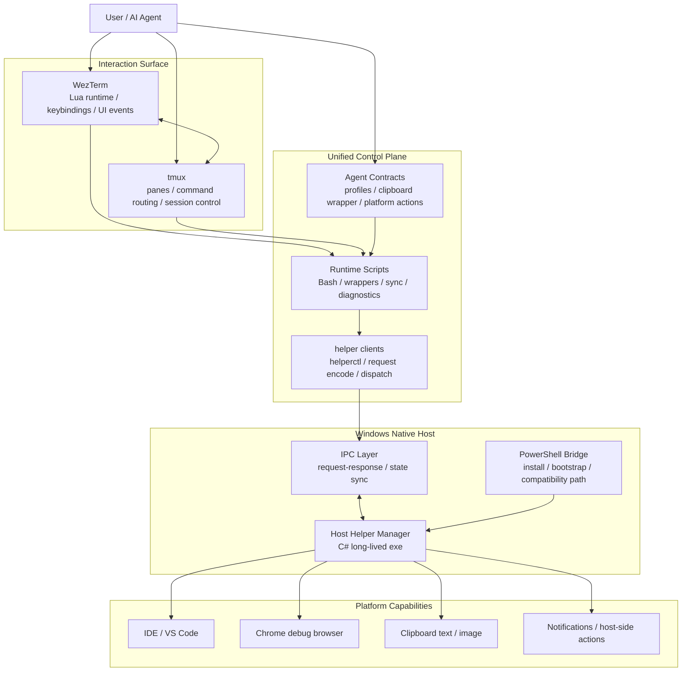

# 我的 AI 工作平台分享

> 分享提纲 — 面向技术同事

---

## 一、开场：这已经不是“终端配置”了

- 以前以为自己在折腾 `WezTerm + tmux`
- 现在回头看，实际上是在搭一个 personal terminal platform
- 这套平台同时承载：
  - 日常开发
  - Git worktree 并行任务
  - AI CLI 协作
  - Windows 宿主动作
  - 跨语言运行时控制面

一句话定位：

> `v1.0` 的意义，是这套环境第一次从“能跑”变成“有主干的系统”。

---

## 二、为什么值得分享

- AI 编码助手起来之后，终端重新变成主战场
- 单靠“几个快捷键 + 几个脚本”已经不够了
- 真正需要的是一套统一工作流：
  - 项目切换快
  - 多任务隔离清晰
  - AI 是一等公民
  - 平台动作可控
  - 整套系统可验证、可维护、可演化

---

## 三、v1.0 的核心变化

- 从“工具并排摆着”走向“统一控制面”
- 从“脚本堆出来”走向“多语言分层架构”
- 从“本机能跑”走向“helper 可构建、可发布、可回退”
- 从“AI 辅助写代码”走向“AI 快速推进 + 人持续纠偏 + 真实验证闭环”

可以重点讲这四个关键词：

- `C#`
- `IPC`
- Windows `exe`
- 混合语言架构

---

## 四、整体架构一览

### 讲解重点

- `WezTerm + tmux` 还是交互表面
- 真正的新东西在下面：统一控制面和 Windows native helper
- AI 不是外挂，而是这套平台的直接消费者

---

## 五、分层看这个项目

| 层 | 技术 | 角色 |
|---|---|---|
| 交互层 | `WezTerm` / `tmux` | 工作区、面板、快捷键、命令路由 |
| 运行时层 | Bash / shell | sync、bootstrap、diagnostics、repo-local wrappers |
| 宿主桥接层 | `PowerShell` | Windows 安装、兼容、bootstrap |
| 原生控制层 | `C#` | helper-manager.exe / helperctl.exe / IPC control plane |
| 协作层 | docs / agent profiles / contracts | 让 AI 和人都能稳定消费平台能力 |

### 这一页想强调什么

- 这不是单语言项目
- 难点也不是“语言多”
- 难点是每一层该放什么，边界要怎么收

---

## 六、前端视角下最有意思的地方

### 1. 第一次把 `C# + IPC` 真做进系统里

- 以前知道 `IPC`，但更多是概念
- 这次是把它做成了平台主链路
- `WezTerm / tmux / shell -> helperctl -> helper-manager.exe -> response`

### 2. 第一次认真处理 Windows `exe` 交付问题

- 本地有 `dotnet` 时直接 publish
- 没有 `dotnet` 时走 release fallback
- 开始有制品、安装、版本和回退语义

### 3. 第一次真正做混合语言架构收口

- `Lua`、shell、`PowerShell`、`C#` 各自干什么
- 哪些逻辑应该继续留在脚本里
- 哪些必须收敛到 long-lived helper

---

## 七、工作流设计：AI 不是插件，是一等公民

### worktree-task 的意义

- 一个任务 = 一个分支 + 一个目录 + 一个 AI 会话
- AI 在隔离 worktree 里工作，不污染主 worktree
- 多个任务可以并行推进

### 这里真正重要的不是“开新目录”

- 而是把 AI 会话、Git 分支、tmux window、工作上下文绑定在一起
- 让 AI 不只是“帮你写代码”，而是真进入你的日常工作流

---

## 八、交互哲学：tmux-first，但不牺牲直觉

### 现在的方向

- tmux 作为稳定执行层和低延迟命令表面
- `WezTerm` 负责 UI、快捷键、粘贴和终端能力
- 宿主动作走 native helper，而不是继续堆临时脚本

### 这页可以举几个点

- `Ctrl+Shift+P` 走 tmux-owned command palette
- `Ctrl+k` 作为 tmux chord prefix
- 选择、复制、智能粘贴按层分工
- `IDE/VS Code`、Chrome、剪贴板这些宿主动作进入统一请求路径

---

## 九、可观测性和验证，为什么是 v1.0 的关键

- 这次不是只做功能，还一起补了：
  - 结构化日志
  - helper diagnostics
  - smoke tests
  - runtime sync
  - release fallback

### 讲法建议

- 没有日志和验证，这套东西永远只是“玄学配置”
- 有了日志、状态、smoke test，它才开始像平台

---

## 十、AI 协作方式：不是自动生成，而是持续纠偏

这部分是分享里很值得讲的点。

### 实际过程更像这样

1. 我先提出目标
2. AI 快速实现或给结构方案
3. 我不断纠偏：
   - 方向对不对
   - 交互是不是自然
   - 结构够不够优雅
   - 验证是不是太浅
4. 再用真实链路回归
5. 最后才继续重构和收口

### 这页的关键词

- 不是“AI 自动写完”
- 是“AI 提速，人把标准抬高”
- 真正有效的是：`实现 -> 纠偏 -> 验证 -> 收口`

---

## 十一、Demo 路线建议

### 1. 先讲平台，不先讲快捷键

- 展示 `v1.0` 架构图
- 讲为什么这已经不是单纯的 terminal config

### 2. 再讲日常工作流

- 打开 `work` workspace
- 展示 tmux 状态栏和 repo-family session
- 演示 worktree 切换
- 演示命令面板
- 演示 AI task worktree 打开

### 3. 最后讲系统能力

- `IDE/VS Code` 打开链路
- Chrome debug browser 调起
- clipboard wrapper
- helper + `IPC` + logs + smoke test

---

## 十二、最后想传达的结论

- 表面上我是在折腾终端环境
- 实际上我是在搭一个自己的 AI 工作平台
- 作为前端，这次最有价值的不是“配置更顺手了”
- 而是第一次把 `C#`、`IPC`、Windows `exe`、长驻 helper、混合语言架构这些以前更抽象的东西真正做深了

一句话收尾：

> 软件做到后面，很多问题本质上都是系统设计问题。

---

## 十三、Q&A

- 这套平台适合什么样的开发者？
- 哪些部分最值得迁移到其他环境？
- 如果不是 Windows + WSL，这套设计还能保留什么？
- AI 协作里，哪些是必须由人把控的？

