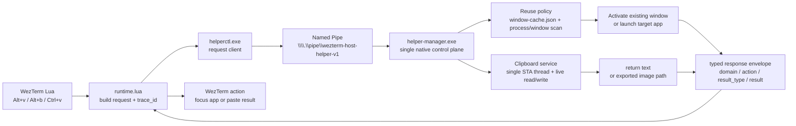

# Maintenance

Use this doc when you need to apply or verify changes.

## Daily Workflow

1. Edit files in this repo.
2. Sync runtime files with the `wezterm-runtime-sync` skill.

Private machine/project config should live in `wezterm-x/local/`, starting from the tracked templates in `wezterm-x/local.example/`.
Keep simple cross-language values in `wezterm-x/local/shared.env`, and keep Lua-only structured settings in `wezterm-x/local/constants.lua`.
Optional machine-local tmux command palette actions belong in `wezterm-x/local/command-panel.sh`.
Use `wezterm-x/local.example/shared.env` as the tracked starting point for shared scalar values such as `WAKATIME_API_KEY`.

The skill's implementation lives under `skills/wezterm-runtime-sync/scripts/`. If repo-root `.sync-target` already points at a valid home, you can sync directly:

```bash
skills/wezterm-runtime-sync/scripts/sync-runtime.sh
```

If you need to choose or change the target home, use the explicit two-step flow:

```bash
skills/wezterm-runtime-sync/scripts/sync-runtime.sh --list-targets
skills/wezterm-runtime-sync/scripts/sync-runtime.sh --target-home /mnt/c/Users/your-user
```

Run those commands from the repo root, or set `WEZTERM_CONFIG_REPO=/absolute/path/to/repo` before invoking the script from elsewhere.

3. Let WezTerm auto-reload the synced config changes.
   In current WezTerm versions, `automatically_reload_config` defaults to `true`: the loaded config file is watched, `require`-loaded Lua files are also watched, and the majority of options take effect automatically. The sync script now runs two grouped flows in parallel: a `runtime/native/helper` flow that publishes the runtime trees and installs the Windows helper, plus a `wezterm.lua` staging flow. It only commits and touches the top-level `%USERPROFILE%\.wezterm.lua` after both flows finish, so WezTerm reload does not race ahead of helper installation. Use `Ctrl+Shift+R` only to force a reload when needed.
4. The sync script also tries to reload tmux automatically when a tmux server is already running and reachable from the current shell. If you changed tmux styling or startup behavior and that automatic reload was unavailable or not sufficient, reload tmux config manually:

```bash
scripts/dev/reload-tmux.sh
```

Recreate affected sessions only if a simple reload is not enough.
For WakaTime key changes in `wezterm-x/local/shared.env`, a tmux reload is sufficient; that path no longer depends on WezTerm injecting environment variables into WSL.
5. If runtime shell rc files changed, reload the interactive shell in affected tmux panes or recreate those sessions.

For tmux reset regressions, prefer the isolated repo test suite before touching your live tmux workspace:

```bash
bash tests/tmux-reset/run.sh
```

That suite uses a dedicated temporary `tmux -L ...` socket, a temporary `HOME`, and an internal shim so it does not touch the live default tmux server. The current cases cover default-session resolution, in-place reset, current-workspace cleanup, global cleanup, and fallback-to-home behavior when the cwd is unusable.

In `hybrid-wsl`, `Ctrl+v` smart image paste now resolves clipboard state through the Windows host helper over IPC at paste time. The clipboard decision no longer depends on a separate clipboard state file or listener log; the live paste result comes directly from the helper request/response path. If text paste is fast but image-path paste stops working, sync the runtime, let WezTerm auto-reload, and inspect the shared `trace_id` across `%LOCALAPPDATA%\wezterm-runtime\logs\wezterm.log` and `%LOCALAPPDATA%\wezterm-runtime\logs\helper.log`.
The Windows host smoke test now validates clipboard behavior with controlled IPC writes as well: it writes a formatted timestamp string to the Windows clipboard, resolves it back as text, waits one second, then writes the tracked [`assets/copy-test.png`](/home/yuns/github/wezterm-config/assets/copy-test.png) image to the clipboard and resolves it back as image. The one-second gap is intentional so clipboard history tools like Ditto do not treat the second write as an update that happened "too fast" and skip it. This keeps clipboard regression checks independent of whatever is currently on the desktop clipboard.
After migrating to the new runtime layout, run [`scripts/dev/cleanup-runtime-legacy-paths.sh`](/home/yuns/github/wezterm-config/scripts/dev/cleanup-runtime-legacy-paths.sh) once from WSL to remove old runtime directories and the legacy single-file WSL log. The script deletes itself after a successful run.

## Windows Host Design

- In `hybrid-wsl`, WezTerm Lua is only responsible for request generation, helper bootstrap, and request-side diagnostics.
- `%LOCALAPPDATA%\wezterm-runtime\` is the Windows runtime state root. It keeps `logs/`, `state/`, `cache/`, and `bin/` in one place.
- `%LOCALAPPDATA%\wezterm-runtime\bin\helper-manager.exe` is the active Windows host control plane. It owns VS Code focus/open, Chrome debug-browser reuse, clipboard monitoring, and request-side decision logging.
- `%LOCALAPPDATA%\wezterm-runtime\bin\helperctl.exe` is the thin console IPC client that WezTerm Lua, tmux-side scripts, and smoke tests invoke when they need a request/response.
- `%USERPROFILE%\.wezterm-native\host-helper\windows\` is the source tree that sync publishes and the installer compiles from; `%LOCALAPPDATA%\wezterm-runtime\bin\` is the stable installed binary location that the runtime actually launches.
- `wezterm-x/scripts/` is now intentionally thin on Windows. It keeps the helper installer/launcher/bootstrap pieces, but the old Windows request handlers and worker-plugin chain are no longer part of the active design.

### Core Flow



### Key Points And Hard Parts

- 热路径现在应该只有一条主链路: `Lua -> helperctl.exe -> named pipe -> helper-manager.exe -> response`。pipe 上的请求/响应都使用 typed envelope：顶层固定 `message_type / domain / action / payload|result`，不再把不同能力都塞进一个 `kind` 和一组散字段。常态请求仍以 IPC 为主；只有在 helper 心跳明显过期或 bootstrap 状态缺失时，WezTerm 才会先做一次轻量 `state.env` 预检并同步 ensure。
- `helper-manager.exe` 是唯一决策点: VS Code 目录归一化、Chrome 调试实例复用、剪贴板文本/图片判定都放在这里，避免 Lua、Shell、PowerShell 各自维护一套状态机。
- 响应结果也按类型收口: 当前窗口复用返回 `result_type=window_ref`，剪贴板返回 `clipboard_text` 或 `clipboard_image`，避免 `pid/hwnd/text/windows_path` 继续平铺在同一层。
- 复用逻辑的难点不在“启动应用”，而在“找到正确窗口并置前”: 需要同时结合持久化缓存、进程命令行匹配、`MainWindowHandle` 可见窗口扫描，以及启动后的前台绑定补偿。
- 剪贴板逻辑的难点不在 IPC，而在 Windows 数据格式: 读的时候要在 STA 线程里拿最新内容，写图片时要同时写 `CF_DIB` 和 `PNG`，这样 Ditto 和目标程序都能稳定识别。
- 日志必须贯穿整条链路: 一个 `trace_id` 贯通 Lua 发起、helper 收到、复用决策、请求完成，排查窗口复用和剪贴板问题时不能再拆多个零散日志文件。

### Removed Or Shrunk Low-Efficiency Logic

- 旧的 PowerShell 请求处理与 worker/plugin 链已经不在 Windows 热路径。
- `Ctrl+v` 不再依赖独立剪贴板状态文件或 listener log，决策直接来自 helper 的实时请求返回。
- 请求热路径现在会先做一次轻量 bootstrap 状态预检：当 `state.env` 显示 helper 已过期、未就绪或 runtime 不匹配时，WezTerm 会先同步执行一次 ensure，再发出 IPC 请求；如果 direct IPC 仍然失败，兜底重试逻辑仍然保留。
- `wezterm-x/scripts/` 在 Windows 侧只保留安装和 bootstrap 脚本，不再承载 VS Code、Chrome、clipboard 的实际业务逻辑。

### Active Hybrid Flow

- In `hybrid-wsl`, new WSL tabs in the built-in `default` workspace now start through `scripts/runtime/open-default-shell-session.sh`, which creates a lightweight single-pane tmux session, keeps tmux status rendering enabled, and marks it `destroy-unattached on` so closing the tab still behaves like an ephemeral shell.
- WezTerm Lua generates a typed request envelope with `trace_id`, `domain`, and `action`, then invokes `%LOCALAPPDATA%\wezterm-runtime\bin\helperctl.exe` against the stable named pipe `\\.\pipe\wezterm-host-helper-v1`.
- The steady-state path now sends that IPC request first; only when the request fails does WezTerm synchronously run `wezterm-x/scripts/ensure-windows-runtime-helper.ps1` and retry once.
- `wezterm-x/scripts/ensure-windows-runtime-helper.ps1` is only a thin bootstrap: it checks the installed helper heartbeat/config, writes `manager-config.json`, and launches the stable native helper if needed.
- `%LOCALAPPDATA%\wezterm-runtime\bin\helper-manager.exe` hosts the named-pipe server, evaluates reuse/launch policy, writes decision logs, and updates the persisted instance registry.
- `%LOCALAPPDATA%\wezterm-runtime\bin\helperctl.exe` keeps request/response transport out of WezTerm Lua and avoids depending on the `WinExe` server binary for stdout.
- `%LOCALAPPDATA%\wezterm-runtime\cache\helper\window-cache.json` is the persisted instance registry for reusable app windows.
- `%LOCALAPPDATA%\wezterm-runtime\state\helper\state.env` is now bootstrap state, not request-time routing state.
- `%LOCALAPPDATA%\wezterm-runtime\state\helper\manager-config.json` is the persisted helper bootstrap config snapshot.
- `%LOCALAPPDATA%\wezterm-runtime\state\clipboard\exports\` stores exported clipboard images that bridge Windows clipboard reads back into WSL paste flows.
- `%LOCALAPPDATA%\wezterm-runtime\logs\wezterm.log` and `%LOCALAPPDATA%\wezterm-runtime\logs\helper.log` are the main diagnostics files; use one `trace_id` to follow Lua request submission, helper reuse evaluation, and request completion.

## Posix Host Design

- `posix-local` does not have a native host helper yet. Host-integrated shortcuts that depend on the Windows helper model, such as `Alt+b`, should stay unavailable there until a native helper exists.
- When `posix-local` gets a host helper, it should follow the same split as Windows: WezTerm Lua should remain a request producer, while a stable per-user native agent owns focus/open logic, clipboard monitoring, reuse policy evaluation, and structured decision logging.
- The preferred install shape is a stable per-user binary outside the synced runtime tree, with platform-specific source under `native/host-helper/<platform>/` and a thin bootstrap/installer layer under `wezterm-x/scripts/`.
- The preferred IPC/state model should stay aligned with Windows: a stable local IPC endpoint, heartbeat/state file, persisted instance registry, and shared `trace_id` propagation for diagnostics.
- Suggested platform-native service hosts are `launchd`/`LaunchAgent` on macOS and a stable per-user daemon managed directly or via `systemd --user` on Linux, as long as the runtime still sees one stable executable path and one stable state directory.

## Renderer Backend

- The tracked config currently sets `front_end = 'WebGpu'` in `wezterm-x/lua/ui.lua`.
- `WebGpu` and `OpenGL` use the same terminal/parser/shaping pipeline; the practical difference is the final GUI renderer and its driver stack.
- `WebGpu` usually maps to the platform-native modern graphics API through `wgpu` and may offer better throughput, but it is also more sensitive to driver- and compositor-specific bugs.
- `OpenGL` is the compatibility fallback. If you see stale frames, missing redraws, or a window that only visibly refreshes after focus returns, test `OpenGL` before assuming the bug is elsewhere.
- If `OpenGL` refreshes correctly even while the window is unfocused, treat that as a backend/driver compatibility clue rather than a workspace or tmux problem.
- After changing `front_end`, prefer a full WezTerm restart over relying on auto reload or `Ctrl+Shift+R`; most config edits hot-reload, but renderer changes should be verified in a new GUI process.

## Worktree Task Skill

Use the `worktree-task` skill when you want a fresh agent CLI implementation session in a linked worktree instead of continuing in the current worktree.

- Run it from the existing managed tmux agent window for the target repository when possible so the new task window can reuse the current repo-family tmux session directly from live git context.
- The skill creates linked worktrees under the repository parent's `.worktrees/<repo>/` directory.
- `WEZTERM_CONFIG_REPO` is required. In an agent workflow, every `worktree-task` run should first check whether it is configured; if it is missing, the agent should ask which tracked `wezterm-config` repo or derived repo you want, then run `skills/worktree-task/scripts/worktree-task configure --repo /absolute/path` to save the result into `~/.config/worktree-task/config.env`.
- This repository's tracked worktree-task profile lives at `config/worktree-task.env`. It enables the built-in `tmux-agent` provider, points `WEZTERM_CONFIG_REPO=.` back at this repo, and declares reusable agent launcher profiles such as `claude` and `codex`. Legacy `.worktree-task/config.env` is still accepted as a compatibility fallback.
- Machine-local agent selection belongs in `wezterm-x/local/shared.env` as `MANAGED_AGENT_PROFILE=claude|codex|...`.
- Config collection order is: configured `wezterm-config` repo profile, then `~/.config/worktree-task/config.env`, then the target repo's own `config/worktree-task.env` (or legacy `.worktree-task/config.env`), then the selected `wezterm-config` repo's `wezterm-x/local/shared.env`.
- Relative repo-managed paths such as `WT_PROVIDER_TMUX_CONFIG_FILE=tmux.conf` resolve against the configured `wezterm-config` repo or derived repo, not against the task repo where you launch the command.
- Use `configure --repo` as the stable recovery path whenever `WEZTERM_CONFIG_REPO` is missing; `launch` often consumes stdin for the task prompt, so configuration should not depend on waiting for input on that same stream.
- The built-in `tmux-agent` provider derives session reuse, existing task-window discovery, and reclaim cleanup from live git context instead of stored tmux worktree metadata.
- Managed workspace launchers and the built-in `tmux-agent` provider now execute the actual agent CLI inside the resolved login shell so PATH and shell startup files come from one stable source.
- Switch both managed WezTerm workspaces and the built-in `tmux-agent` provider by setting `MANAGED_AGENT_PROFILE=claude` or `MANAGED_AGENT_PROFILE=codex` in `wezterm-x/local/shared.env`.
- The tracked `codex` profile keeps bare `codex` for dark mode and uses `codex -c 'tui.theme="github"'` for the light variant, matching the previously validated repo behavior.
- Add a third-party agent CLI by defining `WT_PROVIDER_AGENT_PROFILE_<NAME>_COMMAND`, optional `_COMMAND_LIGHT`, optional `_COMMAND_DARK`, and optional `_PROMPT_FLAG`, then point `WT_PROVIDER_AGENT_PROFILE` at that profile name.
- The legacy direct overrides `WT_PROVIDER_AGENT_COMMAND`, `WT_PROVIDER_AGENT_COMMAND_LIGHT`, `WT_PROVIDER_AGENT_COMMAND_DARK`, and `WT_PROVIDER_AGENT_PROMPT_FLAG` still work, but profile-based switching is the preferred path because one selection now drives both launch surfaces.
- Runtime launch uses a temporary prompt file only long enough for the new pane to start; the repository does not keep a prompt archive.
- Linked worktree folders live outside the repository working tree, so they do not pollute `git status`.

Example machine-local override:

```bash
MANAGED_AGENT_PROFILE=codex
WAKATIME_API_KEY='your-key'
```

Example tracked or user-level profile extension:

```bash
WT_PROVIDER_AGENT_PROFILE=codex

WT_PROVIDER_AGENT_PROFILE_CODEX_COMMAND='codex'
WT_PROVIDER_AGENT_PROFILE_CODEX_COMMAND_LIGHT='codex -c ''tui.theme="github"'''

WT_PROVIDER_AGENT_PROFILE_GEMINI_COMMAND='gemini --interactive'
WT_PROVIDER_AGENT_PROFILE_GEMINI_PROMPT_FLAG='--prompt'
```

If you installed the skill globally and want other repositories to reuse this repo's conventions, point your user config at a `wezterm-config` repo or one of its derived repos:

```bash
mkdir -p ~/.config/worktree-task
cat > ~/.config/worktree-task/config.env <<'EOF'
WEZTERM_CONFIG_REPO=/absolute/path/to/wezterm-config
EOF
```

For a repo that is itself a `wezterm-config` repo or a derived repo carrying the same conventions, keep `WEZTERM_CONFIG_REPO=.` in that repo's tracked `config/worktree-task.env`.

If you run `launch` or `reclaim` before configuring `WEZTERM_CONFIG_REPO`, the command now stops with an explicit error telling you to run `skills/worktree-task/scripts/worktree-task configure --repo /absolute/path/to/wezterm-config` first.

Config example:

```bash
skills/worktree-task/scripts/worktree-task configure --repo /absolute/path/to/wezterm-config
```

Example:

```bash
printf '%s' "$TASK_PROMPT" | skills/worktree-task/scripts/worktree-task launch --title "short task title"
```

Useful options:

- `--base-ref <ref>` to branch from something other than the primary worktree `HEAD`
- `--branch <name>` to force a branch name
- `--provider <name|custom:name|/absolute/path>` to override the selected runtime provider
- `--provider-mode <off|auto|required>` to disable runtime launch, allow fallback, or require provider success
- `--session-name <name>` to target an already running tmux session for that repo family when launching from outside tmux
- `--variant light|dark|auto` to choose the agent CLI UI variant for the new window
- `--no-attach` to prepare the worktree and tmux window without switching the current client, including the first time that task window is created

Reclaim a finished task:

```bash
skills/worktree-task/scripts/worktree-task reclaim
```

Useful reclaim options:

- `--task-slug <slug>` to reclaim `.worktrees/<repo>/<slug>` from the current repo family
- `--worktree-root <path>` to reclaim a specific linked task worktree
- `--provider <name|custom:name|/absolute/path>` to override the provider used for cleanup
- `--provider-mode <off|auto|required>` to disable runtime cleanup, allow fallback, or require provider success
- `--force` to discard local changes and pass `-f` to `git worktree remove`
- `--keep-branch` to keep the task branch even when it is already merged

Reclaim only removes skill-managed linked worktrees under the repository parent's `.worktrees/<repo>/`. By default it refuses to remove a dirty worktree, closes tmux windows whose live pane layout still resolves to that worktree, and deletes the task branch only when that branch is already merged into the primary worktree `HEAD`.

## Diagnostics

- WezTerm-side diagnostics are configured in `wezterm-x/local/constants.lua` under `diagnostics.wezterm`.
- Runtime shell diagnostics are configured separately in `wezterm-x/local/runtime-logging.sh`, starting from `wezterm-x/local.example/runtime-logging.sh`.
- Both logging systems are enabled by default at the `info` level for control-plane events so normal workspace, tmux, worktree-task, and sync flows leave an audit trail.
- When `diagnostics.wezterm.enabled = true`, WezTerm writes structured lines to the configured `file` and also shows them in the Debug Overlay.
- Current WezTerm-side diagnostics categories include `workspace`, `alt_o`, `chrome`, `clipboard`, `command_panel`, and `host_helper`.
- Set `diagnostics.wezterm.debug_key_events = true` only for keybinding investigations; it is intentionally noisy.
- When `WEZTERM_RUNTIME_LOG_ENABLED=1`, the runtime scripts append structured lines to `WEZTERM_RUNTIME_LOG_FILE`.
- `sync-runtime.sh` also prints a one-line tmux reload result to the terminal, while the full structured detail still goes to `WEZTERM_RUNTIME_LOG_FILE`.
- `sync-runtime.sh` now also prints `[sync] step=...` milestones for the chosen target, temporary publish directories, helper install start/end, bootstrap refresh, and tmux reload status, so collapsed agent-cli transcripts still preserve the critical path.
- WSL-side helper scripts now invoke Windows PowerShell through a UTF-8 command wrapper before they call repo-managed `.ps1` files. This keeps Windows-side stderr readable in agent-cli output instead of showing mojibake when PowerShell emits localized errors.
- Runtime and WezTerm log lines now include a shared `trace_id` so related subprocesses can be correlated while debugging.
- Runtime logs rotate with `WEZTERM_RUNTIME_LOG_ROTATE_BYTES` and `WEZTERM_RUNTIME_LOG_ROTATE_COUNT`; WezTerm-side diagnostics rotate with `diagnostics.wezterm.max_bytes` and `diagnostics.wezterm.max_files`.
- Leave `WEZTERM_RUNTIME_LOG_CATEGORIES` empty to capture all runtime categories, or set a comma-separated list such as `alt_o,workspace,worktree`.
- Current runtime categories include `alt_o`, `workspace`, `worktree`, `managed_command`, `command_panel`, `task`, `provider`, and `sync`.
- `command_panel` diagnostics now carry decision fields across the WezTerm-to-tmux palette path: WezTerm logs whether `Ctrl+Shift+P` used `decision_path="user_key_transport"` or fell back to `decision_path="wezterm_native_palette"`, and tmux-side palette logs include `trigger_source` such as `user0_transport`.
- In `hybrid-wsl`, the Windows-side `Alt+v` launcher now writes structured `alt_o` lines into `%LOCALAPPDATA%\wezterm-runtime\logs\helper.log`, reusing the same `trace_id` and rotation settings as the helper diagnostics path; those lines include millisecond timestamps plus per-phase and total `duration_ms` fields for launch-path profiling. The diagnostics category remains `alt_o` for compatibility.
- In `hybrid-wsl`, the Windows host control plane is now a stable `%LOCALAPPDATA%\wezterm-runtime\bin\helper-manager.exe` process instead of a versioned PowerShell worker script. It still writes heartbeat state to `%LOCALAPPDATA%\wezterm-runtime\state\helper\state.env` for bootstrap health, while request delivery goes through the stable named pipe `\\.\pipe\wezterm-host-helper-v1`.
- `Alt+v` and `Alt+b` requests are now handled directly inside that same `helper-manager.exe` process. The old PowerShell request handlers and worker plugin chain are no longer part of the active Windows hot path.
- Host-helper reuse diagnostics now emit explicit decision fields such as `decision_path`, `registry_hit`, `matched_process_count`, `matched_process_ids`, and `matched_window_found`, so one `trace_id` is enough to explain why a request reused an existing window or fell through to launch.
- Clipboard image monitoring now runs inside that same `helper-manager.exe` process without launching a second standalone listener PowerShell window. `Ctrl+v` no longer depends on the state-file heartbeat to decide whether to paste an image path; it issues a live clipboard IPC request instead.
- In `hybrid-wsl`, WezTerm now prewarms the host helper once in the background during GUI startup, then still falls back to on-demand ensure when the helper later goes stale or a request path detects missing bootstrap state.
- For a repeatable live smoke test of the Windows runtime host, run [`scripts/dev/check-windows-runtime-host.sh`](../../scripts/dev/check-windows-runtime-host.sh) from WSL; it verifies helper health plus the current `Alt+v`, `Alt+b`, and clipboard IPC control paths against the synced Windows runtime.
## Hybrid WSL Agent Startup Measurement

- Use [`scripts/dev/install-hybrid-wsl-agent-startup-desktop-script.sh`](../../scripts/dev/install-hybrid-wsl-agent-startup-desktop-script.sh) from WSL when you want a Windows-side PowerShell test script for the currently configured managed agent CLI across the full hybrid `WSL + login shell + agent CLI` launch path.
- The generator resolves the current project agent CLI through the same `worktree-task` config chain used by the built-in `tmux-agent` provider, including `config/worktree-task.env` (or legacy `.worktree-task/config.env`), `~/.config/worktree-task/config.env`, and `wezterm-x/local/shared.env`.
- By default it writes `measure-hybrid-wsl-agent-startup-<repo>.ps1` to the Windows Desktop and targets the current WSL distro.
- The generated PowerShell wrapper invokes the generic [`scripts/dev/measure-hybrid-wsl-agent-startup.ps1`](../../scripts/dev/measure-hybrid-wsl-agent-startup.ps1) template with the resolved agent command baked in, so the wrapper tracks the current project selection instead of hard-coding a specific CLI.
- Run the generator from the target repo root or pass `--cwd /path/to/repo` to resolve a different project context.
- Use `--variant light` or `--variant dark` when you want the generated wrapper to measure that specific configured command variant instead of the default/base command.

Example:

```bash
scripts/dev/install-hybrid-wsl-agent-startup-desktop-script.sh
```

After the wrapper is placed on the Desktop, run it from Windows PowerShell with execution policy bypass:

```powershell
powershell -ExecutionPolicy Bypass -File C:\Users\your-user\Desktop\measure-hybrid-wsl-agent-startup-your-repo.ps1 -Pause
```

## Shell Integration

- Managed tmux flows no longer require shell rc `OSC 7` integration. tmux status and tmux-owned shortcuts resolve cwd from tmux's own `pane_current_path`.
- In `hybrid-wsl`, `default` workspace `Alt+v` still falls back to the pane when WezTerm only sees a WSL host path such as `/C:/Users/...`.
- In `hybrid-wsl`, the built-in `default` workspace still is not a managed workspace, but its WSL tabs now start inside a lightweight tmux session so tmux owns rendering and copy-mode behavior there too.
- Optional shell rc `OSC 7` integration can still improve WezTerm-side cwd inference for unmanaged tabs, fallback tab-title inference, and `default` workspace `Alt+v` behavior inside tmux.
- No shell rc edits are required for the managed tmux workflow described in this repository.

## Validation

- Verify workspace shortcuts still match [`keybindings.md`](./keybindings.md).
- If workspace behavior changed, verify it still matches [`workspaces.md`](./workspaces.md).
- If tmux styling or status changed, verify it still matches [`tmux-and-status.md`](./tmux-and-status.md).

The `open-project-session.sh` helper now warns when it detects tmux older than 3.3; those versions cannot enable `allow-passthrough` so the tmux theme/status may fall back to the distro defaults. Upgrade tmux (build from source or use a newer Ubuntu package) before relying on the managed theme.

### Sync helper

- Use the `wezterm-runtime-sync` skill for runtime sync work. Its scripts live under `skills/wezterm-runtime-sync/scripts/`.  
- Files under `wezterm-x/local/` are gitignored, but they are still copied because the sync skill works from the repository working tree.  
- Run `skills/wezterm-runtime-sync/scripts/sync-runtime.sh --list-targets` to print candidate user homes without syncing anything. The script skips common Windows system profiles such as `Default` and `Public`.  
- Run `skills/wezterm-runtime-sync/scripts/sync-runtime.sh --target-home /absolute/path` after the user confirms a target. This syncs immediately and updates `.sync-target`.  
- The sync step now copies the live runtime back to the stable `%USERPROFILE%\.wezterm-x\...` directory and copies native host-helper sources to `%USERPROFILE%\.wezterm-native\...`.
- The stable top-level `%USERPROFILE%\.wezterm.lua` bootstrap is still updated last, so normal WezTerm file watching continues to auto-reload the refreshed runtime after sync.
- The sync step still writes `repo-root.txt` and `repo-main-root.txt` into `%USERPROFILE%\.wezterm-x` so managed runtime code can locate the source repo and main worktree.
- On Windows targets, every sync now runs `wezterm-x/scripts/install-windows-runtime-helper-manager.ps1` and prints the helper install/build log to the terminal. If that install step fails, the whole sync fails instead of silently leaving an older helper binary running.
- On Windows targets, the sync step also publishes `%USERPROFILE%\.wezterm-native\host-helper\windows\` into the stable `%LOCALAPPDATA%\wezterm-runtime\bin\` install root so the host helper executable does not move every time the runtime is resynced.
- The synced `wezterm-x/scripts/` directory is now intentionally thin on Windows: it keeps the helper installer/launcher/bootstrap pieces and cross-platform shell helpers, while the actual VS Code/Chrome/clipboard request handling lives under `native/host-helper/windows/`.
- `.sync-target` is repo-local and gitignored. If you need to change the target home later, delete it and rerun the script to re-prompt.

## Commit Workflow

When you want a commit message that includes AI collaboration metadata, use:

```bash
scripts/dev/commit-with-ai-context.sh --help
```

The helper script:

- builds a conventional commit title and optional body
- appends an `AI Collaboration:` block when you provide AI metadata
- previews the full message before commit
- requires explicit confirmation before it runs `git commit`

Count only meaningful human adjustments in `human-adjustments`. Exclude approval-only or escalation-only interactions.
