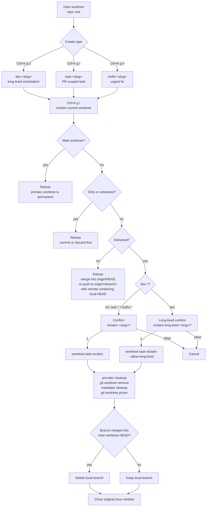

# Workspaces

Use this doc when you need to understand or edit managed workspaces.

## Workspace Model

WezTerm workspaces are the top-level session unit. For the full WezTerm-vs-tmux nesting picture and the cross-layer ownership rule, see [`architecture.md`](./architecture.md#interaction-layers).

- `default`: WezTerm built-in workspace
- `work`: managed business workspace
- `config`: managed config workspace
- `opensource`: managed open-source workspace (personal / `~/github` projects, bound to `Alt+s`)

## Behavior

- If the target workspace already exists, the shortcut switches to it. The switch runs inside a synchronous WezTerm callback, so its cost shows up directly as key-to-repaint latency — WezTerm cannot repaint the new workspace until the callback returns.
- When the existing tabs already match the configured items in order, the switch fast-paths to `mux.set_active_workspace` and skips the reorder/prune loop, so repeated switches stay roughly constant-time regardless of item count. This hot path must not run synchronous WSL subprocesses; capped workspaces use tab-visibility's label fallback instead of `print-session-names.sh` when the target workspace already exists. Without the fast path, a 7-item workspace would pay O(N²) tab matching, per-item `set_title`, optional `MoveTab`, and a final stale-tab scan on every switch, and the delay scales with item count (single-item workspaces such as `config` stay fast either way).
- When the workspace is out of sync (worktree reclaimed, items added or reordered), the next switch pays the full reorder/prune pass once to realign tabs, then later switches return to the fast path.
- If it does not exist, WezTerm creates the workspace window first and then switches to it, opening the first configured project as that workspace's entry window.
- `default` stays the built-in WezTerm workspace at the top level. In `hybrid-wsl`, its WSL tabs still launch into a lightweight single-pane tmux session.
- Non-default managed workspaces use the managed tmux bootstrap with repo-aware session reuse and the shared status layout.
- Each managed project tab boots through `tmux`.
- Each managed git project tab attaches to one tmux session per repo family, even when that repo has multiple linked worktrees.
- Inside that tmux session, each git worktree gets its own tmux window.
- Worktree switching inside that tmux session follows the live git state of the current pane or window layout, so manually created linked worktrees are discoverable without prewritten tmux metadata.
- The `worktree-task` skill creates linked task worktrees under the repository parent's `.worktrees/<repo>/` directory and opens them as additional tmux windows inside that same repo-family session.
- The `worktree-task` runtime also ships a lifecycle-aware quick-create prompt (`scripts/runtime/worktree/create-prompt`) bound to the `Ctrl+k` `g` sub-chord (`g d` for dev-, `g t` for task-, `g h` for hotfix-, `g r` to reclaim the current pane's worktree; see [`keybindings.md`](./keybindings.md#panes)). The prompt explains the selected lifecycle, its reclaim rule, and live-previews the final subject slug, worktree slug, worktree path, and branch as you type. On Enter it calls `open-task-window`, which passes the subject title, explicit worktree slug, and explicit branch to `worktree-task launch`: local worktree slugs carry lifecycle (`dev-<subject>`, `task-<subject>`, `hotfix-<subject>`), while branches use type-specific prefixes (`dev/<subject>`, `task/<subject>`, `hotfix/<subject>` by default). The configured agent starts in the new tmux window and comes up idle — `worktree-task` never injects an initial prompt.
- The left pane runs the configured primary command.
- The right pane stays as a shell in the same directory.
- `work` and `config` default to the managed launcher profile from `managed_cli.default_profile`.
- The tracked baseline resolves that profile from `MANAGED_AGENT_PROFILE` in `wezterm-x/local/shared.env` when present; otherwise it falls back through the shared `worktree-task` config and then the built-in Lua default.
- The managed agent startup uses the profile default, and switches to the light variant when `managed_cli.ui_variant = "light"`.
- Profile commands are forked into bare and `-resume` variants. Every wezterm/tmux entry point that creates **or refreshes** an agent pane — workspace first-open of `work` / `config` (the `defaults.launcher` for managed workspaces resolves to `<base>-resume` when that profile is registered), `Ctrl+k g d/t/h` lifecycle hotkeys, the `Alt+g` picker when it spawns a window on demand, `Alt+Shift+G` cycle, the legacy bare-name path of `open-task-window`, and the palette refresh actions (`session.refresh-current-window` / `refresh-current-session` / `refresh-current-workspace`) — launches the agent under the `<base>-resume` profile (`sh -c 'claude --continue || exec claude'`, `sh -c 'codex resume --last || exec codex'`). Both wrappers fall back to a fresh session when the cwd has no prior conversation — `claude --continue` exits 1 with "No conversation found to continue" on its own, but the `||` wrapper catches that and execs the bare CLI, so resume is safe on first open of a brand-new worktree or workspace tab. The bare `claude` / `codex` profiles are kept as the fallback target of those resume commands and for direct `worktree-task launch` invocations that opt out of resume explicitly.
- `session.refresh-current-window` only respawns the focused pane: focus the agent pane to bring the agent back under the resume profile, focus a secondary pane to respawn just that shell. The "primary pane" of a managed window is identified by pane id (the first entry from `tmux list-panes`), not pane index — under this repo's `tmux.conf` (`pane-base-index 1`) the agent pane's index is `1`. Use `refresh-current-session` if you want the whole window rebuilt regardless of focus.
- The pane's `@wezterm_pane_role=agent-cli:<base>` tag is written by **both** entry points: `open-project-session.sh` on first workspace open (it receives the agent profile via `--agent-profile <base>`, supplied by `workspace/runtime.lua:project_session_args` whenever `item.launcher` resolves to a managed launcher) and `tmux-reset/{session,window}.sh` on every refresh / reset (which clear the option for non-agent respawns via `ensure_primary_pane_role_tag`). This tag lets `Ctrl+n` / `Ctrl+P` recognize agent panes through the `sh -c '<resume> || exec <fresh>'` wrapper's `pane_current_command=sh`/`node` boot transient. The shared `@agent_pane_match` predicate (defined at the top of `tmux.conf`) layers this **intent tag** with the leaf-name fallback (`claude*` / `codex*` / `grok*`) and a shell-veto, so manually-launched agent panes still work without a tag and the binding falls through cleanly once a shell takes over the pane. See the `Ctrl+n` entry in `keybindings.md` for the full predicate.
- Profile command strings are sourced from `config/worktree-task.env` (repo-level) and `~/.config/worktree-task/config.env` (user-level). The Lua baseline in `wezterm-x/lua/constants.lua` only carries bare fallbacks used when no env file populates them, so both WezTerm workspace panes and worktree-task quick-create windows read the same single source of truth; edit the env file to change every surface at once.
- Naming convention asymmetry: shell-side reads use the literal `<base>-resume` form (hyphen) to derive `WT_PROVIDER_AGENT_PROFILE_<UPPER>_RESUME_COMMAND` env keys, while the Lua env parser in `wezterm-x/lua/config/managed_cli.lua` normalizes the captured profile name with `[^a-z0-9]+ → _`, so the registered Lua key is `<base>_resume` (underscore). The workspace-open resolver in `wezterm-x/lua/constants.lua` looks up `<base>_resume`. If you add a new managed agent profile, update both sides or `default_resume_profile` will silently fall back to the bare profile.

  Resolution chain (each arrow names the consumer that owns the next link):

  ```mermaid
  flowchart LR
    ENV[("config/worktree-task.env<br/>WT_PROVIDER_AGENT_PROFILE_<br/>CLAUDE_RESUME_COMMAND=...")]
    SYNC[("&lt;runtime_dir&gt;/<br/>repo-worktree-task.env<br/>(NTFS-readable mirror)")]
    LUA["wezterm-x/lua/<br/>config/managed_cli.lua<br/>parses + normalises<br/>'-' → '_'"]
    REG{{"managed_cli.profiles<br/>['claude_resume']"}}
    DEF["constants.lua<br/>default_resume_profile<br/>looks up 'claude_resume'"]
    LAUNCH(["workspace open /<br/>Ctrl+k g d/t/h /<br/>Alt+g picker /<br/>refresh-* actions"])

    ENV -->|"wezterm-runtime-sync<br/>(P0 step)"| SYNC
    SYNC -->|"io.open from<br/>wezterm.exe Lua"| LUA
    LUA -->|"register"| REG
    REG -->|"name lookup<br/>(underscore)"| DEF
    DEF -->|"resolved command<br/>(sh -c 'claude --continue<br/> || exec claude')"| LAUNCH

    SHELL["shell side<br/>reads &lt;base&gt;-resume<br/>(hyphen)"] -.->|"derives env key"| ENV

    classDef warn fill:#fff8c5,stroke:#9a6700
    class LUA,SHELL warn
  ```

  The two yellow nodes are where the hyphen / underscore split lives — they read the same env file but address it through different name shapes. Skip the sync step (top arrow) and the entire NTFS mirror is missing, so `claude_resume` never registers and workspace open falls back to bare `claude` (no `--continue`).

- Hybrid-wsl env file pickup: `config/worktree-task.env` is copied into `<runtime_dir>/repo-worktree-task.env` at sync time and `constants.lua` reads that local copy first. Necessary because `repo-root.txt` stores a WSL-native path (`/home/yuns/...`) which Windows-side wezterm.exe cannot resolve via `io.open`. Without the local copy, the env-only `<base>_resume` profiles would never register and workspace open would fall back to the bare profile.
- Managed agent commands run inside the resolved login shell so workspace startup sees the same shell environment as your normal terminal sessions.
- Raw `command = { ... }` overrides still bypass the managed launcher profile entirely.
- Existing tmux worktree sessions are reused as-is. Changing the launcher affects newly created or recreated sessions.
- **Focus restore on reopen.** `scripts/runtime/open-project-session.sh` no longer forces `select-window` onto the configured item cwd when a session already exists. It prefers the durable access-ledger `last_path` for that session (survives `tmux kill-server`), then the session's already-active window (survives WezTerm-only quit), and only then falls back to the item cwd. When `last_path` still exists on disk but its tmux window was not recreated (cold open after `kill-server` / WSL restart), open recreates **that one** window on demand — same contract as `Alt+g` Enter — so focus lands on the worktree you were actually in, instead of the primary cwd. Sibling worktrees beyond `last_path` are still not pre-created; `Alt+g` shows last-visit age for those paths and selecting a row creates+resumes on demand. Ledger path: `~/.local/state/wezterm-runtime/state/access-ledger.json` (see [`tab-visibility.md`](./tab-visibility.md) for the Alt+x / Alt+g shared sort contract).
- `workspace.open()` opens only its first configured entry window immediately. Wider navigation is expected to happen inside tmux.

### Agent selection layers

Three layers, most specific wins:

| Layer | Where | Example |
|---|---|---|
| **Repo** | `items[].launcher` in `workspaces.lua` | one opensource checkout on `codex_resume` |
| **Workspace** | `defaults.launcher` for that workspace | `config` / `opensource` → `grok_resume` (tracked baseline + local example) |
| **Global** | `MANAGED_AGENT_PROFILE` in `wezterm-x/local/shared.env` (else `WT_PROVIDER_AGENT_PROFILE` / built-in `claude`) | machine default for `work` when its defaults still point at `managed_launcher` |

```lua
config = {
  defaults = { launcher = 'grok_resume' },  -- workspace default
  items = {
    { cwd = '/home/you/github/wezterm-config' },                 -- inherits grok
    { cwd = '/home/you/github/special', launcher = 'codex_resume' }, -- repo override
    { cwd = '/home/you/github/legacy', command = { 'bash' } },   -- no managed agent
  },
}
```

- **WezTerm first-open** resolves `item.launcher or defaults.launcher` in Lua.
- **Shell entry points** (`Alt+g`, `Ctrl+k g d/t/h`, refresh, tab-overflow cold-spawn) read `wezterm-x/local/workspace-agent-map.tsv` (cwd → base profile), which flattens the same merge (repo override, else workspace default). Sync regenerates it via `scripts/runtime/render-workspace-agent-map.sh`. Edit `launcher` / workspace defaults, then run `wezterm-runtime-sync` before expecting shell paths to pick up the change.
- If the map misses the cwd: `MANAGED_AGENT_PROFILE` / `shared.env` → `WT_PROVIDER_AGENT_PROFILE` → `claude`.
- Within one repo family, a more specific mapped cwd wins over a shorter prefix; when only the family rule applies, the entry whose cwd equals the primary worktree is preferred.
- Registered profiles today: `claude`, `claude_sub2api`, `codex`, `grok` (each with a `_resume` Lua key / `-resume` shell form). Add new ones in `config/worktree-task.env` + `scripts/runtime/agent-launcher.sh`.

## Task Worktree Lifecycle Model

The worktree-task runtime supports a two-tier model where directory naming encodes lifecycle, decoupled from git branch naming. Use this for projects with team collaboration and PR review cycles; **personal projects that work directly on master usually don't need it**.

### Directory prefixes (lifecycle)

| Prefix | Lifetime | Created by | Reclaimed by | Agent profile |
|---|---|---|---|---|
| `main/` (the primary worktree) | permanent | initial clone | never | `claude-resume` / `codex-resume` |
| `dev-*` | weeks–months | `Ctrl+k g d` | `Ctrl+k g r` after explicit long-lived confirmation; CLI requires `--allow-long-lived` | `claude-resume` / `codex-resume` |
| `task-*` | hours–days | `Ctrl+k g t` | `Ctrl+k g r` after merge | `claude-resume` / `codex-resume` |
| `hotfix-*` | hours | `Ctrl+k g h` | `Ctrl+k g r` after merge | `claude-resume` / `codex-resume` |

Long-lived `dev-*` worktrees act like persistent parallel "workstations" — accumulated agent context, dev-server state, dependency caches survive across days. The CLI refuses them by default; `Ctrl+k g r` can reclaim one only after the normal clean / delivered checks pass and the confirmation prompt names it as long-lived.

Lifecycle and reclaim flow:



(`task-*` and `hotfix-*` differ only in directory prefix and intended lifetime; their lifecycle transitions are identical.)

### Branch naming is independent

Worktree directory prefix encodes lifecycle (your local UX), git branch name follows the team's review surface. Quick-create separates the subject from lifecycle: typing `ci fix` under `Ctrl+k g t` creates worktree `.worktrees/<repo>/task-ci-fix/` and branch `task/ci-fix`; under `Ctrl+k g d` it creates `.worktrees/<repo>/dev-ci-fix/` and branch `dev/ci-fix`. The defaults live in `WT_POLICY_BRANCH_PREFIX_DEV=dev/`, `WT_POLICY_BRANCH_PREFIX_TASK=task/`, and `WT_POLICY_BRANCH_PREFIX_HOTFIX=hotfix/`; `WT_POLICY_BRANCH_PREFIX=task/` remains the generic `worktree-task launch --title` fallback. Set the per-type values to the same prefix if a repository requires all branches under one namespace.

### Base ref strategy

The default `WT_POLICY_BASE_REF_STRATEGY=origin-default-branch` performs `git fetch origin` then branches off `origin/HEAD`. This insulates new worktrees from the primary worktree's current checkout AND from local divergence with origin. New task/dev/hotfix branches are created with `--no-track`: `origin/HEAD` is only the start point, not the branch upstream, so `git status` does not compare a fresh task branch against `origin/main` / `origin/master`. The branch gets an upstream only after the normal first push (`git push -u origin <branch>`). **First-time setup**: run `git remote set-head origin -a` once per repo to populate `origin/HEAD`. Repos without a remote fall back to `WT_POLICY_BASE_REF_STRATEGY=primary-head` (set explicitly in their env file or pass `--base-ref HEAD` per launch).

### Reclaim safety

`worktree-task reclaim` (and the `Ctrl+k g r` wrapper) enforce: refuse on the primary worktree, refuse on `dev-*` slugs unless `--allow-long-lived` is explicit, refuse on uncommitted/untracked changes (use `--force` to override), and only delete the task branch when it's already merged into the primary worktree's HEAD. The wrapper additionally checks "delivery" — the branch must be either merged into `origin/HEAD` OR pushed to `origin/<branch>` with no local commits ahead of the remote tip; a stale or behind remote ref is not accepted (would silently drop unpushed commits). Pushed-but-unmerged is fine — the work is recoverable via `git fetch && git worktree add ../foo origin/<branch>`. For `dev-*`, the wrapper adds `--allow-long-lived` only after those checks pass and the confirmation prompt calls out the long-lived worktree. After removal: `git worktree prune` cleans any phantom admin entries git may still hold. The Claude Code transcript at `~/.claude/projects/<escaped-cwd>/` is intentionally left in place — when a later worktree happens to reuse the same slug (legitimate inside the lifecycle prefix model), `claude --continue` resumes the prior conversation; use `/clear` inside the resumed session if the carried-over context isn't wanted.

## File Ownership

- `wezterm-x/workspaces.lua` is the tracked public baseline.
- `wezterm-x/local/workspaces.lua` is the gitignored private override file for your real project directories.
- `wezterm-x/local.example/workspaces.lua` is the tracked template you should copy before editing local values.
- `config` is defined in the tracked baseline and points at the primary worktree root for the synced repo family.
- The managed launcher scripts still run from the synced checkout while it exists, so testing a linked worktree does not add another top-level WezTerm tab.
- If that synced linked checkout is later reclaimed, managed workspace launchers fall back to the repo family's primary worktree.
- `work` is intentionally empty in the tracked baseline until you define your private directories in `wezterm-x/local/workspaces.lua`.

## Edit Rules

Edit `wezterm-x/workspaces.lua` when you need to change:

- shared workspace semantics
- the default launcher for that workspace
- tracked workspace names such as `config`

Edit `wezterm-x/local/workspaces.lua` when you need to change:

- your private project directories
- machine-specific workspace overrides
- per-project launcher overrides that should not be committed (also regenerates `workspace-agent-map.tsv` on sync so `Alt+g` / `Ctrl+k g` / refresh honor them)
- raw per-project command overrides that should bypass the managed launcher
- optional per-item `title` for the WezTerm tab display name (defaults to the cwd basename; does not rename the checkout dir or the tmux session id)

Example local override (minimal — full template with `work` + `opensource` + `config` lives in `wezterm-x/local.example/workspaces.lua`):

```lua
local wezterm = require 'wezterm'
local runtime_dir = _G.WEZTERM_RUNTIME_DIR or (wezterm.config_dir .. '/.wezterm-x')
local constants = dofile(runtime_dir .. '/lua/constants.lua')

local managed_launcher = nil
if constants.managed_cli and constants.managed_cli.default_profile then
  managed_launcher = constants.managed_cli.default_profile
end

return {
  work = {
    defaults = {
      launcher = managed_launcher,
    },
    items = {
      { cwd = '/home/your-user/work/project-a' },
      { cwd = '/home/your-user/work/project-b' },
      { cwd = '/home/your-user/work/project-c', command = { 'bash' } },
    },
  },
}
```

- Launcher profiles live in `wezterm-x/lua/constants.lua` under `managed_cli.profiles`.
- Machine-local profile selection belongs in `wezterm-x/local/shared.env`.
- Shared profile registration may also come from `config/worktree-task.env` and `~/.config/worktree-task/config.env`.

If you change the local file shape, update `wezterm-x/local.example/workspaces.lua` in the same edit.

After editing, follow [`daily-workflow.md`](./daily-workflow.md).
